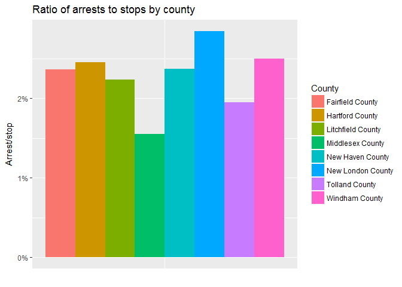

### Problem

In recent years, there has been a growing spotlight on the interactions between police and citizens, causing many protests throughout the country and poor relationships with law enforcement. In an effort to provide an objective understanding, this project will use machine learning to investigate what factors, if any, predict which traffic stops end in arrest. And, which, if any, of those factors are demographic, possibly contributing to the issue of police profiling.

### Client

There are two possible clients who would benefit from the findings of this project:<br />

1.  Police departments seeking to identify areas of bias and improve community relationships.
    -   In an effort to confront implicit bias and learn strategies to combat it, many police departments, like the Madison Police Department (“Are All Cops Racist?” 2015), have implemented police bias training programs. To further aid in this initiative, the findings from this project can help identify areas of improvement for a specific department so the training can be catered and relevant. The self-reflection and acknowledgement of shortcomings also provides law enforcement the opportunity to reach out to affected communities and work to better relationships, something the MPD has already started doing (Vetterkind 2015).
2.  General public/ government groups seeking to investigate and hold offending police departments accountable.
    -   With public scrutiny mounting, having an objective perspective on the offenses of police departments is important for transparency and truth. The project findings also help provide such groups with a way to form a list of departments to focus efforts on. The Justice Department’s Office of Community Oriented Policing Services (COPS) and civil rights division (Barrett 2017) partake in a number of initiatives to investigate and report on police departments failings as well as provide training. The work from this project could be used by those programs, and others similar, as an additional tool to help effectively and efficiently complete inquiries.

Overall, the analysis from this project can provide police, government groups, and concerned citizens with an objective perspective of the possible biases within departments (particularly, with this use case, the Connecticut State Police). This knowledge can help with investigation efforts and inform necessary improvement actions.

#### Cost:

The cost of these trainings can be expensive ($4.5 million for the NYPD (Dimon and Parascandola 2018) and $100-$300 per officer per day for 3 days to several weeks for another (Neuhauser 2016)), so having a clear understanding of a police department's biases will make the training more tailored and effective, ensuring the best investment.

More than the cost of the training, the hours required, as enumerated above, add an additional cost in terms of time away from officers performing their regular policing duties.

Additionally, the analytical techniques utilized in this project provide efficiency to the work of the governmental departments, allowing for both a wider reach to more police departments and a deeper analysis of those they investigate.

### Data

The data I will be using comes from [The Stanford Open Policing Project](https://openpolicing.stanford.edu/) (Pierson et al. 2017) and contains information on traffic stops throughout the United States. For this project, I will be focusing on data from Connecticut since, compared to other states, it includes more features for analysis. In total, the dataset contains 24 features across 318,669 observations (traffic stops), covering the time period from 10/1/2013 through 3/31/2015. The features are largely categorical, including information such as the driver's gender and race, county of stop, if a search was conducted, and resulting violations. The dataset has been standardized from the raw data provided by the [Connecticut Data Collaborative](http://ctrp3.ctdata.org/rawdata/) and includes some new fields, including a unique ID for each stop, county information (name and FIPS ([Federal Information Processing Standard codes](https://en.wikipedia.org/wiki/Federal_Information_Processing_Standards)) codes, which are standard codes used by the US goverment), and stop duration.

In the analysis, focused will be placed on the demographic factors since implicit bias regarding specific groups is a problem this project would like to help uncover. The feature, is\_arrested, will be the outcome variable because it is "worst" of the outcomes of the stop\_outcome variable, so is of most interest in terms of bias effect.

Additionally, to conduct an accurate analysis, I will need to calculate proportions of total demographic population for many of the features. I will be using a [2014 US Census Bureau dataset](https://www.census.gov/data/datasets/2016/demo/popest/counties-detail.html#tables) (Bureau, n.d.) to pull the necessary denominators for demographic population proportions of gender, age, and race.

Other external datasets might be incorporated for comparison as needed depending on what the data unveils and what questions arise.

Dataset header:

<table class="table" style="margin-left: auto; margin-right: auto;">
<thead>
<tr>
<th style="text-align:left;">
id
</th>
<th style="text-align:left;">
state
</th>
<th style="text-align:left;">
stop\_date
</th>
<th style="text-align:left;">
stop\_time
</th>
<th style="text-align:left;">
location\_raw
</th>
<th style="text-align:left;">
county\_name
</th>
<th style="text-align:right;">
county\_fips
</th>
<th style="text-align:left;">
fine\_grained\_location
</th>
<th style="text-align:left;">
police\_department
</th>
<th style="text-align:left;">
driver\_gender
</th>
<th style="text-align:right;">
driver\_age\_raw
</th>
<th style="text-align:right;">
driver\_age
</th>
<th style="text-align:left;">
driver\_race\_raw
</th>
<th style="text-align:left;">
driver\_race
</th>
<th style="text-align:left;">
violation\_raw
</th>
<th style="text-align:left;">
violation
</th>
<th style="text-align:left;">
search\_conducted
</th>
<th style="text-align:left;">
search\_type\_raw
</th>
<th style="text-align:left;">
search\_type
</th>
<th style="text-align:left;">
contraband\_found
</th>
<th style="text-align:left;">
stop\_outcome
</th>
<th style="text-align:left;">
is\_arrested
</th>
<th style="text-align:left;">
officer\_id
</th>
<th style="text-align:left;">
stop\_duration
</th>
</tr>
</thead>
<tbody>
<tr>
<td style="text-align:left;">
CT-2013-00001
</td>
<td style="text-align:left;">
CT
</td>
<td style="text-align:left;">
10/1/2013
</td>
<td style="text-align:left;">
0:01
</td>
<td style="text-align:left;">
westport
</td>
<td style="text-align:left;">
Fairfield County
</td>
<td style="text-align:right;">
9001
</td>
<td style="text-align:left;">
00000 N I 95 (WESTPORT, T158) X 18 LL
</td>
<td style="text-align:left;">
State Police
</td>
<td style="text-align:left;">
F
</td>
<td style="text-align:right;">
69
</td>
<td style="text-align:right;">
69
</td>
<td style="text-align:left;">
Black
</td>
<td style="text-align:left;">
Black
</td>
<td style="text-align:left;">
Speed Related
</td>
<td style="text-align:left;">
Speeding
</td>
<td style="text-align:left;">
FALSE
</td>
<td style="text-align:left;">
</td>
<td style="text-align:left;">
</td>
<td style="text-align:left;">
FALSE
</td>
<td style="text-align:left;">
Ticket
</td>
<td style="text-align:left;">
FALSE
</td>
<td style="text-align:left;">
1000002754
</td>
<td style="text-align:left;">
1-15 min
</td>
</tr>
<tr>
<td style="text-align:left;">
CT-2013-00002
</td>
<td style="text-align:left;">
CT
</td>
<td style="text-align:left;">
10/1/2013
</td>
<td style="text-align:left;">
0:02
</td>
<td style="text-align:left;">
mansfield
</td>
<td style="text-align:left;">
Tolland County
</td>
<td style="text-align:right;">
9013
</td>
<td style="text-align:left;">
rte 195 storrs
</td>
<td style="text-align:left;">
State Police
</td>
<td style="text-align:left;">
M
</td>
<td style="text-align:right;">
20
</td>
<td style="text-align:right;">
20
</td>
<td style="text-align:left;">
White
</td>
<td style="text-align:left;">
White
</td>
<td style="text-align:left;">
Moving Violation
</td>
<td style="text-align:left;">
Moving violation
</td>
<td style="text-align:left;">
FALSE
</td>
<td style="text-align:left;">
</td>
<td style="text-align:left;">
</td>
<td style="text-align:left;">
FALSE
</td>
<td style="text-align:left;">
Verbal Warning
</td>
<td style="text-align:left;">
FALSE
</td>
<td style="text-align:left;">
1000001903
</td>
<td style="text-align:left;">
1-15 min
</td>
</tr>
<tr>
<td style="text-align:left;">
CT-2013-00003
</td>
<td style="text-align:left;">
CT
</td>
<td style="text-align:left;">
10/1/2013
</td>
<td style="text-align:left;">
0:07
</td>
<td style="text-align:left;">
franklin
</td>
<td style="text-align:left;">
New London County
</td>
<td style="text-align:right;">
9011
</td>
<td style="text-align:left;">
Rt 32/whippoorwill
</td>
<td style="text-align:left;">
State Police
</td>
<td style="text-align:left;">
M
</td>
<td style="text-align:right;">
34
</td>
<td style="text-align:right;">
34
</td>
<td style="text-align:left;">
Hispanic
</td>
<td style="text-align:left;">
Hispanic
</td>
<td style="text-align:left;">
Speed Related
</td>
<td style="text-align:left;">
Speeding
</td>
<td style="text-align:left;">
FALSE
</td>
<td style="text-align:left;">
</td>
<td style="text-align:left;">
</td>
<td style="text-align:left;">
FALSE
</td>
<td style="text-align:left;">
Ticket
</td>
<td style="text-align:left;">
FALSE
</td>
<td style="text-align:left;">
1000002711
</td>
<td style="text-align:left;">
1-15 min
</td>
</tr>
<tr>
<td style="text-align:left;">
CT-2013-00004
</td>
<td style="text-align:left;">
CT
</td>
<td style="text-align:left;">
10/1/2013
</td>
<td style="text-align:left;">
0:10
</td>
<td style="text-align:left;">
danbury
</td>
<td style="text-align:left;">
Fairfield County
</td>
<td style="text-align:right;">
9001
</td>
<td style="text-align:left;">
I-84
</td>
<td style="text-align:left;">
State Police
</td>
<td style="text-align:left;">
M
</td>
<td style="text-align:right;">
46
</td>
<td style="text-align:right;">
46
</td>
<td style="text-align:left;">
Black
</td>
<td style="text-align:left;">
Black
</td>
<td style="text-align:left;">
Speed Related
</td>
<td style="text-align:left;">
Speeding
</td>
<td style="text-align:left;">
FALSE
</td>
<td style="text-align:left;">
</td>
<td style="text-align:left;">
</td>
<td style="text-align:left;">
FALSE
</td>
<td style="text-align:left;">
Written Warning
</td>
<td style="text-align:left;">
FALSE
</td>
<td style="text-align:left;">
113658284
</td>
<td style="text-align:left;">
1-15 min
</td>
</tr>
<tr>
<td style="text-align:left;">
CT-2013-00005
</td>
<td style="text-align:left;">
CT
</td>
<td style="text-align:left;">
10/1/2013
</td>
<td style="text-align:left;">
0:10
</td>
<td style="text-align:left;">
east hartford
</td>
<td style="text-align:left;">
Hartford County
</td>
<td style="text-align:right;">
9003
</td>
<td style="text-align:left;">
00000 W I 84 (EAST HARTFORD, T043)E.OF XT.56
</td>
<td style="text-align:left;">
State Police
</td>
<td style="text-align:left;">
M
</td>
<td style="text-align:right;">
30
</td>
<td style="text-align:right;">
30
</td>
<td style="text-align:left;">
White
</td>
<td style="text-align:left;">
White
</td>
<td style="text-align:left;">
Speed Related
</td>
<td style="text-align:left;">
Speeding
</td>
<td style="text-align:left;">
FALSE
</td>
<td style="text-align:left;">
</td>
<td style="text-align:left;">
</td>
<td style="text-align:left;">
FALSE
</td>
<td style="text-align:left;">
Ticket
</td>
<td style="text-align:left;">
FALSE
</td>
<td style="text-align:left;">
830814942
</td>
<td style="text-align:left;">
1-15 min
</td>
</tr>
<tr>
<td style="text-align:left;">
CT-2013-00006
</td>
<td style="text-align:left;">
CT
</td>
<td style="text-align:left;">
10/1/2013
</td>
<td style="text-align:left;">
0:10
</td>
<td style="text-align:left;">
trumbull
</td>
<td style="text-align:left;">
Fairfield County
</td>
<td style="text-align:right;">
9001
</td>
<td style="text-align:left;">
rt 8
</td>
<td style="text-align:left;">
State Police
</td>
<td style="text-align:left;">
M
</td>
<td style="text-align:right;">
25
</td>
<td style="text-align:right;">
25
</td>
<td style="text-align:left;">
Black
</td>
<td style="text-align:left;">
Black
</td>
<td style="text-align:left;">
Defective Lights
</td>
<td style="text-align:left;">
Lights
</td>
<td style="text-align:left;">
FALSE
</td>
<td style="text-align:left;">
</td>
<td style="text-align:left;">
</td>
<td style="text-align:left;">
FALSE
</td>
<td style="text-align:left;">
Verbal Warning
</td>
<td style="text-align:left;">
FALSE
</td>
<td style="text-align:left;">
230931989
</td>
<td style="text-align:left;">
1-15 min
</td>
</tr>
</tbody>
</table>

#### Limitations:

The data is comprised largely of categorical variables, restricting the machine learning algorithms and measures, like correlation, available for use. Ideally, there would be more features describing aspects of the stopped individual, like the car make and color, because those features shouldn't be the cause of a traffic stop, so any trends indicating they are would need to be reported on.

One particular issue addressed in this project is that the demographic spread of predictor variables in the dataset don't necessarily align with the state/county demographic spread, altering perception of a characteristic’s influence on arrest status. Therefore, where appropriate, weights are applied to each demographic characteristic by its distribution in the total population (Connecticut and/or county). Additionally, the dataset does not cover complete calendar years, reporting only part of 2013 and 2015. For summary time analysis, weights are applied, for example, to account for April only appearing in 2014 while March appears in 2014 and 2015.

An important point to highlight is that the analysis cannot determine if a feature causes an arrest, it can only show correlation between one feature and another. Further investigation on the part of the police department would be necessary to determine cause and effect.

#### Cleaning and wrangling:

Cleaning and wrangling the data was completed throughout the many investigation stages, as needed. However, the immediate and obvious fixes were addressed in the beginning of the project and are enumerated below.

Many features were not in the correct format, so needed to be cast to allow for easier analysis and visualization.

For example, the date fields, were updated from factors to dates:

``` r
class(df_clean$stop_date)
```

    ## [1] "character"

``` r
df_clean$stop_date <- as.POSIXct(df_clean$stop_date, format = "%m/%d/%Y")
```

And stop\_duration was made into an ordered factor:

``` r
df_clean$stop_duration_fact <- factor(df_clean$stop_duration, order = TRUE)
```

There are a number of blank values throughout the dataset. Blank values in county\_name and county\_fips were updated based on investigation of the raw text column, fine\_grained\_location:

``` r
library(dplyr)
library(tidyr)
# rocky neck:
df_clean %>% filter(grepl(pattern = "*rocky neck*", x = tolower(fine_grained_location))) %>% select(fine_grained_location, county_name) %>% distinct(county_name)
```

    ##         county_name
    ## 1 New London County
    ## 2

``` r
# -> distinct county is New London County
# -> Google search indicates it's a state park in New London

# Figure out the corresponding FIP
df_clean %>% filter(county_name == "New London County") %>% select(county_fips) %>% distinct()
```

    ##   county_fips
    ## 1        9011

``` r
# -> 9011
# update county_name and county_fips for "rocky neck" matches
df_clean <- df_clean %>% mutate(county_name = replace(county_name, county_name == "" & grepl(pattern = "*rocky neck*", x = tolower(fine_grained_location)), "New London County"),
                          county_fips = replace(county_fips, county_name == "New London County" & is.na(county_fips), 9011))
```

Follow same process for other unique texts in fine\_grained\_location:

``` r
# update matches for "east lyme"
df_clean <- df_clean %>% mutate(county_name = replace(county_name, county_name == "" & grepl(pattern = "*east lyme*", x = tolower(fine_grained_location)), "New London County"),
                                county_fips = replace(county_fips, county_name == "New London County" & is.na(county_fips), 9011))
# update matches for "37 hov" with FIP 9003 and county name Hartford County
df_clean <- df_clean %>% mutate(county_name = replace(county_name, county_name == "" & grepl(pattern = "*37 hov*", x = tolower(fine_grained_location)), "Hartford County"),
                                county_fips = replace(county_fips, county_name == "Hartford County" & is.na(county_fips), 9003))
# update matches for "niantic"
df_clean <- df_clean %>% mutate(county_name = replace(county_name, county_name == "" & grepl(pattern = "*niantic*", x = tolower(fine_grained_location)), "New London County"),
                                county_fips = replace(county_fips, county_name == "New London County" & is.na(county_fips), 9011))
# update matches for "terminal"
df_clean <- df_clean %>% mutate(county_name = replace(county_name, county_name == "" & grepl(pattern = "*terminal*", x = tolower(fine_grained_location)), "Hartford County"),
                                county_fips = replace(county_fips, county_name == "Hartford County" & is.na(county_fips), 9003))
# update matches for "I-95 sb 43"
df_clean <- df_clean %>% mutate(county_name = replace(county_name, county_name == "" & grepl(pattern = "*i-95 sb 43*", x = tolower(fine_grained_location)), "New Haven County"),
                                county_fips = replace(county_fips, county_name == "New Haven County" & is.na(county_fips), 9009))
#update matches for "rt 6/195"
df_clean <- df_clean %>% mutate(county_name = replace(county_name, county_name == "" & grepl(pattern = "*rt 6/195*", x = tolower(fine_grained_location)), "Tolland County"),
                                county_fips = replace(county_fips, county_name == "Tolland County" & is.na(county_fips), 9013))
# update matches for "schoeph"
df_clean <- df_clean %>% mutate(county_name = replace(county_name, county_name == "" & grepl(pattern = "*schoeph*", x = tolower(fine_grained_location)), "Hartford County"),
                                county_fips = replace(county_fips, county_name == "Hartford County" & is.na(county_fips), 9003))
# update matches for "e litchfield rd"
df_clean <- df_clean %>% mutate(county_name = replace(county_name, county_name == "" & grepl(pattern = "*e litchfield rd*", x = tolower(fine_grained_location)), "Litchfield County"),
                                county_fips = replace(county_fips, county_name == "Litchfield County" & is.na(county_fips), 9005))
# update matches for "T130"
df_clean <- df_clean %>% mutate(county_name = replace(county_name, county_name == "" & grepl(pattern = "*t130*", x = tolower(fine_grained_location)), "New Haven County"),
                                county_fips = replace(county_fips, county_name == "New Haven County" & is.na(county_fips), 9009))
# update matches for "RT 229 @ RT 72"
df_clean <- df_clean %>% mutate(county_name = replace(county_name, county_name == "" & grepl(pattern = "*rt 229 @ rt 72*", x = tolower(fine_grained_location)), "Hartford County"),
                                county_fips = replace(county_fips, county_name == "Hartford County" & is.na(county_fips), 9003))
#update matches for "i84 exit 9"
df_clean <- df_clean %>% mutate(county_name = replace(county_name, county_name == "" & grepl(pattern = "*i84 exit 9*", x = tolower(fine_grained_location)), "Fairfield County"),
                                county_fips = replace(county_fips, county_name == "Fairfield County" & is.na(county_fips), 9001))
# update matches for "liberty way"
df_clean <- df_clean %>% mutate(county_name = replace(county_name, county_name == "" & grepl(pattern = "*liberty way*", x = tolower(fine_grained_location)), "New London County"),
                                county_fips = replace(county_fips, county_name == "New London County" & is.na(county_fips), 9011))
# update matches for "rt 8 n ext 23"
df_clean <- df_clean %>% mutate(county_name = replace(county_name, county_name == "" & grepl(pattern = "*rt 8 n ext 23*", x = tolower(fine_grained_location)), "New Haven County"),
                                county_fips = replace(county_fips, county_name == "New Haven County" & is.na(county_fips), 9009))
# update matches for "i-91 south exit 4"
df_clean <- df_clean %>% mutate(county_name = replace(county_name, county_name == "" & grepl(pattern = "*i-91 south exit 4*", x = tolower(fine_grained_location)), "New Haven County"),
                                county_fips = replace(county_fips, county_name == "New Haven County" & is.na(county_fips), 9009))
# update matches for "rt 172"
df_clean <- df_clean %>% mutate(county_name = replace(county_name, county_name == "" & grepl(pattern = "*rt 172*", x = tolower(fine_grained_location)), "New Haven County"),
                                county_fips = replace(county_fips, county_name == "New Haven County" & is.na(county_fips), 9009))
# update matches for "91n x 34"
df_clean <- df_clean %>% mutate(county_name = replace(county_name, county_name == "" & grepl(pattern = "*91n x 34*", x = tolower(fine_grained_location)), "Hartford County"),
                                county_fips = replace(county_fips, county_name == "Hartford County" & is.na(county_fips), 9003))
# update matches for "main t045"
df_clean <- df_clean %>% mutate(county_name = replace(county_name, county_name == "" & grepl(pattern = "*main t045*", x = tolower(fine_grained_location)), "New London County"),
                                county_fips = replace(county_fips, county_name == "New London County" & is.na(county_fips), 9011))
# update matches for "91 n x 36"
df_clean <- df_clean %>% mutate(county_name = replace(county_name, county_name == "" & grepl(pattern = "*91 n x 36*", x = tolower(fine_grained_location)), "Hartford County"),
                                county_fips = replace(county_fips, county_name == "Hartford County" & is.na(county_fips), 9003))
# update matches for "fern"
df_clean <- df_clean %>% mutate(county_name = replace(county_name, county_name == "" & grepl(pattern = "*fern*", x = tolower(fine_grained_location)), "Litchfield County"),
                                county_fips = replace(county_fips, county_name == "Litchfield County" & is.na(county_fips), 9005))
# update matches for "nb south of exit 15" 
df_clean <- df_clean %>% mutate(county_name = replace(county_name, county_name == "" & grepl(pattern = "*nb south of exit 15*", x = tolower(fine_grained_location)), "New Haven County"),
                                county_fips = replace(county_fips, county_name == "New Haven County" & is.na(county_fips), 9009))
#update matches for "x 64"
df_clean <- df_clean %>% mutate(county_name = replace(county_name, county_name == "" & grepl(pattern = "*x 64*", x = tolower(fine_grained_location)), "Middlesex County"),
                                county_fips = replace(county_fips, county_name == "Middlesex County" & is.na(county_fips), 9007))
#update matches for "post road fairfield"
df_clean <- df_clean %>% mutate(county_name = replace(county_name, county_name == "" & grepl(pattern = "*post road fairfield*", x = tolower(fine_grained_location)), "Fairfield County"),
                                county_fips = replace(county_fips, county_name == "Fairfield County" & is.na(county_fips), 9001))
# -> no other groups (patterns that appear more than once) to investigate-- 16 blank county_names left
```

There were a number of variables with both a "raw" and "non-raw" column:

For driver\_age and driver\_age\_raw, The Stanford Open Policing Project made ages &lt;15 blank in the driver\_age column, which I made NA for easier filtering. It is a fairly logical assumption that ages &lt; 15 were made in error, since in the US, one can't get their driver's permit until they're 15, so the driver\_age column was used throughout the rest of the analysis. Furthermore, the logic was extended to make older ages (&gt;=80) NA, also under the assumption they were made in error because it doesn't seem reasonable to have many 80+ year old drivers.

``` r
df_clean <- df_clean %>% mutate(driver_age = replace(driver_age, driver_age == "", NA))

df_clean <- df_clean %>% mutate(driver_age = replace(driver_age, driver_age >= 80, NA))
```

In the driver\_race column, races in driver\_race\_raw are bucketed into an "other" column. This was done by The Stanford Open Policing Project to [standardize driver race](https://github.com/5harad/openpolicing/blob/master/DATA-README.md) throughout the states, but since we're only investigating one state, to avoid loss of information, driver\_race\_raw will be used.

There was no distinct difference between the columns, search\_type\_raw and search\_type or violation and violation\_raw, so search\_type\_raw and violation\_raw will be used, keeping the information of the original Connecticut data.

To make for easier filtering, blanks are changed to NAs in search\_type\_raw:

``` r
df_clean <- df_clean %>% mutate(search_type = replace(search_type, search_type == "", NA))
```

The violation\_raw has many distinct values because it is a comma-delineated list of all the violations for a traffic stop. Two steps were completed to make sense of the data housed in violation\_raw. The first, was making a violation\_count column.

``` r
library(stringr)
library(splitstackshape)
dist_viol_raw <- df_clean %>% arrange(violation_raw) %>% select(violation_raw) %>% distinct()
# first: determine max violations for a stop
no_viols <- str_count(dist_viol_raw, ",")
max(no_viols) + 1
# 5 -> = number of new columns to create
# second: create # of violations column 
df_clean <- df_clean %>% mutate(violation_count = str_count(violation_raw, ",") + 1)
```

And the second task was making a new data set with one-hot encoded columns, one for every violation, where a 1 indicates the stop had that violation, and a 0 means it did not. A new data set was created to avoid needing to use a bloated dataset for all calculations. Instead, this new dataset will be used only when violations are investigated.

``` r
df_split <- df_clean
df_split <- cSplit_e(df_split, "violation_raw", ",", mode = "binary", type = "character", fill = 0)
```

There are some leftover NA values which will be addressed as needed. For the visualization and statistics investigation, NAs were ignored. For the machine learning investigation, NAs were handled more carefully, as enumerated in the machine learning section. Here are the columns with missing values:

-   stop\_time: 222
-   county\_name: 38
-   driver\_age: 274
-   search\_type: 313823
-   stop\_outcome: 5356
-   is\_arrested: 5356

*\*For more on the data cleaning and wrangling process, see the R script in GitHub, [here](https://github.com/paigewil/capstone/blob/master/capstone_data_wrangling.R).*

### Exploratory Data Analysis (Visualizations and Statistics)

#### Summary:

All the attributes tested against is\_arrested had statistically significant results, meaning all of the attributes significantly contribute to the arrest outcome of a stop. For some attributes, this makes more intuitive sense than others. For example, attributes that describe the stop, like stop duration, search type, search conducted, and violation are obviously going to relate to the stop outcome. However, characteristics of the driver; gender, race, and age also influence arrest status. <br /> <br /> For completion of understanding, here is a list of all the attributes tested:

-   driver\_gender
-   driver\_race\_raw
-   driver\_age
-   county\_name
-   search\_conducted
-   search\_type
-   contraband\_found
-   stop\_duration
-   violation\_count
-   violation
-   stop\_time\_hour
-   day\_of\_week
-   day\_of\_month
-   month\_year

Below will highlight a few of the more important attributes. However, the methods used were applied to all the attribute investigations in a similar fashion. <br /> <br /> The conventional significance level for social sciences is 0.05 (Perezgonzalez 2011), which is what will be used here.

#### Bivariate analysis:

##### Stop Duration:

By looking at the plot below, it becomes clear that the percent of stops that end in arrest increases as the stop durations increase in time length. This makes intuitive sense because, naturally the arresting process will take longer.

Our visual analysis is cemented with statistical testing. We see that the greater proportion of arrests/stops in the 30+ time bucket is likely not due to chance as well as no independence between stop duration and arrest status.


``` r
# -> chi-square test for independence
sd_arrest_chi <- table(df_clean$stop_duration, df_clean$is_arrested, useNA = "ifany")
chisq16 <- chisq.test(sd_arrest_chi)
chisq16
```

    ## 
    ##  Pearson's Chi-squared test
    ## 
    ## data:  sd_arrest_chi
    ## X-squared = 37303, df = 4, p-value < 2.2e-16

``` r
# -> Is the difference between the arrest/stop proportion of 30+ stop durations
# and the other durations statistically significant?
sd_arrest_chi <- addmargins(table(df_clean$stop_duration, df_clean$is_arrested, useNA = "ifany"))
sd_30 <- sd_arrest_chi[3,]
sd_not_30 <- colSums(sd_arrest_chi[c(1:2),])
sd_30_not_30 <- rbind(sd_30, sd_not_30)
res30 <- prop.test(x = as.vector(sd_30_not_30[,2]), n = as.vector(sd_30_not_30[,4]), alternative = "greater")
res30
```

    ## 
    ##  2-sample test for equality of proportions with continuity
    ##  correction
    ## 
    ## data:  as.vector(sd_30_not_30[, 2]) out of as.vector(sd_30_not_30[, 4])
    ## X-squared = 28872, df = 1, p-value < 2.2e-16
    ## alternative hypothesis: greater
    ## 95 percent confidence interval:
    ##  0.3252607 1.0000000
    ## sample estimates:
    ##     prop 1     prop 2 
    ## 0.35239884 0.01677685

##### Search Conducted:

While most stops where a search was conducted don’t end in arrest, there are 14.69 times more searches conducted for stops that do end in arrest. With a two-proportion z-test giving a p-value of 2.2e-16, we verify this result is statistically significant.

Additionally, from the chi-square independence test we get a p-value of 2.2e-16 showing that search conducted and arrest status are dependent.


``` r
# -> chi-square test for independence
sc_arrest_chi <- table(df_clean$search_conducted, df_clean$is_arrested, useNA = "ifany")
chisq11 <- chisq.test(sc_arrest_chi)
chisq11
```

    ## 
    ##  Pearson's Chi-squared test
    ## 
    ## data:  sc_arrest_chi
    ## X-squared = 15271, df = 2, p-value < 2.2e-16

``` r
# -> 2-sample test to compare proportions
# Is search conducted == TRUE > search conducted == FALSE?
sc_arrest_ft <- addmargins(table(df_clean$search_conducted, df_clean$is_arrested, useNA = "ifany"))
sc_arrest_ft <- sc_arrest_ft[c(2,1),]
res19 <- prop.test(x = as.vector(sc_arrest_ft[,2]), n = as.vector(sc_arrest_ft[,4]), alternative = "greater")
res19
```

    ## 
    ##  2-sample test for equality of proportions with continuity
    ##  correction
    ## 
    ## data:  as.vector(sc_arrest_ft[, 2]) out of as.vector(sc_arrest_ft[, 4])
    ## X-squared = 15258, df = 1, p-value < 2.2e-16
    ## alternative hypothesis: greater
    ## 95 percent confidence interval:
    ##  0.2453714 1.0000000
    ## sample estimates:
    ##     prop 1     prop 2 
    ## 0.27419355 0.01866999

These results seem to indicate that while having a search conducted during a stop does not lead to an arrest a majority of the time, those stops that do end in arrest are most likely to have had a search conducted. This is not too concerning of a result because a search conducted does not mean contraband was found. However, it might lead you to question whether most of the stops where a search was conducted and there was no arrest resulted in the search coming up empty-handed. A dive into the contraband\_found variable, leads to some interesting results.

##### Contraband Found:

In the image below, we see that most stops where contraband was found don't end in arrest. 

In the summer of 2015, after the time period of this dataset, the drug possession crime sentences were reduced to misdemeanors in Connecticut. Additionally, in 2011, Connecticut "decriminalized small amounts of marijuana" (Collins 2015). The high proportion of non-arrests for stops where contraband is found might mean either officers are not enforcing the law appropriately or a large number of the contraband found was small amounts of marijuana or another misdemeanor contraband. This is a good example of the desirability for more granular data, in this case, a feature explaining the contraband that was found. Ultimately, with the data available, it is difficult to know if these results indicate police behavior that needs investigation or a confirmation of proper law enforcement.

##### Search Type:

Most of the inventory searches were from a stop that had an arrest while all other search types mostly were not. Inventory searches are those that are conducted on impounded vehicles (“Inventory Search Law and Legal Definition,” n.d.) and many vehicles can be impounded in Connecticut after arrest for driving with a suspended license or under the influence (Frisman 2009), making the large percentage of arrests for inventory searches logical.


A plot of arrest status for inventory violations confirms that many of the arrests and therefore, presumptively, impounds are for those violations. However, again, more detailed information is desirable to be more certain. 

Backing the visual observations with some statistics, there is 95% confidence interval of (0.7139833, 0.8214710) for the proportion of inventory searches that have arrests, indicating that since the whole interval is above 50%, we can be 95% confident that for the entire inventory search population, more are going to end in arrest than not.

``` r
df_search_conducted <- df_clean %>% filter(search_conducted == TRUE)
st_arrest_ft <- addmargins(table(df_search_conducted$search_type_raw, df_search_conducted$is_arrested, useNA = "ifany"))
st_arrest_ft <- head(st_arrest_ft,-1)
inv <- st_arrest_ft[3,]
# -> is it likely that if you have an inventory search you will also have 
# an arrest?-- what is the confidence interval of values?
inv_true <- inv[[2]]
inv_n <- inv[[4]]
prop.test(inv_true, inv_n)
```

    ## 
    ##  1-sample proportions test with continuity correction
    ## 
    ## data:  inv_true out of inv_n, null probability 0.5
    ## X-squared = 72.9, df = 1, p-value < 2.2e-16
    ## alternative hypothesis: true p is not equal to 0.5
    ## 95 percent confidence interval:
    ##  0.7139833 0.8214710
    ## sample estimates:
    ##     p 
    ## 0.772

Now that we've investigated features more closely related to the stop itself and seen that the results either align with our understanding of Connecticut law and policing or we need more information, let's investigate the impact of our demographic features on arrest status.

##### Gender:

From the bivariate plot breakdown on arrest/stop by gender, we see that males who are stopped are more likely to be arrested than females who are stopped. In fact, in this sample, stopped men are arrested 1.7 times more than stopped women: 0.02650022 / 0.01589189 = 1.667531. 

The two-proportion z-test comparing males' arrest rate to females' gives a p-value of 2.2e-16, allowing us the reject the null hypothesis and say that the difference in arrest rate is statistically signficiant.

``` r
addmargins(table(df_clean$driver_gender, df_clean$is_arrested, useNA = "ifany"))
```

    ##      
    ##        FALSE   TRUE   <NA>    Sum
    ##   F   103593   1697   1494 106784
    ##   M   202408   5615   3862 211885
    ##   Sum 306001   7312   5356 318669

``` r
res4 <- prop.test(x = c(5615, 1697), n = c(211885, 106784), alternative = "greater")
res4
```

    ## 
    ##  2-sample test for equality of proportions with continuity
    ##  correction
    ## 
    ## data:  c(5615, 1697) out of c(211885, 106784)
    ## X-squared = 355.93, df = 1, p-value < 2.2e-16
    ## alternative hypothesis: greater
    ## 95 percent confidence interval:
    ##  0.009749431 1.000000000
    ## sample estimates:
    ##     prop 1     prop 2 
    ## 0.02650022 0.01589189

##### Race:

When weighted against the census Connecticut populations, Blacks and Whites have the highest number of stops. 

However, when looking at the proportion of arrests/stops, Hispanics and Blacks have the highest ratios. 

It is interesting to note that Hispanics are the third highest in terms of stop proportion when weighted by Census race population but have the highest arrest likelihood. This seems to anecdotally support the results seen here that race does impact arrest status outcome. In fact, the arrest/stop ratio of Hispanics is (0.03912443/0.02455756) = 1.593173 times more than the next highest ratio, which is the ratio for Blacks. With statistical tests, we see this result as being statistically signficant with a two-proportion z-test returning a p-value of 2.2e-16.

``` r
race_table <- table(df_clean$driver_race_raw, df_clean$is_arrested, useNA = "ifany")
non_hispanic <- colSums(race_table[c(1,2,4,5),])
race_table2 <- rbind(race_table, non_hispanic)
race_table2 <- race_table2[c(3,6),]
race_table2 <- addmargins(race_table2)
race_table2 <- race_table2[c(1,2),]
prop.test(x = as.vector(race_table2[,2]), n = as.vector(race_table2[,4]), alternative = "greater")
```

    ## 
    ##  2-sample test for equality of proportions with continuity
    ##  correction
    ## 
    ## data:  as.vector(race_table2[, 2]) out of as.vector(race_table2[, 4])
    ## X-squared = 402.41, df = 1, p-value < 2.2e-16
    ## alternative hypothesis: greater
    ## 95 percent confidence interval:
    ##  0.01605447 1.00000000
    ## sample estimates:
    ##     prop 1     prop 2 
    ## 0.03912443 0.02119216

Additionally, we see that race and arrest status are not independent, with the chi-square independence test giving a p-value of 2.2e-16.

``` r
race_arrest_chi <- table(df_clean$driver_race_raw, df_clean$is_arrested, useNA = "ifany")
chisq.test(race_arrest_chi)
```

    ## 
    ##  Pearson's Chi-squared test
    ## 
    ## data:  race_arrest_chi
    ## X-squared = 507.62, df = 8, p-value < 2.2e-16

##### Race and Age:

Adding an extra layer into our analysis of race, let’s see if there is a difference in the mean age of arrest for each race.

Looking at the boxplots, we can see that the mean age of arrest is lower for Black and Hispanic drivers. Note, NAs were excluded to compute the means.

``` r
ggboxplot(df_clean %>% filter(is_arrested == TRUE), x = "driver_race_raw", y = "driver_age", color = "driver_race_raw",
          xlab = "Driver Race", ylab = "Driver Age")
```


Performing a t-test on the difference in mean ages of arrest for Hispanic and Black drivers versus the other races, confirms our observations, giving a p-value of 2.2e-16, meaning we favor the alternative hypothesis that says the mean age of arrest for Hispanics and Blacks is significantly less than the other races.

``` r
df_clean$race2 <- vector(mode="character", length = nrow(df_clean))
df_clean$race2[df_clean$driver_race_raw != "Hispanic" & df_clean$driver_race_raw != "Black"] <- "NonHB"
df_clean$race2[df_clean$driver_race_raw == "Hispanic" | df_clean$driver_race_raw == "Black" ] <- "HB"
t.test(driver_age ~ race2, data = df_clean %>% filter(is_arrested == TRUE), alternative = "less")
```

    ## 
    ##  Welch Two Sample t-test
    ## 
    ## data:  driver_age by race2
    ## t = -9.1618, df = 4854, p-value < 2.2e-16
    ## alternative hypothesis: true difference in means is less than 0
    ## 95 percent confidence interval:
    ##       -Inf -2.307413
    ## sample estimates:
    ##    mean in group HB mean in group NonHB 
    ##            33.87758            36.69002

Overall, we see that demographic characteristics of drivers have a statistically significant difference on the arrest outcome of a traffic stop in Connecticut. Whether or not these demographics can accurately predict arrest status will be determined in the machine learning section. However, the significance is still important enough for the Conencticut State Police department to explore further, desirably with more detailed data.

##### Over-time:

In addition to demographics and stop characteristics, when an individual is stopped seems to have an effect on whether or not they’re arrested.

For example, we see that more arrests/stops occur on the weekend, a finding supported with the two-proportion z-tests comparing Saturday and Sunday to the other weekdays. To accomplish this analysis, more data wrangling was required, making a day\_of\_week variable.

``` r
df_clean$stop_date <- as.POSIXct(df_clean$stop_date, "%Y-%m-%d", tz = "America/New_York")
df_clean$day_of_week <- weekdays(df_clean$stop_date)
df_clean$day_of_week <- factor(df_clean$day_of_week, levels = c("Sunday", "Monday", "Tuesday", "Wednesday", "Thursday", "Friday", "Saturday"))
arrests_per_day_of_week <- data.frame(df_clean %>% group_by(day_of_week, is_arrested) %>% dplyr::summarise(sum_arrests = n()))
arrests_dow_total <- arrests_per_day_of_week %>% group_by(day_of_week) %>% dplyr::summarise(sum_count = sum(sum_arrests))
arrests_per_day_of_week  <- left_join(arrests_per_day_of_week , arrests_dow_total, by = "day_of_week")
arrests_per_day_of_week <- arrests_per_day_of_week %>% mutate(arrests_per_stop  = sum_arrests/sum_count)  
ggplot(arrests_per_day_of_week %>% filter(is_arrested == TRUE), aes(day_of_week, arrests_per_stop)) +
  geom_bar(stat = "identity", fill = "#1E90FF") +
  labs(title = "% of stops that end in arrest by day of week", x = "Day of Week", y = "Arrests/stops") +
  scale_y_continuous(labels = scales::percent)
```


``` r
weekend <- addmargins(table(df_clean$day_of_week, df_clean$is_arrested, useNA = "ifany"))
weekend <- head(weekend, -1)
satsun <- colSums(weekend[c(1,7),])
weekday <- colSums(weekend[c(2:6),])
weekend2 <- rbind(satsun, weekday)
# Testing arrest proportion of the weekend
prop.test(x = as.vector(weekend2[,2]), n = as.vector(weekend2[,4]), alternative = "greater")
```

    ## 
    ##  2-sample test for equality of proportions with continuity
    ##  correction
    ## 
    ## data:  as.vector(weekend2[, 2]) out of as.vector(weekend2[, 4])
    ## X-squared = 303.11, df = 1, p-value < 2.2e-16
    ## alternative hypothesis: greater
    ## 95 percent confidence interval:
    ##  0.009170215 1.000000000
    ## sample estimates:
    ##     prop 1     prop 2 
    ## 0.03025112 0.02002214

Some more temporal trends uncovered is the arrest/stop ratio tends to decrease towards the last 3rd of the month, the highest arrest/stop ratio occurs in the early morning (0000- 0300), and winter months seems to have the higher arrest/stop ratios.

##### County:

One more point of interest worth mentioning is the arrest/stop ratio per county. As we can see from the graph below, there are some large discrepancies between some of the counties.



Comparing the freeway and interstate volume traffic per county to the total number of arrests per county, shows some positive correlation, showing that certain counties have more highways and therefore vehicles traveling through them, and explaining the differing arrest/stop ratios.

The data for freeway and interstate traffic volume comes from [Connecticut Open Data](https://data.ct.gov/Transportation/2014-Daily-Vehicle-Miles-Travelled-By-Town-And-Roa/dpat-eygf) (Roadway Systems Information, n.d.) and is from 2014 .

Total arrests per county:


Total miles traveled-- interstate:


Total miles traveled-- freeway:


There is one obvious county that doesn't match up: New London. Further investigation might be necessary to determine if the high number of arrests per stops is expected.

*\*For more visualizations and associated statistics, see the R scripts in GitHub, [here](https://github.com/paigewil/capstone/blob/master/visualization.R) and [here](https://github.com/paigewil/capstone/blob/master/statistics.R), respectively. Data wrangling of the Connecticut Census dataset can also be found in the visualization script*

### Approach

A supervised machine learning algorithm will be used to predict if a traffic stop will end in arrest, i.e. the is\_arrested variable. Specifically, since the outcome variable is categorical, classification will be used.

### Deliverables

The following items will be available on the project's [GitHub repository](https://github.com/paigewil/capstone):<br />

-   R code for:
    -   Data wrangling
    -   Exploratory data analysis <br />   -&gt; including plots
    -   Statistics
    -   Machine learning
-   Report explaing the analysis conducted and associated findings
-   Slide deck presentation, catered to a non-technical audience

### Appendix

Conditions used in statistical analysis testing:

-   Chi-square independence test:
    -   Random: Since the data contains all stops for the specified time period, not just a selection, this is a random sample.
    -   Expected values for each data point &gt;=5 (R function verifies).
    -   Independence: Sample size &lt;= 10% of population or sampling with replacement.
        -   This dataset is just for two years of stops, undoubtedly 10% of the total population of stops in Connecticut's lifetime.
-   Two-sample z-test for proportions (same for proportion confidence interval):
    -   Random: See above.
    -   Normal: At least 10 expected successes and failures each— the R functions used test for this condition, if it is not met, test was not performed.
    -   Independence: See above.
-   T-test for sample mean comparison:
    -   Random: See above.
    -   Normal: Our sample size is &gt;= 30 so using the central limit theorem, we can say our sampling distribution of the sample mean is normal.
    -   Independence: See above.

### References

“Are All Cops Racist?” 2015. The Daily Show with Trevor Noah. October. <https://www.youtube.com/watch?v=3QIWolLM9i8>.

Barrett, Devlin. 2017. “Justice Department Ends Program Scrutinizing Local Police Forces.” *The Washington Post*, September. <https://www.washingtonpost.com/world/national-security/justice-department-ends-program-scrutinizing-local-police-forces/2017/09/15/ee88d02e-9a3d-11e7-82e4-f1076f6d6152_story.html?utm_term=.9f66520651a8>.

Bureau, US Census. n.d. “County Population by Characteristics: 2010-2016.” <https://www.census.gov/data/datasets/2016/demo/popest/counties-detail.html#tables>.

Collins, Dave. 2015. “Connecticut Eases Penalties for Most Drug Possession Crimes.” *CBS Connecticut*, June. <https://connecticut.cbslocal.com/2015/06/30/connecticut-eases-penalties-for-most-drug-possession-crimes/>.

Dimon, Laura, and Rocco Parascandola. 2018. “NYPD to Start ’Implicit Bias’ Training.” *PoliceOne*, February. <https://www.policeone.com/patrol-issues/articles/470642006-NYPD-to-start-implicit-bias-training/>.

Frisman, Paul. 2009. “Impounding Vehicles as Penalty for Operating Under Suspension.” *Connecticut General Assembly*, December. <https://www.cga.ct.gov/2009/rpt/2009-R-0431.htm>.

“Inventory Search Law and Legal Definition.” n.d. USLegal. <https://definitions.uslegal.com/i/inventory-search/>.

Neuhauser, Alan. 2016. “Can Training Really Stop Police Bias?” *U.S. News*, December. <https://www.usnews.com/news/national-news/articles/2016-12-29/can-training-really-stop-police-bias>.

Perezgonzalez, Jose. 2011. “Significance Level - Conventional Level of Significance.” *WikiofScience*, August. <http://wikiofscience.wikidot.com/stats:significance-level-cutoff-point>.

Pierson, E., C. Simoiu, J. Overgoor, S. Corbett-Davies, V. Ramachandran, C. Phillips, and S. Goel. 2017. “A large-scale analysis of racial disparities in police stops across the United States.” *ArXiv E-Prints*, June.

Roadway Systems Information, Office of. n.d. “2014 Daily Vehicle Miles Travelled by Town and Roadway Classification.” <https://data.ct.gov/Transportation/2014-Daily-Vehicle-Miles-Travelled-By-Town-And-Roa/dpat-eygf>.

Vetterkind, Riley. 2015. “MPD Employs Unconscious Bias Training to Combat Racism in Force.” *The Badger Herald*, March. <https://badgerherald.com/news/2015/03/23/mpd-employs-unconscious-bias-training-to-combat-racism-in-force/>.
