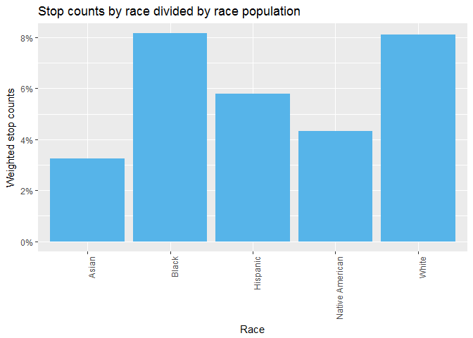
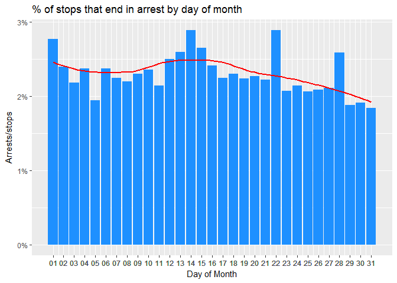

Introduction to Data Science Capstone Project: <br />An Analysis of Connecticut State Police Traffic Stops
================
Paige Williams

### Problem

In recent years, there has been a growing spotlight on the interactions between police and citizens, causing many protests throughout the country and poor relationships with law enforcement. In an effort to provide an objective understanding, this project will use machine learning to investigate what factors, if any, predict which traffic stops end in arrest. And, which, if any, of those factors are demographic, indicating the possible prevalence of police profiling.

### Client

There are two possible clients who would benefit from the findings of this project:<br />

1.  Police departments seeking to identify areas of bias and improve community relationships.
    -   In an effort to confront implicit bias and learn strategies to combat it, many police departments, like the [Madison Police Department](https://www.youtube.com/watch?v=3QIWolLM9i8) (“Are All Cops Racist?” 2015), have implemented police bias training programs. To further aid in this initiative, the findings from this project can help identify areas of improvement for a specific department so the training can be catered and relevant. The self-reflection and acknowledgement of shortcomings also provides law enforcement the opportunity to reach out to affected communities and work to better relationships, something the MPD has [already started doing](https://badgerherald.com/news/2015/03/23/mpd-employs-unconscious-bias-training-to-combat-racism-in-force/) (Vetterkind 2015).
2.  General public/ government groups seeking to investigate and hold offending police departments accountable.
    -   With public scrutiny mounting, having an objective perspective on the offenses of police departments is important for transparency and truth. The project findings also help provide such groups with a way to form a list of departments to focus efforts on. [The Justice Department’s Office of Community Oriented Policing Services (COPS) and civil rights division](https://www.washingtonpost.com/world/national-security/justice-department-ends-program-scrutinizing-local-police-forces/2017/09/15/ee88d02e-9a3d-11e7-82e4-f1076f6d6152_story.html?utm_term=.9f66520651a8) (Barrett 2017) partake in a number of initiatives to investigate and report on police departments shortcomings as well as provide training. The work from this project could be used by those programs, and others similar, as an additional tool to help effectively and efficiently complete inquiries.

Overall, the analysis from this project can provide police, government groups, and concerned citizens with an objective perspective of the possible biases within departments (particularly, with this use case, the Connecticut State Police). This knowledge can help with investigation efforts and inform necessary improvement actions.

#### Cost:

The cost of these trainings can be expensive ([$4.5 million for the NYPD](https://www.policeone.com/patrol-issues/articles/470642006-NYPD-to-start-implicit-bias-training/) (Dimon and Parascandola 2018) and [$100-$300 per officer per day](https://www.usnews.com/news/national-news/articles/2016-12-29/can-training-really-stop-police-bias) for 3 days to several weeks for another (Neuhauser 2016)), so having a clear understanding of a police department's biases will make the training more tailored and effective, ensuring the best investment of public funds.

More than the cost of the training, the hours required, as enumerated above, add an additional cost in terms of time away from officers performing their regular policing duties.

Additionally, the analytical techniques utilized in this project provide efficiency to the work of the governmental departments, allowing for both a wider reach to more police departments and a deeper analysis of those they investigate.

### Data

The data I will be using comes from [The Stanford Open Policing Project](https://openpolicing.stanford.edu/) (Pierson et al. 2017) and contains information on traffic stops throughout the United States. For this project, I will be focusing on data from Connecticut since, compared to other states, it includes more features for analysis. In total, the dataset contains 24 features across 318,669 observations (traffic stops), covering the time period from 10/1/2013 through 3/31/2015. The features are largely categorical, including information such as the driver's gender and race, county of stop, if a search was conducted, and resulting violations. The Stanford Open Policing Project dataset has been standardized from the raw data provided by the [Connecticut Data Collaborative](http://ctrp3.ctdata.org/rawdata/) (“Connecticut Racial Profiling Prohibition Project Data Portal,” n.d.) and includes some new fields, including a unique ID for each stop, county information (name and [FIPS codes](https://en.wikipedia.org/wiki/Federal_Information_Processing_Standards), which are standard codes used by the US goverment (“Federal Information Processing Standards” 2018)), and stop duration.

In the analysis, focus will be placed on the demographic factors since implicit bias regarding specific groups is a problem this project would like to help uncover. The feature, is\_arrested, will be the outcome variable because it is "worst" of the outcomes of the stop\_outcome variable, so is of most interest in terms of bias effect.

Additionally, to conduct an accurate analysis, we will need to calculate proportions of the dataset to total demographic population for many of the features. A [2014 US Census Bureau dataset](https://www.census.gov/data/datasets/2016/demo/popest/counties-detail.html#tables) (Bureau, n.d.) was used to pull the necessary denominators for the demographic population proportions. In the analysis highlighted below, this dataset is used for an investigation of race.

In an analysis of counties, another dataset was used, sourced from [Connecticut Open Data](https://data.ct.gov/Transportation/2014-Daily-Vehicle-Miles-Travelled-By-Town-And-Roa/dpat-eygf) (Roadway Systems Information, n.d.), containing traffic volumes of Connecticut freeways and interstates by county for 2014.

Dataset header:

<table class="table" style="margin-left: auto; margin-right: auto;">
<thead>
<tr>
<th style="text-align:left;">
id
</th>
<th style="text-align:left;">
state
</th>
<th style="text-align:left;">
stop\_date
</th>
<th style="text-align:left;">
stop\_time
</th>
<th style="text-align:left;">
location\_raw
</th>
<th style="text-align:left;">
county\_name
</th>
<th style="text-align:right;">
county\_fips
</th>
<th style="text-align:left;">
fine\_grained\_location
</th>
<th style="text-align:left;">
police\_department
</th>
<th style="text-align:left;">
driver\_gender
</th>
<th style="text-align:right;">
driver\_age\_raw
</th>
<th style="text-align:right;">
driver\_age
</th>
<th style="text-align:left;">
driver\_race\_raw
</th>
<th style="text-align:left;">
driver\_race
</th>
<th style="text-align:left;">
violation\_raw
</th>
<th style="text-align:left;">
violation
</th>
<th style="text-align:left;">
search\_conducted
</th>
<th style="text-align:left;">
search\_type\_raw
</th>
<th style="text-align:left;">
search\_type
</th>
<th style="text-align:left;">
contraband\_found
</th>
<th style="text-align:left;">
stop\_outcome
</th>
<th style="text-align:left;">
is\_arrested
</th>
<th style="text-align:left;">
officer\_id
</th>
<th style="text-align:left;">
stop\_duration
</th>
</tr>
</thead>
<tbody>
<tr>
<td style="text-align:left;">
CT-2013-00001
</td>
<td style="text-align:left;">
CT
</td>
<td style="text-align:left;">
10/1/2013
</td>
<td style="text-align:left;">
0:01
</td>
<td style="text-align:left;">
westport
</td>
<td style="text-align:left;">
Fairfield County
</td>
<td style="text-align:right;">
9001
</td>
<td style="text-align:left;">
00000 N I 95 (WESTPORT, T158) X 18 LL
</td>
<td style="text-align:left;">
State Police
</td>
<td style="text-align:left;">
F
</td>
<td style="text-align:right;">
69
</td>
<td style="text-align:right;">
69
</td>
<td style="text-align:left;">
Black
</td>
<td style="text-align:left;">
Black
</td>
<td style="text-align:left;">
Speed Related
</td>
<td style="text-align:left;">
Speeding
</td>
<td style="text-align:left;">
FALSE
</td>
<td style="text-align:left;">
</td>
<td style="text-align:left;">
</td>
<td style="text-align:left;">
FALSE
</td>
<td style="text-align:left;">
Ticket
</td>
<td style="text-align:left;">
FALSE
</td>
<td style="text-align:left;">
1000002754
</td>
<td style="text-align:left;">
1-15 min
</td>
</tr>
<tr>
<td style="text-align:left;">
CT-2013-00002
</td>
<td style="text-align:left;">
CT
</td>
<td style="text-align:left;">
10/1/2013
</td>
<td style="text-align:left;">
0:02
</td>
<td style="text-align:left;">
mansfield
</td>
<td style="text-align:left;">
Tolland County
</td>
<td style="text-align:right;">
9013
</td>
<td style="text-align:left;">
rte 195 storrs
</td>
<td style="text-align:left;">
State Police
</td>
<td style="text-align:left;">
M
</td>
<td style="text-align:right;">
20
</td>
<td style="text-align:right;">
20
</td>
<td style="text-align:left;">
White
</td>
<td style="text-align:left;">
White
</td>
<td style="text-align:left;">
Moving Violation
</td>
<td style="text-align:left;">
Moving violation
</td>
<td style="text-align:left;">
FALSE
</td>
<td style="text-align:left;">
</td>
<td style="text-align:left;">
</td>
<td style="text-align:left;">
FALSE
</td>
<td style="text-align:left;">
Verbal Warning
</td>
<td style="text-align:left;">
FALSE
</td>
<td style="text-align:left;">
1000001903
</td>
<td style="text-align:left;">
1-15 min
</td>
</tr>
<tr>
<td style="text-align:left;">
CT-2013-00003
</td>
<td style="text-align:left;">
CT
</td>
<td style="text-align:left;">
10/1/2013
</td>
<td style="text-align:left;">
0:07
</td>
<td style="text-align:left;">
franklin
</td>
<td style="text-align:left;">
New London County
</td>
<td style="text-align:right;">
9011
</td>
<td style="text-align:left;">
Rt 32/whippoorwill
</td>
<td style="text-align:left;">
State Police
</td>
<td style="text-align:left;">
M
</td>
<td style="text-align:right;">
34
</td>
<td style="text-align:right;">
34
</td>
<td style="text-align:left;">
Hispanic
</td>
<td style="text-align:left;">
Hispanic
</td>
<td style="text-align:left;">
Speed Related
</td>
<td style="text-align:left;">
Speeding
</td>
<td style="text-align:left;">
FALSE
</td>
<td style="text-align:left;">
</td>
<td style="text-align:left;">
</td>
<td style="text-align:left;">
FALSE
</td>
<td style="text-align:left;">
Ticket
</td>
<td style="text-align:left;">
FALSE
</td>
<td style="text-align:left;">
1000002711
</td>
<td style="text-align:left;">
1-15 min
</td>
</tr>
<tr>
<td style="text-align:left;">
CT-2013-00004
</td>
<td style="text-align:left;">
CT
</td>
<td style="text-align:left;">
10/1/2013
</td>
<td style="text-align:left;">
0:10
</td>
<td style="text-align:left;">
danbury
</td>
<td style="text-align:left;">
Fairfield County
</td>
<td style="text-align:right;">
9001
</td>
<td style="text-align:left;">
I-84
</td>
<td style="text-align:left;">
State Police
</td>
<td style="text-align:left;">
M
</td>
<td style="text-align:right;">
46
</td>
<td style="text-align:right;">
46
</td>
<td style="text-align:left;">
Black
</td>
<td style="text-align:left;">
Black
</td>
<td style="text-align:left;">
Speed Related
</td>
<td style="text-align:left;">
Speeding
</td>
<td style="text-align:left;">
FALSE
</td>
<td style="text-align:left;">
</td>
<td style="text-align:left;">
</td>
<td style="text-align:left;">
FALSE
</td>
<td style="text-align:left;">
Written Warning
</td>
<td style="text-align:left;">
FALSE
</td>
<td style="text-align:left;">
113658284
</td>
<td style="text-align:left;">
1-15 min
</td>
</tr>
<tr>
<td style="text-align:left;">
CT-2013-00005
</td>
<td style="text-align:left;">
CT
</td>
<td style="text-align:left;">
10/1/2013
</td>
<td style="text-align:left;">
0:10
</td>
<td style="text-align:left;">
east hartford
</td>
<td style="text-align:left;">
Hartford County
</td>
<td style="text-align:right;">
9003
</td>
<td style="text-align:left;">
00000 W I 84 (EAST HARTFORD, T043)E.OF XT.56
</td>
<td style="text-align:left;">
State Police
</td>
<td style="text-align:left;">
M
</td>
<td style="text-align:right;">
30
</td>
<td style="text-align:right;">
30
</td>
<td style="text-align:left;">
White
</td>
<td style="text-align:left;">
White
</td>
<td style="text-align:left;">
Speed Related
</td>
<td style="text-align:left;">
Speeding
</td>
<td style="text-align:left;">
FALSE
</td>
<td style="text-align:left;">
</td>
<td style="text-align:left;">
</td>
<td style="text-align:left;">
FALSE
</td>
<td style="text-align:left;">
Ticket
</td>
<td style="text-align:left;">
FALSE
</td>
<td style="text-align:left;">
830814942
</td>
<td style="text-align:left;">
1-15 min
</td>
</tr>
<tr>
<td style="text-align:left;">
CT-2013-00006
</td>
<td style="text-align:left;">
CT
</td>
<td style="text-align:left;">
10/1/2013
</td>
<td style="text-align:left;">
0:10
</td>
<td style="text-align:left;">
trumbull
</td>
<td style="text-align:left;">
Fairfield County
</td>
<td style="text-align:right;">
9001
</td>
<td style="text-align:left;">
rt 8
</td>
<td style="text-align:left;">
State Police
</td>
<td style="text-align:left;">
M
</td>
<td style="text-align:right;">
25
</td>
<td style="text-align:right;">
25
</td>
<td style="text-align:left;">
Black
</td>
<td style="text-align:left;">
Black
</td>
<td style="text-align:left;">
Defective Lights
</td>
<td style="text-align:left;">
Lights
</td>
<td style="text-align:left;">
FALSE
</td>
<td style="text-align:left;">
</td>
<td style="text-align:left;">
</td>
<td style="text-align:left;">
FALSE
</td>
<td style="text-align:left;">
Verbal Warning
</td>
<td style="text-align:left;">
FALSE
</td>
<td style="text-align:left;">
230931989
</td>
<td style="text-align:left;">
1-15 min
</td>
</tr>
</tbody>
</table>

#### Limitations:

The data is comprised largely of categorical variables, restricting the machine learning algorithms and measures, like correlation, available for use. Ideally, there would also be more features describing aspects of the scene, like the car make and color, because those features shouldn't be the cause of a traffic stop, so any trends indicating they are would need to be reported on. Additionally, more details about the result of the stop would be helpful for clarity and thorough analysis. For example, some of the violations in the current dataset are vague, with an "other" bucket as well as a "moving violation" bucket, which can be used for a wide range of offenses, [from running a stop sign, to driving under the influence](https://traffic.findlaw.com/traffic-tickets/traffic-tickets-basics.html) (“Traffic Tickets Overview,” n.d.).

One particular issue addressed in this project is that the demographic spread of predictor variables in the dataset don't necessarily align with the state/county demographic spread, altering perception of a characteristic’s influence on arrest status. Therefore, where appropriate, weights are applied to each demographic characteristic by the demographic group's distribution in the total population (Connecticut). Additionally, the dataset does not cover complete calendar years, reporting only parts of 2013 and 2015. For summary time analysis, weights are applied, for example, to account for April only appearing in 2014 while March appears in 2014 and 2015.

An important point to highlight is that the analysis cannot determine if a feature causes an arrest, it can only show correlation between one feature and another. Further investigation on the part of the police department would be necessary to determine cause and effect.

### Cleaning and Wrangling

Cleaning and wrangling the data was completed throughout the many analysis stages, as needed. However, the immediate and obvious fixes were addressed in the beginning of the project and are enumerated below.

Many features were not in the correct format, so needed to be cast to allow for easier analysis and visualization.

For example, the date fields, were updated from factors to dates:

``` r
class(df_clean$stop_date)
```

    ## [1] "character"

``` r
df_clean$stop_date <- as.POSIXct(df_clean$stop_date, format = "%m/%d/%Y")
```

And stop\_duration was made into an ordered factor:

``` r
df_clean$stop_duration_fact <- factor(df_clean$stop_duration, order = TRUE)
```

There are a number of blank values throughout the dataset. Blank values in county\_name and county\_fips were updated, where able, based on investigation of the raw text column, fine\_grained\_location:

``` r
library(dplyr)
library(tidyr)
# rocky neck:
df_clean %>% filter(grepl(pattern = "*rocky neck*", x = tolower(fine_grained_location))) %>% select(fine_grained_location, county_name) %>% distinct(county_name)
```

    ##         county_name
    ## 1 New London County
    ## 2

``` r
# -> distinct county is New London County
# -> Google search indicates it's a state park in New London

# Figure out the corresponding FIP
df_clean %>% filter(county_name == "New London County") %>% select(county_fips) %>% distinct()
```

    ##   county_fips
    ## 1        9011

``` r
# -> 9011
# update county_name and county_fips for "rocky neck" matches
df_clean <- df_clean %>% mutate(county_name = replace(county_name, county_name == "" & grepl(pattern = "*rocky neck*", x = tolower(fine_grained_location)), "New London County"),
                          county_fips = replace(county_fips, county_name == "New London County" & is.na(county_fips), 9011))
```

Follow same process for other unique text snippets identified in fine\_grained\_location:

``` r
# update matches for "east lyme"
df_clean <- df_clean %>% mutate(county_name = replace(county_name, county_name == "" & grepl(pattern = "*east lyme*", x = tolower(fine_grained_location)), "New London County"),
                                county_fips = replace(county_fips, county_name == "New London County" & is.na(county_fips), 9011))
# update matches for "37 hov"
df_clean <- df_clean %>% mutate(county_name = replace(county_name, county_name == "" & grepl(pattern = "*37 hov*", x = tolower(fine_grained_location)), "Hartford County"),
                                county_fips = replace(county_fips, county_name == "Hartford County" & is.na(county_fips), 9003))
# update matches for "niantic"
df_clean <- df_clean %>% mutate(county_name = replace(county_name, county_name == "" & grepl(pattern = "*niantic*", x = tolower(fine_grained_location)), "New London County"),
                                county_fips = replace(county_fips, county_name == "New London County" & is.na(county_fips), 9011))
# update matches for "terminal"
df_clean <- df_clean %>% mutate(county_name = replace(county_name, county_name == "" & grepl(pattern = "*terminal*", x = tolower(fine_grained_location)), "Hartford County"),
                                county_fips = replace(county_fips, county_name == "Hartford County" & is.na(county_fips), 9003))
# update matches for "I-95 sb 43"
df_clean <- df_clean %>% mutate(county_name = replace(county_name, county_name == "" & grepl(pattern = "*i-95 sb 43*", x = tolower(fine_grained_location)), "New Haven County"),
                                county_fips = replace(county_fips, county_name == "New Haven County" & is.na(county_fips), 9009))
#update matches for "rt 6/195"
df_clean <- df_clean %>% mutate(county_name = replace(county_name, county_name == "" & grepl(pattern = "*rt 6/195*", x = tolower(fine_grained_location)), "Tolland County"),
                                county_fips = replace(county_fips, county_name == "Tolland County" & is.na(county_fips), 9013))
# update matches for "schoeph"
df_clean <- df_clean %>% mutate(county_name = replace(county_name, county_name == "" & grepl(pattern = "*schoeph*", x = tolower(fine_grained_location)), "Hartford County"),
                                county_fips = replace(county_fips, county_name == "Hartford County" & is.na(county_fips), 9003))
# update matches for "e litchfield rd"
df_clean <- df_clean %>% mutate(county_name = replace(county_name, county_name == "" & grepl(pattern = "*e litchfield rd*", x = tolower(fine_grained_location)), "Litchfield County"),
                                county_fips = replace(county_fips, county_name == "Litchfield County" & is.na(county_fips), 9005))
# update matches for "T130"
df_clean <- df_clean %>% mutate(county_name = replace(county_name, county_name == "" & grepl(pattern = "*t130*", x = tolower(fine_grained_location)), "New Haven County"),
                                county_fips = replace(county_fips, county_name == "New Haven County" & is.na(county_fips), 9009))
# update matches for "RT 229 @ RT 72"
df_clean <- df_clean %>% mutate(county_name = replace(county_name, county_name == "" & grepl(pattern = "*rt 229 @ rt 72*", x = tolower(fine_grained_location)), "Hartford County"),
                                county_fips = replace(county_fips, county_name == "Hartford County" & is.na(county_fips), 9003))
#update matches for "i84 exit 9"
df_clean <- df_clean %>% mutate(county_name = replace(county_name, county_name == "" & grepl(pattern = "*i84 exit 9*", x = tolower(fine_grained_location)), "Fairfield County"),
                                county_fips = replace(county_fips, county_name == "Fairfield County" & is.na(county_fips), 9001))
# update matches for "liberty way"
df_clean <- df_clean %>% mutate(county_name = replace(county_name, county_name == "" & grepl(pattern = "*liberty way*", x = tolower(fine_grained_location)), "New London County"),
                                county_fips = replace(county_fips, county_name == "New London County" & is.na(county_fips), 9011))
# update matches for "rt 8 n ext 23"
df_clean <- df_clean %>% mutate(county_name = replace(county_name, county_name == "" & grepl(pattern = "*rt 8 n ext 23*", x = tolower(fine_grained_location)), "New Haven County"),
                                county_fips = replace(county_fips, county_name == "New Haven County" & is.na(county_fips), 9009))
# update matches for "i-91 south exit 4"
df_clean <- df_clean %>% mutate(county_name = replace(county_name, county_name == "" & grepl(pattern = "*i-91 south exit 4*", x = tolower(fine_grained_location)), "New Haven County"),
                                county_fips = replace(county_fips, county_name == "New Haven County" & is.na(county_fips), 9009))
# update matches for "rt 172"
df_clean <- df_clean %>% mutate(county_name = replace(county_name, county_name == "" & grepl(pattern = "*rt 172*", x = tolower(fine_grained_location)), "New Haven County"),
                                county_fips = replace(county_fips, county_name == "New Haven County" & is.na(county_fips), 9009))
# update matches for "91n x 34"
df_clean <- df_clean %>% mutate(county_name = replace(county_name, county_name == "" & grepl(pattern = "*91n x 34*", x = tolower(fine_grained_location)), "Hartford County"),
                                county_fips = replace(county_fips, county_name == "Hartford County" & is.na(county_fips), 9003))
# update matches for "main t045"
df_clean <- df_clean %>% mutate(county_name = replace(county_name, county_name == "" & grepl(pattern = "*main t045*", x = tolower(fine_grained_location)), "New London County"),
                                county_fips = replace(county_fips, county_name == "New London County" & is.na(county_fips), 9011))
# update matches for "91 n x 36"
df_clean <- df_clean %>% mutate(county_name = replace(county_name, county_name == "" & grepl(pattern = "*91 n x 36*", x = tolower(fine_grained_location)), "Hartford County"),
                                county_fips = replace(county_fips, county_name == "Hartford County" & is.na(county_fips), 9003))
# update matches for "fern"
df_clean <- df_clean %>% mutate(county_name = replace(county_name, county_name == "" & grepl(pattern = "*fern*", x = tolower(fine_grained_location)), "Litchfield County"),
                                county_fips = replace(county_fips, county_name == "Litchfield County" & is.na(county_fips), 9005))
# update matches for "nb south of exit 15" 
df_clean <- df_clean %>% mutate(county_name = replace(county_name, county_name == "" & grepl(pattern = "*nb south of exit 15*", x = tolower(fine_grained_location)), "New Haven County"),
                                county_fips = replace(county_fips, county_name == "New Haven County" & is.na(county_fips), 9009))
#update matches for "x 64"
df_clean <- df_clean %>% mutate(county_name = replace(county_name, county_name == "" & grepl(pattern = "*x 64*", x = tolower(fine_grained_location)), "Middlesex County"),
                                county_fips = replace(county_fips, county_name == "Middlesex County" & is.na(county_fips), 9007))
#update matches for "post road fairfield"
df_clean <- df_clean %>% mutate(county_name = replace(county_name, county_name == "" & grepl(pattern = "*post road fairfield*", x = tolower(fine_grained_location)), "Fairfield County"),
                                county_fips = replace(county_fips, county_name == "Fairfield County" & is.na(county_fips), 9001))
# -> no other groups (text patterns that appear more than once) to investigate-- 16 blank county_names left
```

There were a number of variables with both a "raw" and "non-raw" column, so we need to decide which column to use:

For driver\_age and driver\_age\_raw, The Stanford Open Policing Project made ages &lt;15 blank in the driver\_age column, which I made NA for easier filtering. It is a fairly logical assumption that ages &lt; 15 were made in error, since in the US, one can't get their driver's permit until they're 15, so the driver\_age column was used throughout the rest of the analysis. Looking at the graph below showing the distribution of traffic stops per driver age, there is a bump in stops near the 100 years old. It doesn't seem reasonable to have many 80+ year old drivers, so under the same assumption of error that &lt; 15 year olds were made NA, 80+ year olds are made NA.


``` r
df_clean <- df_clean %>% mutate(driver_age = replace(driver_age, driver_age == "", NA))

df_clean <- df_clean %>% mutate(driver_age = replace(driver_age, driver_age >= 80, NA))
```

In the driver\_race column, races in driver\_race\_raw are bucketed into an "other" column. This was done by The Stanford Open Policing Project to [standardize driver race](https://github.com/5harad/openpolicing/blob/master/DATA-README.md) (Pierson et al. 2017) throughout the states, but since we're only investigating one state, to avoid loss of information, driver\_race\_raw will be used.

There was no distinct difference between the columns, search\_type\_raw and search\_type or violation and violation\_raw, so search\_type\_raw and violation\_raw will be used, keeping the columns from the original Connecticut data.

The violation\_raw column has many distinct values because it is a comma-delineated list of all the violations for a single traffic stop. Two steps were completed to make sense of the data housed in violation\_raw. The first, the creation of a violation\_count column.

``` r
library(stringr)
library(splitstackshape)
dist_viol_raw <- df_clean %>% arrange(violation_raw) %>% select(violation_raw) %>% distinct()
# first: determine max violations for any one stop
no_viols <- str_count(dist_viol_raw, ",")
max(no_viols) + 1
# 5 
# second: create # of violations column 
df_clean <- df_clean %>% mutate(violation_count = str_count(violation_raw, ",") + 1)
```

And the second task was making a new data set with one-hot encoded columns, one for every unique violation, where for every observation, a 1 indicates the stop had that violation, and a 0 means it did not. A new data set was created to avoid needing to use a bloated dataset for all calculations. Instead, this new dataset will be used only when violations are investigated.

``` r
df_split <- df_clean
df_split <- cSplit_e(df_split, "violation_raw", ",", mode = "binary", type = "character", fill = 0)
```

There are some leftover NA values which will be addressed as needed. For the visualization and statistics investigation, NAs were ignored. For the machine learning investigation, NAs were handled more carefully, as enumerated in the machine learning section. Here are the columns with missing values:

-   stop\_time: 222
-   county\_name: 38
-   driver\_age: 274
-   search\_type\_raw: 313823
-   is\_arrested: 5356

*\*For more on the data cleaning and wrangling process, see the R script in GitHub, [here](https://github.com/paigewil/capstone/blob/master/capstone_data_wrangling.R).*

### Exploratory Data Analysis (Visualizations and Statistics)

#### Summary:

All the attributes tested against is\_arrested had statistically significant results, meaning all of the attributes significantly relate to the arrest outcome of a stop. For some attributes, this makes more intuitive sense than others. For example, attributes that describe the stop, like stop duration, search type, search conducted, and violation are more obviously going to relate to arrest status. However, characteristics of the driver, gender, race, and age, also are not independent from arrest status, a finding that requires further investigation to uncover if implicit bias is at play. <br /> <br /> For completion of understanding, here is a list of all the attributes tested:

-   driver\_gender
-   driver\_race\_raw
-   driver\_age
-   county\_name
-   search\_conducted
-   search\_type\_raw
-   contraband\_found
-   stop\_duration
-   violation\_count
-   violation (one-hot encoded columns)
-   stop\_time\_hour
-   day\_of\_week
-   day\_of\_month
-   month\_year

Below will highlight a few of the more important and interesting attributes, some of which were chosen based on the machine learning investigation completed below. However, the methods used were applied to all the attribute investigations in a similar fashion. <br /> <br /> The conventional significance level for [social sciences is 0.05](@http://wikiofscience.wikidot.com/stats:significance-level-cutoff-point) (Perezgonzalez 2011), which is what will be used here.

#### Bivariate analysis:

##### Stop Duration:

By looking at the plot below, it becomes clear that the percent of stops that end in arrest increases as the stop durations increase in time length. This makes intuitive sense because, naturally the arresting process will take longer.


Our visual analysis is cemented with statistical testing. We see that the greater proportion of arrests/stops in the 30+ time bucket is likely not due to chance as well as the presence of dependence between stop duration and arrest status.

``` r
# -> chi-square test for independence
sd_arrest_chi <- table(df_clean$stop_duration, df_clean$is_arrested, useNA = "ifany")
chisq16 <- chisq.test(sd_arrest_chi)
chisq16
```

    ## 
    ##  Pearson's Chi-squared test
    ## 
    ## data:  sd_arrest_chi
    ## X-squared = 37303, df = 4, p-value < 2.2e-16

``` r
# -> Is the difference between the arrest/stop proportion of 30+ stop durations
# and the other durations statistically significant?
sd_arrest_chi <- addmargins(table(df_clean$stop_duration, df_clean$is_arrested, useNA = "ifany"))
sd_30 <- sd_arrest_chi[3,]
sd_not_30 <- colSums(sd_arrest_chi[c(1:2),])
sd_30_not_30 <- rbind(sd_30, sd_not_30)
res30 <- prop.test(x = as.vector(sd_30_not_30[,2]), n = as.vector(sd_30_not_30[,4]), alternative = "greater")
res30
```

    ## 
    ##  2-sample test for equality of proportions with continuity
    ##  correction
    ## 
    ## data:  as.vector(sd_30_not_30[, 2]) out of as.vector(sd_30_not_30[, 4])
    ## X-squared = 28872, df = 1, p-value < 2.2e-16
    ## alternative hypothesis: greater
    ## 95 percent confidence interval:
    ##  0.3252607 1.0000000
    ## sample estimates:
    ##     prop 1     prop 2 
    ## 0.35239884 0.01677685

##### Search Conducted:

While most stops where a search was conducted don’t end in arrest, the ratio of arrests/stops is 14.69 times more for a stop where a search is conducted. With a two-proportion z-test giving a p-value of less than 2.2e-16, we verify this result is statistically significant.


``` r
# -> 2-sample test to compare proportions
# Are arrests/stops from search conducted == TRUE significantly > search conducted == FALSE?
sc_arrest_ft <- addmargins(table(df_clean$search_conducted, df_clean$is_arrested, useNA = "ifany"))
sc_arrest_ft <- sc_arrest_ft[c(2,1),]
res19 <- prop.test(x = as.vector(sc_arrest_ft[,2]), n = as.vector(sc_arrest_ft[,4]), alternative = "greater")
res19
```

    ## 
    ##  2-sample test for equality of proportions with continuity
    ##  correction
    ## 
    ## data:  as.vector(sc_arrest_ft[, 2]) out of as.vector(sc_arrest_ft[, 4])
    ## X-squared = 15258, df = 1, p-value < 2.2e-16
    ## alternative hypothesis: greater
    ## 95 percent confidence interval:
    ##  0.2453714 1.0000000
    ## sample estimates:
    ##     prop 1     prop 2 
    ## 0.27419355 0.01866999

These results seem to indicate that while having a search conducted during a stop does not lead to an arrest a majority of the time, there is a higher likelihood of arrest when a search is conducted. This result is not too concerning because a search conducted does not mean contraband was found. However, it might lead one to question whether most of the stops where a search was conducted and contraband was found end in arrest. A dive into the contraband\_found variable, leads to some interesting results.

##### Contraband Found:

In the image below, we see that most stops where contraband was found don't end in arrest. 

For some context, [in the summer of 2015](https://connecticut.cbslocal.com/2015/06/30/connecticut-eases-penalties-for-most-drug-possession-crimes/), after the time period of this dataset, drug possession crime sentences were reduced to misdemeanors in Connecticut. Additionally, in 2011, Connecticut "decriminalized small amounts of marijuana" (Collins 2015). The high proportion of non-arrests for stops where contraband is found might mean either officers were not enforcing the law properly or a large number of the contraband found was small amounts of marijuana or another misdemeanor contraband. This is a good example of the desirability for more data, in this case, a feature detailing the contraband that was found. Ultimately, with the current data available, it is difficult to know if these results indicate police behavior that needs investigation or a confirmation of proper law enforcement.

Now that we've investigated features more closely related to the stop itself and seen that the results either align with our understanding of Connecticut law and policing or need more information to understand, let's investigate the impact of demographic features on arrest status.

##### Gender:

From the bivariate plot breakdown of the arrests/stops ratio by gender, we see that males who are stopped are more likely to be arrested than females who are stopped. In fact, in this dataset, stopped men are 1.7 times more likely to be arrested than stopped women: 0.02650022 / 0.01589189 = 1.667531.


The two-proportion z-test comparing males' arrest rate to females' gives a p-value of less than 2.2e-16, allowing us the reject the null hypothesis and say that the difference in arrest rate is statistically signficiant.

``` r
addmargins(table(df_clean$driver_gender, df_clean$is_arrested, useNA = "ifany"))
```

    ##      
    ##        FALSE   TRUE   <NA>    Sum
    ##   F   103593   1697   1494 106784
    ##   M   202408   5615   3862 211885
    ##   Sum 306001   7312   5356 318669

``` r
res4 <- prop.test(x = c(5615, 1697), n = c(211885, 106784), alternative = "greater")
res4
```

    ## 
    ##  2-sample test for equality of proportions with continuity
    ##  correction
    ## 
    ## data:  c(5615, 1697) out of c(211885, 106784)
    ## X-squared = 355.93, df = 1, p-value < 2.2e-16
    ## alternative hypothesis: greater
    ## 95 percent confidence interval:
    ##  0.009749431 1.000000000
    ## sample estimates:
    ##     prop 1     prop 2 
    ## 0.02650022 0.01589189

##### Race:

When weighted using the Connecticut census populations, Black drivers and White drivers have the highest percentage of stops. 

However, when looking at the ratio of arrests/stops, Hispanic drivers and Black drivers have the highest ratios. 

It is interesting to note that Hispanic drivers are the third highest in terms of stop proportion when weighted by Census race population but have the highest arrest likelihood. In fact, the arrest/stop ratio of Hispanic drivers is (0.03912443/0.02455756) = 1.593173 times more than the next highest ratio, which is the ratio for Black drivers. With statistical tests, we see this result as being statistically signficant with a two-proportion z-test returning a p-value of less than 2.2e-16.

``` r
race_table <- table(df_clean$driver_race_raw, df_clean$is_arrested, useNA = "ifany")
non_hispanic <- colSums(race_table[c(1,2,4,5),])
race_table2 <- rbind(race_table, non_hispanic)
race_table2 <- race_table2[c(3,6),]
race_table2 <- addmargins(race_table2)
race_table2 <- race_table2[c(1,2),]
prop.test(x = as.vector(race_table2[,2]), n = as.vector(race_table2[,4]), alternative = "greater")
```

    ## 
    ##  2-sample test for equality of proportions with continuity
    ##  correction
    ## 
    ## data:  as.vector(race_table2[, 2]) out of as.vector(race_table2[, 4])
    ## X-squared = 402.41, df = 1, p-value < 2.2e-16
    ## alternative hypothesis: greater
    ## 95 percent confidence interval:
    ##  0.01605447 1.00000000
    ## sample estimates:
    ##     prop 1     prop 2 
    ## 0.03912443 0.02119216

Additionally, we see that race and arrest status are not independent, with the chi-square independence test giving a p-value of less than 2.2e-16.

``` r
race_arrest_chi <- table(df_clean$driver_race_raw, df_clean$is_arrested, useNA = "ifany")
chisq.test(race_arrest_chi)
```

    ## 
    ##  Pearson's Chi-squared test
    ## 
    ## data:  race_arrest_chi
    ## X-squared = 507.62, df = 8, p-value < 2.2e-16

These results seem to lend support towards the concern that race, among other demographic factors, impacts arrest status outcome, at least within the Connecticut State Police. However, again, these results only show correlation, not causation, meaning the high arrests/stops ratio of Hispanic drivers does not necessarily mean Hispanic drivers are more likely to be arrested *because* of their race. Different groups could behave differently, leading to different arrest outcomes. For example, maybe a greater proportion of stopped Hispanic drivers have committed violations that require arrests compared to other races. Or maybe police officers behave differently between different groups, indicating bias. Both explanations could be concluded from the arrests/stops ratio discrepancies observed between the different races.

If we breakdown the arrests/stops ratio by race for each stop\_duration (a top performing variable as we’ll see in the machine learning section), we can see some interesting trends. In the 1-15 min bucket, we see that Hispanic drivers have the highest arrests/stops ratio, which seems pretty par for the course, given that overall, Hispanic drivers have the highest arrests/stops ratio. However, in the 16-30 min and 30+ min buckets, White drivers have the highest arrests/stops ratio (but not much higher than most of the other races) and in the 30+ min bucket, Asian drivers have a much lower ratio. Again, it’s hard to parse out a definitive explanation. Are White drivers more talkative to police officers during arrest stops, causing a longer stop duration? Are Asian drivers quieter? Do Hispanic drivers have cut and dry violations, leading to quick arrests? Are the durations of arrest stops racial motivated?


With our current dataset, it is difficult to have a more nuanced understanding and thoroughly investigate all the aforementioned questions. One reason being the violation buckets are general in such a way that the arrest outcome for each bucket varies depending on the specific offense, like "moving violation," as elaborated in the limitations section. Regardless, these finding should not be ignored. The Connecticut State Police department should track more granular data to gain clearer insights.

##### Race and Age:

Adding an extra layer into our analysis of race, let’s see if there is a difference in the mean age of arrest for each race.

Looking at the boxplots of age by race, we can see that the mean age of arrest is lower for Black and Hispanic drivers. Note, NAs were excluded to compute the means.

``` r
ggboxplot(df_clean %>% filter(is_arrested == TRUE), x = "driver_race_raw", y = "driver_age", color = "driver_race_raw",
          xlab = "Driver Race", ylab = "Driver Age")
```


Performing a t-test on the difference in mean ages of arrest for Hispanic and Black drivers versus the other races, confirms our observations, giving a p-value of less than 2.2e-16, meaning we favor the alternative hypothesis that says the mean age of arrest for Hispanic drivers and Black drivers is significantly lower than the other races.

``` r
df_clean$race2 <- vector(mode="character", length = nrow(df_clean))
df_clean$race2[df_clean$driver_race_raw != "Hispanic" & df_clean$driver_race_raw != "Black"] <- "NonHB"
df_clean$race2[df_clean$driver_race_raw == "Hispanic" | df_clean$driver_race_raw == "Black" ] <- "HB"
t.test(driver_age ~ race2, data = df_clean %>% filter(is_arrested == TRUE), alternative = "less")
```

    ## 
    ##  Welch Two Sample t-test
    ## 
    ## data:  driver_age by race2
    ## t = -9.1618, df = 4854, p-value < 2.2e-16
    ## alternative hypothesis: true difference in means is less than 0
    ## 95 percent confidence interval:
    ##       -Inf -2.307413
    ## sample estimates:
    ##    mean in group HB mean in group NonHB 
    ##            33.87758            36.69002

Overall, we see that demographic characteristics of drivers have a statistically significant relationship to the arrest outcome of a State Police traffic stop in Connecticut. Whether or not these demographic factors can accurately predict arrest status will be determined in the machine learning section. However, the significance is still important enough for the Conencticut State Police department to explore further, desirably with more detailed data.

##### Over-time:

In addition to demographics and stop characteristics, when an individual is stopped seems to have a relation to the likelihood of arrest.

For example, we see below that the arrests/stops ratio tends to decrease towards the end of the month. In particular, it seems the last third of the month has a significantly lower ratio, a finding supported with the two-proportion z-tests comparing the last third of the month to the rest of the month. To accomplish this analysis, more data wrangling was required, making a day\_of\_month variable.

``` r
df_clean$stop_date <- as.POSIXct(df_clean$stop_date, "%Y-%m-%d", tz = "America/New_York")
a <- c("01", "02", "03", "04", "05", "06", "07", "08", "09")
b <- as.character(10:31)
days_label <- c(a, b)
df_clean$day_of_month <- format(df_clean$stop_date, "%d")
df_clean$day_of_month <- factor(df_clean$day_of_month,
                              ordered = TRUE,
                              levels = days_label)
arrests_per_day <- data.frame(df_clean %>% group_by(day_of_month, is_arrested) %>% dplyr::summarise(sum_arrests = n()))
arrests_per_day_tot <- arrests_per_day %>% group_by(day_of_month) %>% dplyr::summarise(sum_count = sum(sum_arrests))
arrests_per_day  <- left_join(arrests_per_day, arrests_per_day_tot, by = "day_of_month")
arrests_per_day <- arrests_per_day %>% mutate(arrests_per_stop  = sum_arrests/sum_count)   
ggplot(arrests_per_day %>% filter(is_arrested == TRUE), aes(as.numeric(day_of_month), arrests_per_stop)) +
  geom_bar(stat = "identity", fill = "#1E90FF") + 
  geom_smooth(se = FALSE, color = "red") + 
  labs(title = "% of stops that end in arrest by day of month", x = "Day of Month", y = "Arrests/stops") +
  scale_y_continuous(labels = scales::percent) +
  scale_x_continuous(breaks = as.numeric(arrests_per_day$day_of_month), labels = as.character(arrests_per_day$day_of_month))
```



``` r
end_of_month <- addmargins(table(df_clean$day_of_month, df_clean$is_arrested, useNA = "ifany"))
end_of_month <- head(end_of_month, -1)
end <- colSums(end_of_month[c(21:31),])
beginning <- colSums(end_of_month[c(1:20),])
end_of_month2 <- rbind(end, beginning)
prop.test(x = as.vector(end_of_month2[,2]), n = as.vector(end_of_month2[,4]), alternative = "less")
```

    ## 
    ##  2-sample test for equality of proportions with continuity
    ##  correction
    ## 
    ## data:  as.vector(end_of_month2[, 2]) out of as.vector(end_of_month2[, 4])
    ## X-squared = 11.748, df = 1, p-value = 0.0003046
    ## alternative hypothesis: less
    ## 95 percent confidence interval:
    ##  -1.0000000000 -0.0009956766
    ## sample estimates:
    ##     prop 1     prop 2 
    ## 0.02172794 0.02362915

Some more temporal trends uncovered are; the arrests/stops ratios tend to be higher over the weekend, the highest arrests/stops ratio occurs in the early morning (0000- 0300), and winter months have higher arrests/stops ratios.

##### County:

One more feature of interest worth mentioning is the arrests/stops ratio per county. As we can see from the graph below, there are some large discrepancies between some of the counties.


Comparing the freeway and interstate volume traffic per county to the total number of arrests per county, shows some positive correlation, showing that certain counties have more highways and therefore more vehicles traveling through them, explaining the differing arrests/stops ratios.

As mentioned earlier, the data for freeway and interstate traffic volume comes from [Connecticut Open Data](https://data.ct.gov/Transportation/2014-Daily-Vehicle-Miles-Travelled-By-Town-And-Roa/dpat-eygf) (Roadway Systems Information, n.d.) and is from 2014 .

Total arrests per county:


Total miles traveled-- interstate:


Total miles traveled-- freeway:


There is one obvious county that doesn't match up: New London. Further investigation is necessary to determine if the high number of arrests per stops is expected.

*\*For more visualizations and associated statistics, see the R scripts in GitHub, [here](https://github.com/paigewil/capstone/blob/master/visualization.R) and [here](https://github.com/paigewil/capstone/blob/master/statistics.R), respectively. Data wrangling of the Connecticut Census dataset can also be found in the visualization script.*

### Machine Learning

#### Approach:

Since our main question is one of classification; predicting whether a Connecticut State Police traffic stop ends in arrest or not, a supervised classification machine learning algorithm is necessary. Our outcome variable is is\_arrested while a data wrangled subset of the remaining variables in our original dataset make up the predictors. We used almost all of the remaining variables because, as we saw in the visualization and statistics section, all the variables tested had a statistically significant relationship with our outcome variable, making it difficult to pare down. Feature selection was explored, but the results did not yield noticeable changes to performance.

The details of the data wrangling and NA handling are enumerated below, however, a comprehensive list of the 27 predictor variables used in the final algorithm is as follows:

-   county\_name
-   driver\_gender
-   driver\_age
-   driver\_race\_raw
-   search\_conducted
-   search\_type\_raw
-   contraband\_found
-   stop\_duration
-   violation\_count
-   violation\_raw\_Cell.Phone
-   violation\_raw\_Defective.Lights
-   violation\_raw\_Display.of.Plates
-   violation\_raw\_Equipment.Violation
-   violation\_raw\_Moving.Violation
-   violation\_raw\_Other
-   violation\_raw\_Other.Error
-   violation\_raw\_Registration
-   violation\_raw\_Seatbelt
-   violation\_raw\_Speed.Related
-   violaiton\_raw\_Stop.Sign
-   violation\_raw\_Suspended.License
-   violation\_raw\_Traffic.Control.Signla
-   violation\_raw\_Window.Tint
-   stop\_hour\_part\_of\_day
-   stop\_season
-   stop\_dom (day of month)
-   day\_of\_week

The data set is heavily imbalanced, with non-arrests making up 97.67% of the known arrest outcomes. To handle this, a number of imbalanced solutions were tested in combination with a number of different classification algorithms to find the best model. As a measure of performance, Kappa and AUC were used since accuracy is not the best measure for imbalanced data. The code below will show the final model, CART with a Penalty Matrix. For a full exploration of the different models tested, see the [script](https://github.com/paigewil/capstone/blob/master/machine_learning.R) or the [summary RMarkdown report](https://github.com/paigewil/capstone/blob/master/machine_learning_report.md), where combinations of SMOTE, ROSE, over-sampling, under-sampling, and the Penalty Matrix with CART, Random Forest, and Naive Bayes were explored.

#### Data Wrangling:

``` r
# cleaned capstone data
stops_split <- read.csv("E:/Learning/Springboard Intro to Data Science/capstone/CT_cleaned_split.csv")

stops_split_col <- stops_split[,c(3,4,6,10,12,13,15,17,18,20,21,22,23,24,27,29:42)]
stops_split_col$stop_date <- as.POSIXct(stops_split_col$stop_date, "%Y-%m-%d", tz = "America/New_York")
```

Here, we used the split dataframe, which one hot-encoded the violation\_raw column. This makes it easier to use the violation\_raw information in a machine learning algorithm.

Some of the data wrangling steps below include:

-   Regrouping factor features so that they don't have too many levels, since some algorithms can't handle high-level factors
-   Splitting up some features, extracting seperate pieces of information into new features

``` r
# Making new attributes for ML algorithms
stops_split_edit <- stops_split_col

# making hour attribute
stops_split_edit$stop_time_hour <- stops_split_edit$stop_time
stops_split_edit$stop_time_hour[stops_split_edit$stop_time_hour == "0:00"] <- NA
stops_split_edit$stop_time_hour <- sub(":.*", "", stops_split_edit$stop_time_hour)

# grouping hour into times of day since 24 levels might be too granular
stops_split_edit$stop_time_hour_numeric <- as.numeric(stops_split_edit$stop_time_hour)
stops_split_edit$stop_hour_part_of_day <- vector(mode = "character", length = nrow(stops_split_edit))
stops_split_edit$stop_hour_part_of_day[stops_split_edit$stop_time_hour_numeric >= 0 & stops_split_edit$stop_time_hour_numeric < 6] <- "time_block1"
stops_split_edit$stop_hour_part_of_day[stops_split_edit$stop_time_hour_numeric >= 6 & stops_split_edit$stop_time_hour_numeric < 12] <- "time_block2"
stops_split_edit$stop_hour_part_of_day[stops_split_edit$stop_time_hour_numeric >= 12 & stops_split_edit$stop_time_hour_numeric < 18] <- "time_block3"
stops_split_edit$stop_hour_part_of_day[stops_split_edit$stop_time_hour_numeric >= 18 & stops_split_edit$stop_time_hour_numeric <= 23] <- "time_block4"
# -> replacing blanks with NAs
stops_split_edit$stop_hour_part_of_day[stops_split_edit$stop_hour_part_of_day == ""] <- NA
# -> turning into factor
stops_split_edit$stop_hour_part_of_day <- factor(stops_split_edit$stop_hour_part_of_day)
```

``` r
# making stop month attribute 
stops_split_edit$stop_month <- month(stops_split_edit$stop_date)

# -> making seasons variable since month variable might be too granular
stops_split_edit$stop_month_numeric <- as.numeric(stops_split_edit$stop_month)
stops_split_edit$stop_season <- vector(mode = "character", length = nrow(stops_split_edit))
stops_split_edit$stop_season[stops_split_edit$stop_month_numeric >= 3 & stops_split_edit$stop_month_numeric <= 5] <- "spring"
stops_split_edit$stop_season[stops_split_edit$stop_month_numeric >= 6 & stops_split_edit$stop_month_numeric <= 8] <- "summer"
stops_split_edit$stop_season[stops_split_edit$stop_month_numeric >= 9 & stops_split_edit$stop_month_numeric <= 11] <- "autumn"
stops_split_edit$stop_season[stops_split_edit$stop_month_numeric == 12 | stops_split_edit$stop_month_numeric == 1 | stops_split_edit$stop_month_numeric == 2] <- "winter"
stops_split_edit$stop_season <- factor(stops_split_edit$stop_season)
```

``` r
# -> making stop day of month attribute
a <- c("01", "02", "03", "04", "05", "06", "07", "08", "09")
b <- as.character(10:31)
days_label <- c(a, b)
stops_split_edit$day_of_month <- format(stops_split_edit$stop_date, "%d")

# -> breaking day of month in rough thirds since stats investigation showed the last third of the month has a lower arrests/stops ratio
  #1-10
  #11-20
  #21-31
stops_split_edit$day_of_month_numeric <- as.numeric(stops_split_edit$day_of_month)
stops_split_edit$stop_dom <- vector(mode = "character", length = nrow(stops_split_edit))
stops_split_edit$stop_dom[stops_split_edit$day_of_month_numeric >= 1 & stops_split_edit$day_of_month_numeric <= 10] <- "first_third"
stops_split_edit$stop_dom[stops_split_edit$day_of_month_numeric >= 11 & stops_split_edit$day_of_month_numeric <= 20] <- "second_third"
stops_split_edit$stop_dom[stops_split_edit$day_of_month_numeric >= 21 & stops_split_edit$day_of_month_numeric <= 31] <- "third_third"
stops_split_edit$stop_dom <- factor(stops_split_edit$stop_dom)
```

``` r
# add day of week attribute
stops_split_edit$day_of_week <- weekdays(stops_split_edit$stop_date)
stops_split_edit$day_of_week <- factor(stops_split_edit$day_of_week)
```

Cleaning up the dataset from all the wrangling steps:

``` r
# Trim off attributes created to create other attributes
# Also remove Officer ID since we don't want to create an algorithm using an ID column
# Removing original attributes that grouped/aggregated:
  # -> stop_time
  # -> stop_date
  # -> violation_raw
stops_split_small <- stops_split_edit[, c(-1,-2, -7, -13, -30, -31, -33, -34, -36, -37)]
```

We need to turn some features into factors for easier handling in the machine learning algorithms:

``` r
for (i in c(5, 7, 9, 11:25)){
  stops_split_small[[i]] <- as.factor(stops_split_small[[i]])
}
```

It is important to handle NAs in the dataset explicitly instead of leaving it up to the machine learning algorithms. We will do so in a way to ensure minimum loss of information:

``` r
summary(stops_split_small)
# NAs
  # -> county_name
  # -> driver_age
  # -> search_type_raw
  # -> stop_hour_part_of_day
  # -> is_arrested

stops_clean <- stops_split_small
```

We will populate driver\_age NAs with the median because it ends up being a whole number (like our other driver\_age ages) and is very similar to the mean:

``` r
#driver_age
med <- median(stops_clean$driver_age, na.rm = TRUE)
stops_clean$driver_age[is.na(stops_clean$driver_age) == TRUE] <- med
```

For search\_type\_raw, when no search was conducted, the value is NA. Instead, we'll create a new factor level, "None". In addition, there are some NAs where a search was conducted. Those are now bucketed into the pre-existing "Other" category.

``` r
#search_type_raw
# -> replacing blanks with NAs
stops_clean$search_type_raw[stops_clean$search_type_raw == ""] <- NA
table(stops_clean$search_type_raw, stops_clean$search_conducted, useNA = "always")
# -> 313337 are from search_conducted = FALSE
# -> 486 where search_conducted = TRUE but no search type indicated
# adding level to factor to make a "None" level for the search types where no search was conducted
stops_clean$search_type_raw <- factor(stops_clean$search_type_raw, levels = c(levels(stops_clean$search_type_raw), "None"))
stops_clean$search_type_raw[(is.na(stops_clean$search_type_raw) == TRUE & stops_clean$search_conducted == FALSE)] <- "None"

table(stops_clean$search_type_raw, stops_clean$is_arrested, useNA = "always")
# 151/7312  = 0.02065098 are is_arrested == TRUE, so can't remove with out 
#                        significant loss of information
# => will identify as "Other"" since that is the mode of is_arrested = TRUE and a 
#    generic "catch all" level
stops_clean$search_type_raw[(is.na(stops_clean$search_type_raw) == TRUE)] <- "Other"
```

county\_name and stop\_hour\_part\_of\_day have small amounts of NAs so those rows will be removed since there is no sensible way to populate them:

``` r
# county_name
stops_clean$county_name[stops_clean$county_name == ""] <- NA
#get rid of blank level
stops_clean$county_name <- factor(stops_clean$county_name, levels = levels(stops_clean$county_name)[2:9])
table(stops_clean$county_name, stops_clean$is_arrested, useNA = "always")
# 4/7312 = .000547046 (percentage removed from is_arrested == TRUE)
# 10/306001 = 3.267963e-05 (percentage removed from is_arrested == FALSE)
# Not a sizeable removal amount

# stop_hour_part_of_day
table(stops_clean$stop_hour_part_of_day, stops_clean$is_arrested, useNA = "always")
table(stops_clean$stop_hour_part_of_day, stops_clean$county_name, useNA = "always")
# -> no overlapping NAs with county_name
# 8/7308 = 0.001094691 (percentage removed from is_arrested == TRUE after remove
#                       county_name NAs)
# 212/305991 = 0.0006928308 (percentage removed from is_arrested == FALSE after 
#                            remove county_name NAs)

# Since neither county_name nor stop_hour_part_of_day NAs account for a significant
# percentage of our outcome variables, we will remove the rows with those NAs.
stops_clean2 <- stops_clean[!is.na(stops_clean$stop_hour_part_of_day),]
stops_clean2 <- stops_clean2[!is.na(stops_clean2$county_name),]
```

There are NAs in our outcome variable, is\_arrested. Since our algorithm might become biased if we assume an arrest status for the NAs, we must remove the rows where is\_arrested = NA:

``` r
# How are NAs distributed throughout is_arrested?
table(stops_clean2$is_arrested, useNA = "always")
# 5352 NAs 

stops_clean2 <- stops_clean2[!is.na(stops_clean2$is_arrested),]
stops_clean3 <- stops_clean2
# Also remove the stop_outcome variable since we're focusing on is_arrested
stops_arrested <- stops_clean3[,-8]
```

#### Algorithms:

A combination of 10-fold cross-validation and parameter fine-tuning was used to select the top performing model combination. Many of the Kappa and AUC values were similar between models so CART with Penalty Matrix was ultimately chosen because the Penalty Matrix handles the imbalanced dataset without manufacturing or removing observations like the other solutions. Because we want a higher penalty for false negatives, i.e., where the model labels an observation as having no arrest when there was one, because we're most concerned about accurately labeling arrests, our Penalty Matrix weights those errors more heavily.

With cp = 0.01 being the best performing parameter for CART with Penalty Matrix, we get:

``` r
# Splitting data using createDataPartition since it works better with unbalanced data
set.seed(3000)
spl_cdp = createDataPartition(stops_arrested$is_arrested, p = 0.75, list = FALSE)
train_arrest = stops_arrested[spl_cdp,]
test_arrest = stops_arrested[-spl_cdp,]

PenaltyMatrix = matrix(c(0,1,6,0), byrow = TRUE, nrow = 2)

cart.penalty.ft <- rpart(is_arrested ~ ., data = train_arrest, cp = 0.01, parms = list(loss = PenaltyMatrix))
pred.cart.penalty.ft <- predict(cart.penalty.ft, newdata = test_arrest, type = "class")
confusionMatrix(table(test_arrest$is_arrested, pred.cart.penalty.ft))$overall['Kappa']
```

    ##     Kappa 
    ## 0.3537442

``` r
roc.curve(test_arrest$is_arrested, pred.cart.penalty.ft)
```


    ## Area under the curve (AUC): 0.693

``` r
prp(cart.penalty.ft)
```


``` r
print(cart.penalty.ft)
```

    ## n= 234810 
    ## 
    ## node), split, n, loss, yval, (yprob)
    ##       * denotes terminal node
    ## 
    ##  1) root 234810 32850 FALSE (0.97668328 0.02331672)  
    ##    2) stop_duration=1-15 min 213803 12930 FALSE (0.98992063 0.01007937) *
    ##    3) stop_duration=16-30 min,30+ min 21007 17687 TRUE (0.84195744 0.15804256)  
    ##      6) stop_duration=16-30 min 16584 10476 FALSE (0.89471780 0.10528220)  
    ##       12) stop_hour_part_of_day=time_block2,time_block3 9131  3516 FALSE (0.93582302 0.06417698) *
    ##       13) stop_hour_part_of_day=time_block1,time_block4 7453  6293 TRUE (0.84435798 0.15564202)  
    ##         26) violation_raw_Other=0 5426  3480 FALSE (0.89310726 0.10689274)  
    ##           52) violation_raw_Moving.Violation=0 4480  2046 FALSE (0.92388393 0.07611607) *
    ##           53) violation_raw_Moving.Violation=1 946   707 TRUE (0.74735729 0.25264271) *
    ##         27) violation_raw_Other=1 2027  1447 TRUE (0.71386285 0.28613715) *
    ##      7) stop_duration=30+ min 4423  2849 TRUE (0.64413294 0.35586706)  
    ##       14) violation_raw_Registration=1 669   270 FALSE (0.93273543 0.06726457) *
    ##       15) violation_raw_Registration=0 3754  2225 TRUE (0.59270112 0.40729888) *

As a final step to fine-tune the model of choice, we will adjust the threshold to be the elbow of the ROC curve, finding the right balance between the false positive rate and the true positive rate.

``` r
set.seed(111)
final_model_pred <- predict(cart.penalty.ft, newdata = test_arrest, type = "p")
final_model_ROC <-  prediction(final_model_pred[,2], test_arrest$is_arrested)
ROCperf_finalmodel <- performance(final_model_ROC, "tpr", "fpr")
plot(ROCperf_finalmodel, colorize=TRUE, print.cutoffs.at=seq(0,0.1,by=0.01), text.adj=c(-0.2,1.7))
```


``` r
confusionMatrix(table(test_arrest$is_arrested, final_model_pred[,2] >= 0.065))$overall['Kappa']
```

    ##     Kappa 
    ## 0.2849794

``` r
roc.curve(test_arrest$is_arrested, final_model_pred[,2]>= 0.065)
```


    ## Area under the curve (AUC): 0.720

With the threshold at 0.065, we at last have our final model, ending with a Kappa of 0.2849794 and an AUC value of 0.720.

Feature selection and ensemble methods were explored as ways to improve the model further, but the performance was not impacted by such changes. They did, however, help identify some of the top important variables, including:

-   stop\_duration
-   search\_conducted
-   search\_type\_raw
-   contraband\_found
-   stop\_hour\_part\_of\_day

Through [statistical analysis](https://github.com/paigewil/capstone/blob/master/statistics.R) using the chi-square test for independence against the outcome variable, is\_arrested, we saw that all predictor variables (save for the individual violation variables, which weren't tested) had a statistically significant dependent relationship with is\_arrested, making it difficult to identify the most important variables. Leveraging tools for feature selection and ensemble methods helped gain a more nuanced understanding of the variables at play. And while none of the models performed well, it is important to note that none of the top variables identified were demographic, a point we will get to in the conclusion.

*\*For more on the machine learning algorithms tested, see the R script in GitHub, [here](https://github.com/paigewil/capstone/blob/master/machine_learning.R).*

### Conclusion

The overall learnings from the machine learning investigation is that the dataset we currently have does not contain the most relevant information for successfully predicting arrest status. Testing different algorithms and combinations, fine-tuning parameters, and feature selection didn’t do much to improve performance, further cementing this point. However, we still learned some important information. One of the overall questions of the project was to see if demographic factors play a role in arrest outcome of traffic stops. Because the important variables identified are not demographic and the models didn’t perform well regardless of what the important variables were, the answer to our question seems to be that demographic factors don’t play a large role in arrest status. In fact, none of the features in the dataset play a large role. However, this doesn’t mean that the features don’t relate in any way to arrest status.

From our visual analysis, we saw statistically significant discrepancies in arrest status between different demographic populations. However, those discrepancies highlight only correlation, not causation, which could explain why our machine learning algorithms didn't perform well. To gain a better-rounded, clearer understanding of what factors are at play in arrests and if implicit bias is present, more detailed data is needed.

#### Recommendations:

1.  Collect more data
    -   With the current data we have, conclusions can't really be made regarding what factors influence arrest status, and therefore recommendations can't be made about what areas of police traffic stops need addressing. To get to that stage, police departments should put efforts towards collecting more robust and descriptive data.
    -   Some suggestions include; the contraband that was found, car descriptors, and more specific violation information.
    -   Once the data is collected, more visual analysis and algorithm testing can be done to try and uncover causation, by creating a better performing model.
2.  Create training programs
    -   Collecting more data might not be an immediately feasible task for every police department. One way to find the root of some of the demographic discrepancies uncovered in the visual analysis section is to attempt to change police behavior through training programs. If, after the training, the outcomes are the same, police behavior might not have been the problem.
3.  Create outreach programs and collect subjective data
    -   While we cannot yet determine the cause of different arrest likelihoods amongst different demographic groups, the disparity exists and is likely felt by many of the communities. No amount of objective data collected can show personal experiences. Anecdotal evidence is an important part of understanding community feelings towards police officers. Creating outreach programs to foster positive relationships and share experiences is a powerful way to address the impact of those disparities and an important part of police being able to do their jobs well. Additionally, collecting data on the anecdotal evidence via surveys, interviews, or some other method, could be a great way to gain a more holistic understanding of the currently available data.

#### Next Steps:

-   Conduct similar analysis throughout US
    -   Just because we couldn’t produce a good model for the Connecticut State Police traffic stops, doesn’t mean the currently available features aren’t good predictors in other police departments.
-   Create standard data collection procedures
    -   The Stanford Open Policing Project had to complete a lot of data standardization processes and some states did not have all features.
    -   To get a holistic report and provide comparisons, standard data that is collected the same way is necessary.

### Appendix

Conditions used in statistical analysis testing:

-   Chi-square independence test:
    -   Random: Since the data contains all stops for the specified time period, not just a selection, this is a random sample.
    -   Expected values for each data point &gt;=5 (R function verifies).
    -   Independence: Sample size &lt;= 10% of population or sampling with replacement.
        -   This dataset is just for two years of stops, undoubtedly 10% of the total population of stops in Connecticut's lifetime.
-   Two-sample z-test for proportions:
    -   Random: See above.
    -   Normal: At least 10 expected successes and failures each— the R functions have tests for this condition, if it is not met, two-sample z-test was not performed.
    -   Independence: See above.
-   T-test for sample mean comparison:
    -   Random: See above.
    -   Normal: Our sample size is &gt;= 30 so using the central limit theorem, we can say our sampling distribution of the sample mean is normal.
    -   Independence: See above.

### References

“Are All Cops Racist?” 2015. The Daily Show with Trevor Noah. October. <https://www.youtube.com/watch?v=3QIWolLM9i8>.

Barrett, Devlin. 2017. “Justice Department Ends Program Scrutinizing Local Police Forces.” *The Washington Post*, September. <https://www.washingtonpost.com/world/national-security/justice-department-ends-program-scrutinizing-local-police-forces/2017/09/15/ee88d02e-9a3d-11e7-82e4-f1076f6d6152_story.html?utm_term=.9f66520651a8>.

Bureau, US Census. n.d. “County Population by Characteristics: 2010-2016.” <https://www.census.gov/data/datasets/2016/demo/popest/counties-detail.html#tables>.

Collins, Dave. 2015. “Connecticut Eases Penalties for Most Drug Possession Crimes.” *CBS Connecticut*, June. <https://connecticut.cbslocal.com/2015/06/30/connecticut-eases-penalties-for-most-drug-possession-crimes/>.

“Connecticut Racial Profiling Prohibition Project Data Portal.” n.d. Connecticut Data Collaborative. <http://ctrp3.ctdata.org/rawdata/>.

Dimon, Laura, and Rocco Parascandola. 2018. “NYPD to Start ’Implicit Bias’ Training.” *PoliceOne*, February. <https://www.policeone.com/patrol-issues/articles/470642006-NYPD-to-start-implicit-bias-training/>.

“Federal Information Processing Standards.” 2018. Wikipedia. April. <https://en.wikipedia.org/wiki/Federal_Information_Processing_Standards>.

Neuhauser, Alan. 2016. “Can Training Really Stop Police Bias?” *U.S. News*, December. <https://www.usnews.com/news/national-news/articles/2016-12-29/can-training-really-stop-police-bias>.

Perezgonzalez, Jose. 2011. “Significance Level - Conventional Level of Significance.” *WikiofScience*, August. <http://wikiofscience.wikidot.com/stats:significance-level-cutoff-point>.

Pierson, E., C. Simoiu, J. Overgoor, S. Corbett-Davies, V. Ramachandran, C. Phillips, and S. Goel. 2017. “A large-scale analysis of racial disparities in police stops across the United States.” *ArXiv E-Prints*, June.

Roadway Systems Information, Office of. n.d. “2014 Daily Vehicle Miles Travelled by Town and Roadway Classification.” <https://data.ct.gov/Transportation/2014-Daily-Vehicle-Miles-Travelled-By-Town-And-Roa/dpat-eygf>.

“Traffic Tickets Overview.” n.d. FindLaw. <https://traffic.findlaw.com/traffic-tickets/traffic-tickets-basics.html>.

Vetterkind, Riley. 2015. “MPD Employs Unconscious Bias Training to Combat Racism in Force.” *The Badger Herald*, March. <https://badgerherald.com/news/2015/03/23/mpd-employs-unconscious-bias-training-to-combat-racism-in-force/>.
