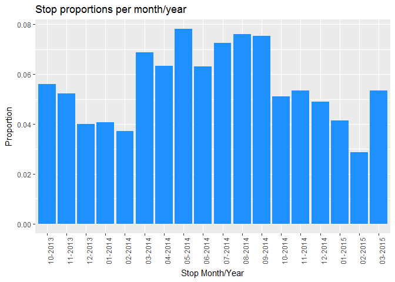
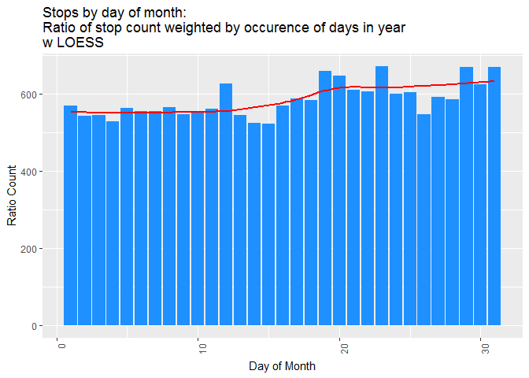
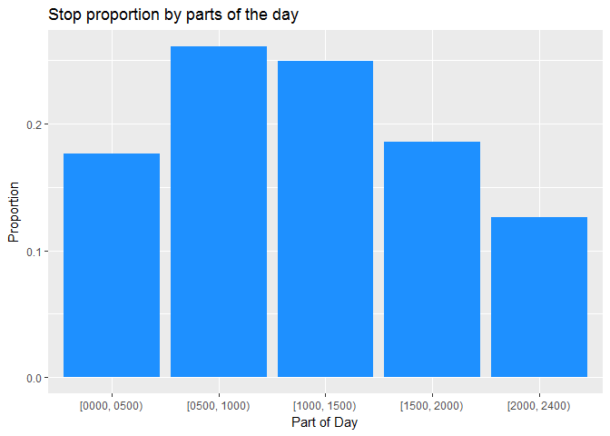
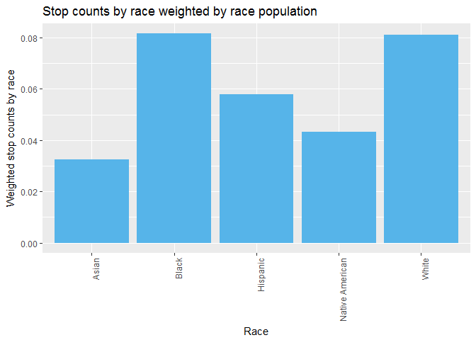
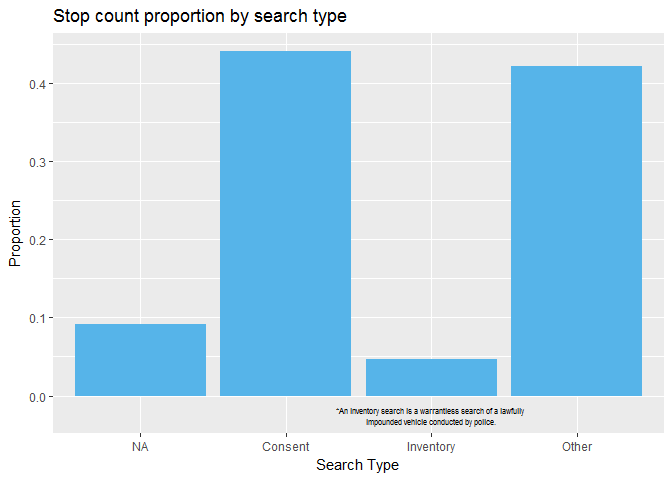

Set-Up:
-------

Required packages:

``` r
library(ggplot2)
library(dplyr)
library(tidyr)
library(lubridate)
library(plyr)
library(ggpubr)
library(gridExtra)
```

Reading in wrangled datasets:

``` r
df_clean <- read.csv("E:/Learning/Springboard Intro to Data Science/capstone/CT_cleaned_edit.csv")
df_split <- read.csv("E:/Learning/Springboard Intro to Data Science/capstone/CT_cleaned_split.csv")
```

Reading in external data sources and changing variable types/names:

``` r
census <- read.csv("E:/Learning/Springboard Intro to Data Science/capstone/cc-est2016-alldata-09.csv")
census$COUNTY <- as.integer(census$COUNTY + 9000)
names(census)[3] <- "county_fips"
```

Only want Census Bureau numbers from 2014, since it's the only full year in our dataset and can't get partial year information for 2013 & 2015 to average everything out and match to dataset time period. AGRP == 0 has summary information on all ages so also need to filter on that criteria.

``` r
census <- census %>% filter(YEAR == 7)
census_county <- census %>% filter(AGEGRP == 0)
```

Making smaller summarized datasets to be used later in weighted calculations:

``` r
df_county <- left_join(df_clean, census_county, by = "county_fips")
census_agegrp <- census %>% group_by(AGEGRP) %>% dplyr::summarise_at(vars(TOT_POP:HNAC_FEMALE), sum)
census_whole_state <- census %>% filter(AGEGRP == 0) %>% group_by(STATE, STNAME) %>% dplyr::summarise_at(vars(TOT_POP:HNAC_FEMALE), sum)
```

Saving a theme often re-used for x-axis text readability:

``` r
theme1 <- theme(axis.text.x=element_text(angle=90, hjust=1))
```

Univariate plots:
-----------------

#### stop\_date

Making date variables the correct variable type as well as creating a summary table of police stops per date:

``` r
df_clean$stop_date <- as.POSIXct(df_clean$stop_date, "%Y-%m-%d", tz = "America/New_York")
df_stop_date <- setNames(data.frame(table(df_clean$stop_date)),c("Stop.Date","Count"))
df_stop_date$Stop.Date <- as.POSIXct(df_stop_date$Stop.Date, "%Y-%m-%d", tz = "America/New_York")
```

``` r
ggplot(df_stop_date, aes(x = Stop.Date, y = Count, group = 1)) + 
  geom_line(color = "#1E90FF") +
  geom_smooth(se = FALSE, color = "red") +
  scale_x_datetime(date_breaks = "1 month", date_labels = "%m/%Y") +
  theme1 +
  labs(title = "Police stops per day (10/1/2013 - 03/31/2015)", x = "Stop Date")
```

 <br />Observations:

-   There are a low number of stops during the winter months (02/2014 and 02/2015) and a higher number of stops during the summer months (05/2014 and 07/2014).

Looking at stops over time using month/year, instead, provides a less cluttered view, yet still shows the important high/low trends. <br />Making a month/year variable:

``` r
mo_yr_label <- seq(as.Date("2013/10/1"), as.Date("2015/3/31"), by = "month")
mo_yr_label <- format(mo_yr_label, "%m-%Y")
df_clean$month_year <- format(df_clean$stop_date, "%m-%Y")
df_clean$month_year <- factor(df_clean$month_year,
                              ordered = TRUE,
                              levels = mo_yr_label)
```

``` r
ggplot(df_clean, aes(month_year)) + 
  geom_bar(fill = "#1E90FF") + 
  theme1 + 
  labs(title = "Stops per month/year", x = "Stop Month/Year")
```

 <br />As a proportion:

``` r
ggplot(df_clean, aes(month_year, ..prop.., group = 1)) + 
  geom_bar(fill = "#1E90FF") + 
  theme1 + 
  labs(title = "Stop proportions per month/year", x = "Stop Month/Year", y = "Proportion")
```



#### day\_of\_month

Since not all days are present in every month (ex. 31) and there are not complete calendar years in the datatset, we need to weight each day by it's number of occurrences in the dataset.

Creating day\_of\_month variable and the summary tables needed to weight:

``` r
a <- c("01", "02", "03", "04", "05", "06", "07", "08", "09")
b <- as.character(10:31)
days_label <- c(a, b)
df_clean$day_of_month <- format(df_clean$stop_date, "%d")
df_clean$day_of_month <- factor(df_clean$day_of_month,
                              ordered = TRUE,
                              levels = days_label)
days_prop <- c(rep(c(18,16), times = c(28, 2)), 11)
days_df <- setNames(data.frame(factor(days_label, levels = days_label), days_prop), c("day", "occurrence"))
table_days <- setNames(data.frame(table(df_clean$day_of_month)),c("day", "count"))
table_days$count <- as.numeric(table_days$count)
days_df <- left_join(table_days, days_df, by = "day")
days_df <- days_df %>% mutate(day_prop = count/occurrence)
```

``` r
ggplot(days_df, aes(as.numeric(day), day_prop)) + 
  geom_bar(stat = "identity", fill = "#1E90FF") + 
  geom_smooth(se = FALSE, color = "red") + 
  theme1 +
  labs(title = "Stops by day of month: \nRatio of stop count weighted by occurence of days in year \nw LOESS", x = "Day of Month", y = "Ratio Count")
```

 <br />Observations:

-   With the LOESS model, we can clearly see that the number of police stops increases towards the end of the month.

#### day\_of\_week

Creating day\_of\_week variable:

``` r
df_clean$day_of_week <- weekdays(df_clean$stop_date)
df_clean$day_of_week <- factor(df_clean$day_of_week, levels = c("Sunday", "Monday", "Tuesday", "Wednesday", "Thursday", "Friday", "Saturday"))
```

``` r
ggplot(df_clean, aes(day_of_week, ..prop.., group = 1)) + 
  geom_bar(fill = "#1E90FF") +
  theme1 +
  labs(title = "Stop proportions by day of week", x = "Day of Week", y = "Proportion")
```

 <br />Observations:

-   More traffic stops seem to occur at the end of the week (Friday and Saturday), with the least amount of stops happening on Sunday.

#### stop\_time

Simplifying time visualizations by plotting only hours instead of hours and minutes. Also, making 0:00 NA because during the data wrangling stage, made NA times 0:00 and only want to use recorded data in exploratory analysis.

``` r
df_clean$stop_time_hour <- df_clean$stop_time
df_clean$stop_time_hour[df_clean$stop_time_hour == "0:00"] <- NA
df_clean$stop_time_hour <- sub(":.*", "", df_clean$stop_time_hour)
df_clean$stop_time_hour <- factor(df_clean$stop_time_hour, 
                                  ordered = TRUE,
                                  levels = as.character(0:23))
df_clean$stop_time_hour_numeric <- as.numeric(df_clean$stop_time_hour) - 1
```

``` r
ggplot(df_clean %>% filter(is.na(stop_time_hour) != TRUE), aes(stop_time_hour, ..prop.., group = 1)) + 
  geom_bar(fill = "#1E90FF") +
  labs(title = "Stop times (hour) by proportion", x = "Stop Time (Hour)", y = "Proportion")
```

 <br />Observations:

-    Low number of stops from 0300 - 0500, while the highest number of stops occur between 0900 and 1000

Breaking up hours into roughly even times of day, creating a parts of day variable:

``` r
df_clean$stop_hour_part_of_day2 <- vector(mode = "character", length = nrow(df_clean))
df_clean$stop_hour_part_of_day2[df_clean$stop_time_hour_numeric >= 0 & df_clean$stop_time_hour_numeric < 5] <- "[0000, 0500)"
df_clean$stop_hour_part_of_day2[df_clean$stop_time_hour_numeric >= 5 & df_clean$stop_time_hour_numeric < 10] <- "[0500, 1000)"
df_clean$stop_hour_part_of_day2[df_clean$stop_time_hour_numeric >= 10 & df_clean$stop_time_hour_numeric < 15] <- "[1000, 1500)"
df_clean$stop_hour_part_of_day2[df_clean$stop_time_hour_numeric >= 15 & df_clean$stop_time_hour_numeric < 20] <- "[1500, 2000)"
df_clean$stop_hour_part_of_day2[df_clean$stop_time_hour_numeric >= 20 & df_clean$stop_time_hour_numeric <= 23] <- "[2000, 2400)"
df_clean$stop_hour_part_of_day2 <- factor(df_clean$stop_hour_part_of_day2,
                                         ordered = TRUE,
                                         levels = c("[0000, 0500)", "[0500, 1000)", "[1000, 1500)", "[1500, 2000)", "[2000, 2400)"))
```

``` r
ggplot(df_clean %>% filter(is.na(stop_time_hour) != TRUE), aes(stop_hour_part_of_day2, ..prop.., group = 1)) + 
  geom_bar(fill = "#1E90FF") +
  labs(title = "Stop proportion by parts of the day", x = "Part of Day", y = "Proportion")
```


When split up by day of week, get more interesting details.

``` r
ggplot(df_clean %>% filter(is.na(stop_time_hour) != TRUE), aes(day_of_week, ..count../sum(..count..))) + 
  geom_bar(fill = "#1E90FF") +
  facet_grid(stop_hour_part_of_day2 ~ .) +
  theme(strip.text.y = element_text(angle = 45)) +
  labs(title = "Stop proportion by parts of the day and day of the week", x = "Day of Week", y = "Proportion")
```

 <br />Observations:

-   Here, we see that early hours of the morning (000-0500) as well as evening hours (2000-2400) have more stops on the weekend
-   During the day (0500-1500), more stops happen during the work week
-   Stops between 1500- 2000 increase on Thursday through Saturday

#### county\_name

``` r
ggplot(df_clean %>%  filter(county_name != ""), aes(county_name)) + 
  geom_bar(fill = "#1E90FF") +
  theme1 +
  labs(title = "Stop count by county", x = "County")
```


Because the populations in each county might not be equal, to get an accurate perspective of the counties with a disproportionate number of stops, we need to weight the nubmer of stops in each county by the US Census Bureaus' 2014 county populations. <br />Creating summary tables to weight:

``` r
df_county_small <- df_county[, c(which(colnames(df_county) == "county_name"), 
                                 which(colnames(df_county) == "county_fips"), 
                                 which(colnames(df_county) == "TOT_POP"):which(colnames(df_county) == "HNAC_FEMALE"))]
df_county_small <- df_county_small %>% group_by(county_fips) %>% dplyr::mutate(count = n(), count_prop = count / TOT_POP) %>% distinct(county_fips, .keep_all = TRUE)
```

``` r
ggplot(df_county_small %>% filter(is.na(county_fips) != TRUE), aes(county_name, count_prop)) + 
  geom_bar(stat = "identity", fill = "#1E90FF") +
  theme1 +
  labs(title = "Stops per county, weighted by county population", x = "County", y = "Counts weighted by Population")
```

 <br />Observations:

-   Fairfield and Hartford has the lowest stop likelihood for its population, while Tolland has the highest

#### driver\_gender

Proportion of gender in dataset:

``` r
ggplot(df_clean, aes(driver_gender, ..prop.., group = 1)) +  
  geom_bar(fill = "#1E90FF") +
  labs(title = "Stop proportion by gender", x = "Gender", y = "Proportion of Stop Count") +
  scale_x_discrete(labels = c("Female", "Male"))
```


However, to get an accurate understanding of the effects of gender of the likelihood of a driver being stopped, we need to weight by the Census population again. <br />Creating a summary table with weighted data:

``` r
gender_pop <- gather(census_whole_state[,4:5], Gender, pop)
gender_pop$Gender[gender_pop$Gender == "TOT_MALE"] <- "M"
gender_pop$Gender[gender_pop$Gender == "TOT_FEMALE"] <- "F"
gender_pop$Gender <- as.factor(gender_pop$Gender)
gender_prop <- setNames(data.frame(table(df_clean$driver_gender, exclude = NULL)), c("Gender", "count")) 
gender_prop <- left_join(gender_prop, gender_pop, by = "Gender") %>%  mutate(gender_prop = count/pop)
```

``` r
ggplot(gender_prop, aes(Gender, gender_prop)) +
  geom_bar(stat = "identity", fill = "#1E90FF") +
  labs(title = "Weighted stop count by population total", y = "Stop Count/ Gender Population") +
  scale_x_discrete(labels = c("Female", "Male"))
```

 <br />Observations:

-   The stop ratio (stops/population) of men is higher; about 12% of the male population (could be repeat offenders) is stopped while only less than 6% of the female population is stopped, indicating men are more likely to be stopped.

#### driver\_age

Creating summary table of stops by ages:

``` r
table_age <- setNames(data.frame(table(df_clean$driver_age, exclude = NULL)),c("age", "count"))
table_age <- table_age %>% mutate(count_prop = count/ sum(count))
```

``` r
x_breaks <- seq(min(df_clean$driver_age[is.na(df_clean$driver_age) != TRUE]), max(df_clean$driver_age[is.na(df_clean$driver_age) != TRUE]) + 5, 5)
ggplot(table_age %>%  filter(is.na(age) != TRUE), aes(age, count_prop)) + 
  geom_bar(stat = "identity", fill = "#56B4E9") + 
  theme1 + 
  labs(title = "Stop count proportion by driver age", x = "Age", y = "Proportion") +
  annotate("text", x = 50, y = .035, label = "* ages < 15 and >= 80 have been made NA.", size = 3, color = "#696969")
```


<br />Creating age buckets to match the US Census dataset and a summary table to do weighting by Connecticut age population in 2014:

``` r
age_df <- df_clean %>% select(driver_age) %>% group_by(driver_age) %>% dplyr::mutate(count = n()) %>% distinct(driver_age, .keep_all = TRUE)
age_df <- age_df %>% arrange(driver_age)
age_df$AGEGRP <- vector(mode="character", length = nrow(age_df))
age_df$AGEGRP[age_df$driver_age >= 15 & age_df$driver_age <= 19] <- 4
age_df$AGEGRP[age_df$driver_age >= 20 & age_df$driver_age <= 24] <- 5
age_df$AGEGRP[age_df$driver_age >= 25 & age_df$driver_age <= 29] <- 6
age_df$AGEGRP[age_df$driver_age >= 30 & age_df$driver_age <= 34] <- 7
age_df$AGEGRP[age_df$driver_age >= 35 & age_df$driver_age <= 39] <- 8
age_df$AGEGRP[age_df$driver_age >= 40 & age_df$driver_age <= 44] <- 9
age_df$AGEGRP[age_df$driver_age >= 45 & age_df$driver_age <= 49] <- 10
age_df$AGEGRP[age_df$driver_age >= 50 & age_df$driver_age <= 54] <- 11
age_df$AGEGRP[age_df$driver_age >= 55 & age_df$driver_age <= 59] <- 12
age_df$AGEGRP[age_df$driver_age >= 60 & age_df$driver_age <= 64] <- 13
age_df$AGEGRP[age_df$driver_age >= 65 & age_df$driver_age <= 69] <- 14
age_df$AGEGRP[age_df$driver_age >= 70 & age_df$driver_age <= 74] <- 15
age_df$AGEGRP[age_df$driver_age >= 75 & age_df$driver_age <= 79] <- 16
age_grp_df <- age_df %>% group_by(AGEGRP) %>% dplyr::mutate(count2 = sum(count)) %>% distinct(AGEGRP, .keep_all = TRUE)
age_grp_df$AGEGRP <- as.integer(age_grp_df$AGEGRP)
census_agegrp_small <- census_agegrp %>% select(1:2)
age_grp_df <- left_join(age_grp_df, census_agegrp_small, by = "AGEGRP")
age_grp_df <- age_grp_df %>% mutate(prop_to_pop = count2/TOT_POP)
```

``` r
ggplot(age_grp_df %>% filter(AGEGRP != ""), aes(AGEGRP, prop_to_pop)) +
  geom_bar(stat = "identity", fill = "#56B4E9") +
  labs(title = "Stop counts by age group weighted by \ntotal age group population", x = "Age Group", y = "Age group stop count/ age group population") +
  scale_x_continuous(breaks = 4:16, labels = c("15-19", "20-24", "25-29", "30-34", "35-39", "40-44", "45-49", "50-54", "55-59", "60-64", "65-69", "70-74", "75-79"))
```

 <br />Observations:

-   Ages 20-29 have the most stops for its population
-   In general, the age proportion distribution follows a positive skew bell curve

#### driver\_race\_raw

``` r
ggplot(df_clean, aes(driver_race_raw, ..prop.., group = 1)) + 
  geom_bar(fill = "#56B4E9") +
  labs(title = "Stop count proportion by driver race", x = "Race")
```


Here, we see that white people account for most of the stops by a large margin, taking up about 75% of the total. However, when we weight according to Connecticut race populations, our understanding changes. <br />Mapping the race groups in the dataset to the race population in the Census dataset as well as creating summary tables of weights:

``` r
census_race <- census_whole_state %>% select(1:5, 
                                             BAC_MALE, BAC_FEMALE, 
                                             WAC_MALE, WAC_FEMALE, 
                                             H_MALE, H_FEMALE, 
                                             IAC_MALE,IAC_FEMALE, 
                                             AAC_MALE, AAC_FEMALE) %>% 
                                      dplyr::mutate(Black = BAC_MALE + BAC_FEMALE, 
                                                    White = WAC_MALE + WAC_FEMALE,
                                                    Hispanic = H_MALE + H_FEMALE,
                                                    NativeAmerican = IAC_MALE + IAC_FEMALE,
                                                    Asian = AAC_MALE + AAC_FEMALE)
census_race <- census_race %>% select(-c(6:15))
race_cols <- colnames(census_race)[6:10]
census_race <- data.frame(t(census_race[,-(1:5)])) # removing non-race columns
census_race$race <- race_cols
census_race <- arrange(census_race, race)
table_race <- setNames(data.frame(table(df_clean$driver_race_raw)),c("race", "count"))
table_race <- bind_cols(table_race, census_race)
temp_name <- colnames(table_race)
temp_name[3] <- "total_pop" #rename weird column
colnames(table_race) <- temp_name
table_race <- table_race %>% mutate(pop_prop = count/total_pop)
```

``` r
ggplot(table_race, aes(race, pop_prop)) + 
  geom_bar(stat = "identity", fill = "#56B4E9") +
  theme1 +
  labs(title = "Stop counts by race weighted by race population", x = "Race", y = "Weighted stop counts by race")
```

 <br />Observations:

-   Blacks and whites have the highest ratios of stops for their respective populations
-   When just looking at the proportion of each race to the number of stops in the dataset, Black people only made up less than 15%.
-   Asians have the lowest ratio of stops/population

#### search\_conducted

``` r
ggplot(df_clean, aes(search_conducted, ..prop.., group = 1)) + 
  geom_bar(fill = "#56B4E9") +
  labs(title = "Stop count proportion by searches conducted", x = "Search Conducted") +
  annotate("text", x = 2.3, y = .97, label = "*Vehicle searches", size = 3, color = "#696969")
```

 <br />Observations:

-   Most stops did not result in a search, ~1.7% did.

#### search\_type\_raw

``` r
ggplot(df_clean %>% filter(df_clean$search_conducted == TRUE & df_clean$search_type_raw != ""), aes(search_type_raw, ..prop.., group = 1)) + 
  geom_bar(fill = "#56B4E9") +
  annotate("text", x = 2, y = -.025, label = "*An inventory search is a warrantless search of a lawfully \nimpounded vehicle conducted by police.", size = 2) +
  labs(title = "Stop count proportion by search type", x = "Search Type")
```

 <br />Observations:

-   Of those stops where a search was conducted and we have information on the search type, Consent and Other are the two top search types with inventory coming in a very far third

#### contraband\_found

``` r
ggplot(df_clean %>% filter(search_conducted == TRUE), aes(contraband_found, ..prop.., group = 1)) + 
  geom_bar(fill = "#56B4E9") +
  labs(title = "Search count proportion by contraband found status", x = "Contraband Found")
```

 <br />Observations:

-   Of those stops where a search was conducted, ~ 34.1% of the stops resulted in contraband being found.

#### stop\_outcome

``` r
ggplot(df_clean %>% filter(is.na(stop_outcome) != TRUE), aes(stop_outcome, ..prop.., group = 1)) + 
  geom_bar(fill = "#56B4E9") +
  labs(title = "Stop count proportion by stop outcome", x = "Stop Outcome", y = "Stop Proportion")
```

 <br />Observations:

-   Most stops end in ticket (~ 70%)
-   Verbal warning comes in a far second

#### is\_arrested

``` r
ggplot(df_clean %>% filter(is_arrested != ""), aes(is_arrested, ..prop.., group = 1)) + 
  geom_bar(fill = "#56B4E9") +
  labs(title = "Stop count proportion by arrested status", x = "Is Arrested", y = "Count Proportion")
```

 <br />Observations:

-   Most stops don’t end in an arrest with 2.3% of stops ending in arrests

#### officer\_id

Because there are a lot of officers and the visualization can get quite cluttered and overwhelming, We'll be looking at the top stopping officers. <br />Creating a table with the top 50 stopping officers:

``` r
officer_stops <- setNames(data.frame(table(df_clean$officer_id)), c("officer", "count"))
officer_stops <- officer_stops %>% arrange(desc(count))
officer_stops <- officer_stops %>% mutate(stop_prop = count/ sum(count))
top_50 <- head(officer_stops, 50)
```

``` r
ggplot(top_50, aes(reorder(officer, -stop_prop), stop_prop)) + 
  geom_col(fill = "#56B4E9") + 
  theme1 +
  labs(title = "Stop proportion per officer (top 50)", x = "Officer ID", y = "Proportion")
```


Bucketing up the number of stops per officer, we can see a distribution of the number of stops state police officers conducted over the 2 year dataset period.

``` r
officer_plot3 <- ggplot(officer_stops, aes(count)) + geom_histogram(binwidth = 50)
plt_officer_plot3 <- ggplot_build(officer_plot3)
officer_plot_x_labs3 <- plt_officer_plot3$data[[1]]$x
ggplot(officer_stops, aes(count, ..count../sum(..count..))) + 
  geom_histogram(binwidth = 50, fill = "#191970") +
  scale_x_continuous(breaks = officer_plot_x_labs3, labels = as.character(officer_plot_x_labs3)) + 
  theme1 +
  labs(title = "Proportion of total officers per stop count", x = "# of stops", y = "% of officers") +
  scale_y_continuous(labels = scales::percent)
```


