Set-Up:
-------

Required packages:

``` r
library(ggplot2)
library(dplyr)
library(tidyr)
library(lubridate)
library(plyr)
library(ggpubr)
library(gridExtra)
```

Reading in wrangled datasets:

``` r
df_clean <- read.csv("E:/Learning/Springboard Intro to Data Science/capstone/CT_cleaned_edit.csv")
df_split <- read.csv("E:/Learning/Springboard Intro to Data Science/capstone/CT_cleaned_split.csv")
```

Reading in external data sources and changing variable types/names: <br />Here, the COUNTY variable doesn't have the full FIP, only the right-end number, so we need to add 9000 to create it.

``` r
census <- read.csv("E:/Learning/Springboard Intro to Data Science/capstone/cc-est2016-alldata-09.csv")
census$COUNTY <- as.integer(census$COUNTY + 9000)
names(census)[3] <- "county_fips"
```

We only want Census Bureau numbers from 2014 (YEAR == 7), since it's the only full year in our dataset and we can't get partial year information for 2013 & 2015 to average everything out and match to our dataset time period. AGEGRP == 0 contains summary information across all ages so we also need to filter on that criteria.

``` r
census <- census %>% filter(YEAR == 7)
census_county <- census %>% filter(AGEGRP == 0)
```

Making grouped and summarized datasets from the census dataframe to be used later in weighted calculations:

``` r
df_county <- left_join(df_clean, census_county, by = "county_fips")
census_agegrp <- census %>% group_by(AGEGRP) %>% dplyr::summarise_at(vars(TOT_POP:HNAC_FEMALE), sum)
census_whole_state <- census %>% filter(AGEGRP == 0) %>% group_by(STATE, STNAME) %>% dplyr::summarise_at(vars(TOT_POP:HNAC_FEMALE), sum)
```

To allow for reusability and text readability, we save a common theme:

``` r
theme1 <- theme(axis.text.x=element_text(angle=90, hjust=1))
```

Univariate plots:
-----------------

#### stop\_date

Making date variables the correct variable type as well as creating a summary table of police stops per date to visualize:

``` r
df_clean$stop_date <- as.POSIXct(df_clean$stop_date, "%Y-%m-%d", tz = "America/New_York")
df_stop_date <- setNames(data.frame(table(df_clean$stop_date)),c("Stop.Date","Count"))
df_stop_date$Stop.Date <- as.POSIXct(df_stop_date$Stop.Date, "%Y-%m-%d", tz = "America/New_York")
```

``` r
p1 <- ggplot(df_stop_date, aes(x = Stop.Date, y = Count, group = 1)) + 
  geom_line(color = "#1E90FF") +
  geom_smooth(se = FALSE, color = "red") +
  scale_x_datetime(date_breaks = "1 month", date_labels = "%m/%Y") +
  theme1 +
  labs(title = "Police stops per day (10/1/2013 - 03/31/2015)", x = "Stop Date")
print(p1)
```

 <br />Observations:

-   There are a low number of stops during the winter months (02/2014 and 02/2015) and a higher number of stops during the summer months (05/2014 and 07/2014).

Looking at stops over time using month/year provides a less cluttered view, yet still shows the important high/low trends. <br />Making a month/year variable:

``` r
mo_yr_label <- seq(as.Date("2013/10/1"), as.Date("2015/3/31"), by = "month")
mo_yr_label <- format(mo_yr_label, "%m-%Y")
df_clean$month_year <- format(df_clean$stop_date, "%m-%Y")
df_clean$month_year <- factor(df_clean$month_year,
                              ordered = TRUE,
                              levels = mo_yr_label)
```

``` r
ggplot(df_clean, aes(month_year)) + 
  geom_bar(fill = "#1E90FF") + 
  theme1 + 
  labs(title = "Stops per month/year", x = "Stop Month/Year")
```

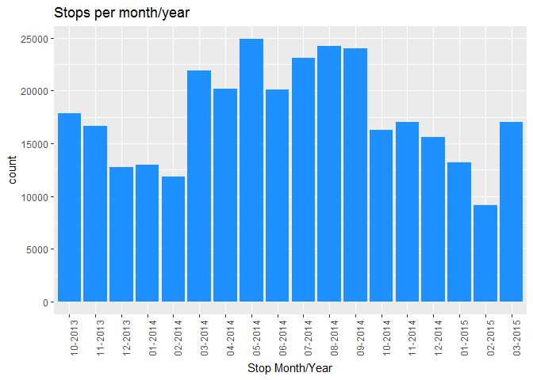 <br />As a proportion:

``` r
ggplot(df_clean, aes(month_year, ..prop.., group = 1)) + 
  geom_bar(fill = "#1E90FF") + 
  theme1 + 
  labs(title = "Stop proportions per month/year", x = "Stop Month/Year", y = "Proportion")
```


#### day\_of\_month

Since not all days are present in every month (ex. 31) and there are not complete calendar years in the datatset, we need to weight each day by its number of occurrences in the dataset.

Creating day\_of\_month variable and the summary tables needed to weight:

``` r
a <- c("01", "02", "03", "04", "05", "06", "07", "08", "09")
b <- as.character(10:31)
days_label <- c(a, b)
df_clean$day_of_month <- format(df_clean$stop_date, "%d")
df_clean$day_of_month <- factor(df_clean$day_of_month,
                              ordered = TRUE,
                              levels = days_label)
days_prop <- c(rep(c(18,16), times = c(28, 2)), 11)
days_df <- setNames(data.frame(factor(days_label, levels = days_label), days_prop), c("day", "occurrence"))
table_days <- setNames(data.frame(table(df_clean$day_of_month)),c("day", "count"))
table_days$count <- as.numeric(table_days$count)
days_df <- left_join(table_days, days_df, by = "day")
days_df <- days_df %>% mutate(day_prop = count/occurrence)
```

``` r
ggplot(days_df, aes(as.numeric(day), day_prop)) + 
  geom_bar(stat = "identity", fill = "#1E90FF") + 
  geom_smooth(se = FALSE, color = "red") + 
  theme1 +
  labs(title = "Stops by day of month: \nRatio of stop count weighted by occurence of days in year \nw LOESS", x = "Day of Month", y = "Ratio Count")
```

 <br />Observations:

-   With the LOESS model, we can clearly see that the number of police stops increases towards the end of the month.

#### day\_of\_week

Creating day\_of\_week variable:

``` r
df_clean$day_of_week <- weekdays(df_clean$stop_date)
df_clean$day_of_week <- factor(df_clean$day_of_week, levels = c("Sunday", "Monday", "Tuesday", "Wednesday", "Thursday", "Friday", "Saturday"))
```

``` r
ggplot(df_clean, aes(day_of_week, ..prop.., group = 1)) + 
  geom_bar(fill = "#1E90FF") +
  theme1 +
  labs(title = "Stop proportions by day of week", x = "Day of Week", y = "Proportion")
```

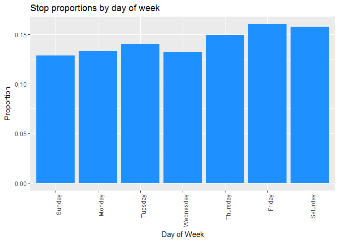 <br />Observations:

-   More traffic stops seem to occur at the end of the week (Friday and Saturday), with the least amount of stops happening on Sunday.

#### stop\_time

To understand stop time information better, we simplify its visualizations by plotting only hours instead of hours and minutes. We also set 0:00 to NA because during the data wrangling stage, we made times with a value NA, 0:00 and for exploratory analysis, we only want to investigate recorded data. Additionally, as we can see below, the NAs are dispersed across stop dates so excluding them does not skew results.

``` r
df_clean$stop_time_hour <- df_clean$stop_time
df_clean$stop_time_hour[df_clean$stop_time_hour == "0:00"] <- NA
df_clean$stop_time_hour <- sub(":.*", "", df_clean$stop_time_hour)
df_clean$stop_time_hour <- factor(df_clean$stop_time_hour, 
                                  ordered = TRUE,
                                  levels = as.character(0:23))
df_clean$stop_time_hour_numeric <- as.numeric(df_clean$stop_time_hour) - 1
```

``` r
ggplot(df_clean %>% filter(is.na(stop_time_hour) == TRUE), aes(stop_date)) + 
  geom_bar(fill = "#1E90FF") +
  labs(title = "NAs by stop date", x = "Stop Date")
```

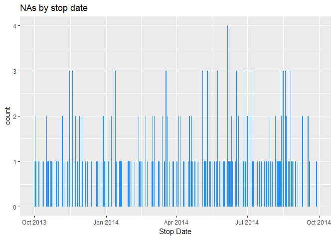

``` r
ggplot(df_clean %>% filter(is.na(stop_time_hour) != TRUE), aes(stop_time_hour, ..prop.., group = 1)) + 
  geom_bar(fill = "#1E90FF") +
  labs(title = "Stop times (hour) by proportion", x = "Stop Time (Hour)", y = "Proportion")
```

 <br />Observations:

-   There are a low number of stops from 0300 - 0500, with the highest number of stops occurring between 0900 and 1000.

To see if there are trends for certain times of the day, we break up hours into roughly even times of day, creating a parts of day variable:

``` r
df_clean$stop_hour_part_of_day2 <- vector(mode = "character", length = nrow(df_clean))
df_clean$stop_hour_part_of_day2[df_clean$stop_time_hour_numeric >= 0 & df_clean$stop_time_hour_numeric < 5] <- "[0000, 0500)"
df_clean$stop_hour_part_of_day2[df_clean$stop_time_hour_numeric >= 5 & df_clean$stop_time_hour_numeric < 10] <- "[0500, 1000)"
df_clean$stop_hour_part_of_day2[df_clean$stop_time_hour_numeric >= 10 & df_clean$stop_time_hour_numeric < 15] <- "[1000, 1500)"
df_clean$stop_hour_part_of_day2[df_clean$stop_time_hour_numeric >= 15 & df_clean$stop_time_hour_numeric < 20] <- "[1500, 2000)"
df_clean$stop_hour_part_of_day2[df_clean$stop_time_hour_numeric >= 20 & df_clean$stop_time_hour_numeric <= 23] <- "[2000, 2400)"
df_clean$stop_hour_part_of_day2 <- factor(df_clean$stop_hour_part_of_day2,
                                         ordered = TRUE,
                                         levels = c("[0000, 0500)", "[0500, 1000)", "[1000, 1500)", "[1500, 2000)", "[2000, 2400)"))
```

``` r
ggplot(df_clean %>% filter(is.na(stop_time_hour) != TRUE), aes(stop_hour_part_of_day2, ..prop.., group = 1)) + 
  geom_bar(fill = "#1E90FF") +
  labs(title = "Stop proportion by parts of the day", x = "Part of Day", y = "Proportion")
```


Parts of the day roughly aligns to the trends observed in the stop time plot, however, when split up further by day of the week, we see more interesting details:

``` r
ggplot(df_clean %>% filter(is.na(stop_time_hour) != TRUE), aes(day_of_week, ..count../sum(..count..))) + 
  geom_bar(fill = "#1E90FF") +
  facet_grid(stop_hour_part_of_day2 ~ .) +
  theme(strip.text.y = element_text(angle = 45)) +
  labs(title = "Stop proportion by parts of the day and day of the week", x = "Day of Week", y = "Proportion")
```

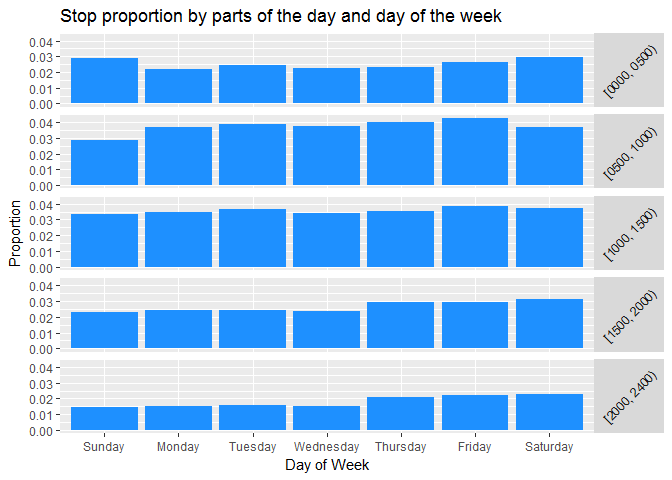 <br />Observations:

-   Here, we see that early hours of the morning (0000-0500) and late hours of the night (2000-2400) have more stops on the weekend.
-   During the day (0500-1500), more stops happen during the work week.
-   Stops between 1500- 2000, or evening hours, increase on Thursday through Saturday, or towards the end of the week.

#### county\_name

Looking at stop counts by county:

``` r
ggplot(df_clean %>%  filter(county_name != ""), aes(county_name)) + 
  geom_bar(fill = "#1E90FF") +
  theme1 +
  labs(title = "Stop count by county", x = "County")
```


Because the populations in each county might not be equal, just comparing raw counts might show an inaccurate picture of the likelihood of stops per county. Therefore, we need to weight the number of stops in each county by the US Census Bureaus' 2014 county populations. <br />Creating county stop summary table, weighted by the Census county populations:

``` r
df_county_small <- df_county[, c(which(colnames(df_county) == "county_name"), 
                                 which(colnames(df_county) == "county_fips"), 
                                 which(colnames(df_county) == "TOT_POP"):which(colnames(df_county) == "HNAC_FEMALE"))]
df_county_small <- df_county_small %>% group_by(county_fips) %>% dplyr::mutate(count = n(), count_prop = count / TOT_POP) %>% distinct(county_fips, .keep_all = TRUE)
```

``` r
ggplot(df_county_small %>% filter(is.na(county_fips) != TRUE), aes(county_name, count_prop)) + 
  geom_bar(stat = "identity", fill = "#1E90FF") +
  theme1 +
  labs(title = "Stops per county, weighted by county population", x = "County", y = "Counts weighted by Population")
```

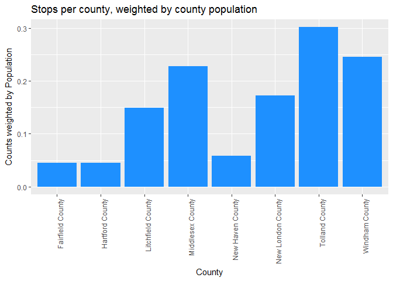 <br />Observations:

-   Fairfield and Hartford has the lowest stop likelihood for its population, while Tolland has the highest.
-   New Haven has one of the lowest stop likelihoods despite having the highest stop count.

#### driver\_gender

Proportion of stops split by driver's gender:

``` r
ggplot(df_clean, aes(driver_gender, ..prop.., group = 1)) +  
  geom_bar(fill = "#1E90FF") +
  labs(title = "Stop proportion by gender", x = "Gender", y = "Proportion of Stop Count") +
  scale_x_discrete(labels = c("Female", "Male"))
```

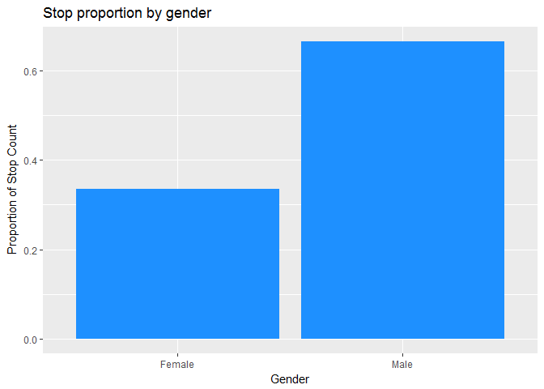

Overall, during the time period of our dataset, more males are stopped. However, to get an accurate understanding of the effects of gender on the likelihood of being stopped, we need to again weight the counts by the Census population. <br />Reshaping the Census dataset to create gender weights and making a gender stop summary table utilizing it:

``` r
gender_pop <- gather(census_whole_state[,4:5], Gender, pop)
gender_pop$Gender[gender_pop$Gender == "TOT_MALE"] <- "M"
gender_pop$Gender[gender_pop$Gender == "TOT_FEMALE"] <- "F"
gender_pop$Gender <- as.factor(gender_pop$Gender)
gender_prop <- setNames(data.frame(table(df_clean$driver_gender, exclude = NULL)), c("Gender", "count")) 
gender_prop <- left_join(gender_prop, gender_pop, by = "Gender") %>%  mutate(gender_prop = count/pop)
```

``` r
ggplot(gender_prop, aes(Gender, gender_prop)) +
  geom_bar(stat = "identity", fill = "#1E90FF") +
  labs(title = "Weighted stop count by population total", y = "Stop Count/ Gender Population") +
  scale_x_discrete(labels = c("Female", "Male"))
```

 <br />Observations:

-   The stop ratio (stops/population) of men is higher; about 12% of the male population (could be repeat offenders) is stopped while less than 6% of the female population is stopped, indicating men are more likely to be stopped. So, not only are men stopped more frequently, they are more likely to be stopped.

#### driver\_age

For the driver age variable, ages below 15 and 80 and older were made NA because it can be reasonably assumed those ages were recorded in error. This is because, it is illegal for people under 15 to drive and the bumps in stop counts for people 80 and older hints at older ages being used in error. <br />Creating summary table of stops by age:

``` r
table_age <- setNames(data.frame(table(df_clean$driver_age, exclude = NULL)),c("age", "count"))
table_age <- table_age %>% mutate(count_prop = count/ sum(count))
```

``` r
x_breaks <- seq(min(df_clean$driver_age[is.na(df_clean$driver_age) != TRUE]), max(df_clean$driver_age[is.na(df_clean$driver_age) != TRUE]) + 5, 5)
ggplot(table_age %>%  filter(is.na(age) != TRUE), aes(age, count_prop)) + 
  geom_bar(stat = "identity", fill = "#56B4E9") + 
  theme1 + 
  labs(title = "Stop count proportion by driver age", x = "Age", y = "Proportion") +
  annotate("text", x = 50, y = .035, label = "* ages < 15 and >= 80 have been made NA.", size = 3, color = "#696969")
```

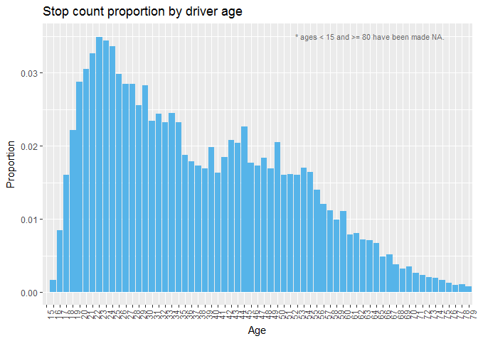

<br />The US Census dataset doesn't have population by age, but instead has population by age group. In order to weight by population, we therefore need to create a column in our dataframe with matching age groups. From that, we can create a stop summary table, weighted and grouped by age:

``` r
age_df <- df_clean %>% select(driver_age) %>% group_by(driver_age) %>% dplyr::mutate(count = n()) %>% distinct(driver_age, .keep_all = TRUE)
age_df <- age_df %>% arrange(driver_age)
age_df$AGEGRP <- vector(mode="character", length = nrow(age_df))
age_df$AGEGRP[age_df$driver_age >= 15 & age_df$driver_age <= 19] <- 4
age_df$AGEGRP[age_df$driver_age >= 20 & age_df$driver_age <= 24] <- 5
age_df$AGEGRP[age_df$driver_age >= 25 & age_df$driver_age <= 29] <- 6
age_df$AGEGRP[age_df$driver_age >= 30 & age_df$driver_age <= 34] <- 7
age_df$AGEGRP[age_df$driver_age >= 35 & age_df$driver_age <= 39] <- 8
age_df$AGEGRP[age_df$driver_age >= 40 & age_df$driver_age <= 44] <- 9
age_df$AGEGRP[age_df$driver_age >= 45 & age_df$driver_age <= 49] <- 10
age_df$AGEGRP[age_df$driver_age >= 50 & age_df$driver_age <= 54] <- 11
age_df$AGEGRP[age_df$driver_age >= 55 & age_df$driver_age <= 59] <- 12
age_df$AGEGRP[age_df$driver_age >= 60 & age_df$driver_age <= 64] <- 13
age_df$AGEGRP[age_df$driver_age >= 65 & age_df$driver_age <= 69] <- 14
age_df$AGEGRP[age_df$driver_age >= 70 & age_df$driver_age <= 74] <- 15
age_df$AGEGRP[age_df$driver_age >= 75 & age_df$driver_age <= 79] <- 16
age_grp_df <- age_df %>% group_by(AGEGRP) %>% dplyr::mutate(count2 = sum(count)) %>% distinct(AGEGRP, .keep_all = TRUE)
age_grp_df$AGEGRP <- as.integer(age_grp_df$AGEGRP)
census_agegrp_small <- census_agegrp %>% select(1:2)
age_grp_df <- left_join(age_grp_df, census_agegrp_small, by = "AGEGRP")
age_grp_df <- age_grp_df %>% mutate(prop_to_pop = count2/TOT_POP)
```

``` r
ggplot(age_grp_df %>% filter(AGEGRP != ""), aes(AGEGRP, prop_to_pop)) +
  geom_bar(stat = "identity", fill = "#56B4E9") +
  labs(title = "Stop counts by age group weighted by \ntotal age group population", x = "Age Group", y = "Age group stop count/ age group population") +
  scale_x_continuous(breaks = 4:16, labels = c("15-19", "20-24", "25-29", "30-34", "35-39", "40-44", "45-49", "50-54", "55-59", "60-64", "65-69", "70-74", "75-79"))
```

 <br />Observations:

-   Ages 20-29 have the most stops for their populations.
-   In general, the age proportion distribution follows a positive skew bell curve.

#### driver\_race\_raw

Plotting stop count proportion by race:

``` r
ggplot(df_clean, aes(driver_race_raw, ..prop.., group = 1)) + 
  geom_bar(fill = "#56B4E9") +
  labs(title = "Stop count proportion by driver race", x = "Race")
```


Here, we see that white people account for most of the stops by a large margin, taking up about 75% of the total. However, when we weight according to Connecticut race populations, our insights change. It is worth mentioning that in the Census data, Hispanic is not considered a race, but an ethnicity, so the populations are not necessarily mutually exclusive. <br />In order to create a weighted summary table, we map the race groups in the dataset to the summed gender race populations in the Census dataset:

``` r
census_race <- census_whole_state %>% select(1:5, 
                                             BAC_MALE, BAC_FEMALE, 
                                             WAC_MALE, WAC_FEMALE, 
                                             H_MALE, H_FEMALE, 
                                             IAC_MALE,IAC_FEMALE, 
                                             AAC_MALE, AAC_FEMALE) %>% 
                                      dplyr::mutate(Black = BAC_MALE + BAC_FEMALE, 
                                                    White = WAC_MALE + WAC_FEMALE,
                                                    Hispanic = H_MALE + H_FEMALE,
                                                    NativeAmerican = IAC_MALE + IAC_FEMALE,
                                                    Asian = AAC_MALE + AAC_FEMALE)
census_race <- census_race %>% select(-c(6:15))
race_cols <- colnames(census_race)[6:10]
census_race <- data.frame(t(census_race[,-(1:5)])) # removing non-race columns
census_race$race <- race_cols
census_race <- arrange(census_race, race)
table_race <- setNames(data.frame(table(df_clean$driver_race_raw)),c("race", "count"))
table_race <- bind_cols(table_race, census_race)
temp_name <- colnames(table_race)
temp_name[3] <- "total_pop" #rename weird column
colnames(table_race) <- temp_name
table_race <- table_race %>% mutate(pop_prop = count/total_pop)
```

``` r
ggplot(table_race, aes(race, pop_prop)) + 
  geom_bar(stat = "identity", fill = "#56B4E9") +
  theme1 +
  labs(title = "Stop counts by race weighted by race population", x = "Race", y = "Weighted stop counts by race")
```

 <br />Observations:

-   Blacks and whites have the highest ratios of stops for their respective populations, at 0.08155939 and 0.08110469, respectively.
    -   This is somewhat unexpected because when just looking at the proportion of stops by race, Black people only made up less than 15%, compared to White people's 75%.
-   Asians have the lowest ratio of stops/population, at 0.03258203.

#### search\_conducted

Plotting stop proportion by search conducted status:

``` r
ggplot(df_clean, aes(search_conducted, ..prop.., group = 1)) + 
  geom_bar(fill = "#56B4E9") +
  labs(title = "Stop count proportion by searches conducted", x = "Search Conducted") +
  annotate("text", x = 2.3, y = .97, label = "*Vehicle searches", size = 3, color = "#696969")
```

 <br />Observations:

-   Most stops did not result in a search, with only ~1.7% ending in a vehicle search.

#### search\_type\_raw

Since there will only be a search type for stops where a vehicle search was conducted, we create a summary dataframe to find the proportion of stops by search type for the stops where a search was conducted:

``` r
searchtype <- df_clean %>% filter(search_conducted == TRUE) %>% group_by(search_type_raw) %>% dplyr::summarise(n = n()) %>% mutate(st_prop = n/sum(n))
```

Plotting stop proportions calculated above:

``` r
ggplot(searchtype, aes(search_type_raw, st_prop)) + 
  geom_bar(stat = "identity", fill = "#56B4E9") +
  annotate("text", x = 3, y = -.025, label = "*An inventory search is a warrantless search of a lawfully \nimpounded vehicle conducted by police.", size = 2) +
  labs(title = "Stop count proportion by search type", x = "Search Type", y = "Proportion") +
  scale_x_discrete(labels = c("NA", "Consent", "Inventory", "Other"))
```

 <br />Observations:

-   Of those stops where a search was conducted, Consent and Other are the two top search types with inventory coming in a very far third (for the stops where we have search type information).

#### contraband\_found

Similarly to search type, there will only be contraband found during the stops where a search was conducted, so we will plot the stop proportion only for the stops where search\_conducted == TRUE:

``` r
ggplot(df_clean %>% filter(search_conducted == TRUE), aes(contraband_found, ..prop.., group = 1)) + 
  geom_bar(fill = "#56B4E9") +
  labs(title = "Search count proportion by contraband found status", x = "Contraband Found")
```

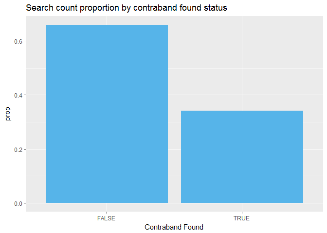 <br />Observations:

-   Of those stops where a search was conducted, ~ 34.1% of the stops resulted in contraband being found.

#### stop\_outcome

Plotting stop proportion by outcome:

``` r
ggplot(df_clean, aes(stop_outcome, ..prop.., group = 1)) + 
  geom_bar(fill = "#56B4E9") +
  labs(title = "Stop count proportion by stop outcome", x = "Stop Outcome", y = "Stop Proportion")
```

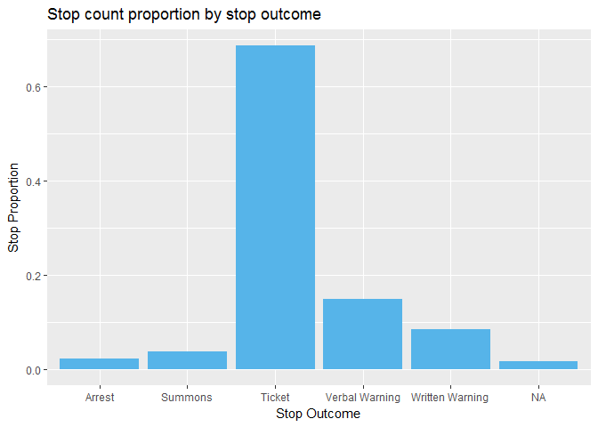 <br />Observations:

-   Most stops end in ticket (~ 70%).
-   Verbal warning comes in a far second at ~15%.

#### is\_arrested

Plotting the proportion of stops by their arrest status:

``` r
ggplot(df_clean, aes(is_arrested, ..prop.., group = 1)) + 
  geom_bar(fill = "#56B4E9") +
  labs(title = "Stop count proportion by arrested status", x = "Is Arrested", y = "Count Proportion")
```

 <br />Observations:

-   Most stops don’t end in an arrest with 2.3% of stops ending in arrest.

#### officer\_id

Because there are a lot of officers and the visualization can get quite cluttered and overwhelming, we'll be looking at the top stopping officers. <br />Creating a table with the top 50 stopping officers:

``` r
officer_stops <- setNames(data.frame(table(df_clean$officer_id)), c("officer", "count"))
officer_stops <- officer_stops %>% arrange(desc(count))
officer_stops <- officer_stops %>% mutate(stop_prop = count/ sum(count))
top_50 <- head(officer_stops, 50)
```

``` r
ggplot(top_50, aes(reorder(officer, -stop_prop), stop_prop)) + 
  geom_col(fill = "#56B4E9") + 
  theme1 +
  labs(title = "Stop proportion per officer (top 50)", x = "Officer ID", y = "Proportion")
```


By bucketing up the number of stops per officer, we can see a distribution of the number of stops state police officers conducted over the 2 year dataset period.

``` r
officer_plot3 <- ggplot(officer_stops, aes(count)) + geom_histogram(binwidth = 50)
plt_officer_plot3 <- ggplot_build(officer_plot3)
officer_plot_x_labs3 <- plt_officer_plot3$data[[1]]$x
ggplot(officer_stops, aes(count, ..count../sum(..count..))) + 
  geom_histogram(binwidth = 50, fill = "#191970") +
  scale_x_continuous(breaks = officer_plot_x_labs3, labels = as.character(officer_plot_x_labs3)) + 
  theme1 +
  labs(title = "Proportion of total officers per stop count", x = "# of stops", y = "% of officers") +
  scale_y_continuous(labels = scales::percent)
```

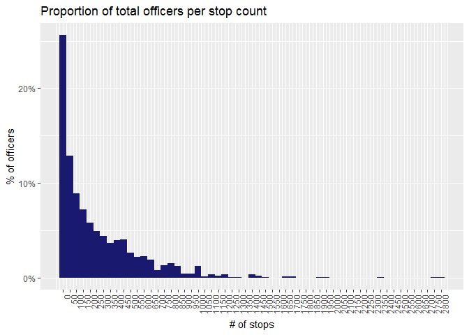

To get an idea of the spread of officers' daily activity, we create a summary table to calculate the average stops/day for officers. To make sure we compare officers' average activity fairly, we compute calculations using only days where an officer had at least one stop. In this way, we attempt to account for days off.

``` r
df_officer <- setNames(data.frame(table(df_clean$officer_id, df_clean$stop_date)), c("OfficerID", "StopDate", "count"))
officer_tot_stops <- df_officer %>% group_by(OfficerID) %>% dplyr::summarise(sum_stops  = sum(count))
df_officer <- left_join(df_officer, officer_tot_stops, by = "OfficerID")
df_officer <- df_officer %>% arrange(desc(sum_stops), OfficerID)
df_officer <- df_officer %>% group_by(OfficerID) %>% dplyr::mutate(avg_stops_per_day = mean(count[count >0]))
avg_stops_officer <- df_officer %>% group_by(OfficerID) %>% select(OfficerID, sum_stops, avg_stops_per_day) %>% distinct(OfficerID, .keep_all = TRUE)
```

``` r
ggplot(avg_stops_officer, aes(avg_stops_per_day)) +
  geom_histogram(binwidth = 1, fill = "#56B4E9") +
  scale_x_continuous(breaks = 1:14, labels = as.character(1:14)) +
  labs(title = "Average Stops/Day", x = "Average stops per day", y = "# of officers") +
  annotate("text", x = 10, y = 390, label = "*Days with 0 stops not included in an officer's \naverage calculation.", size = 3, color = "#696969")
```

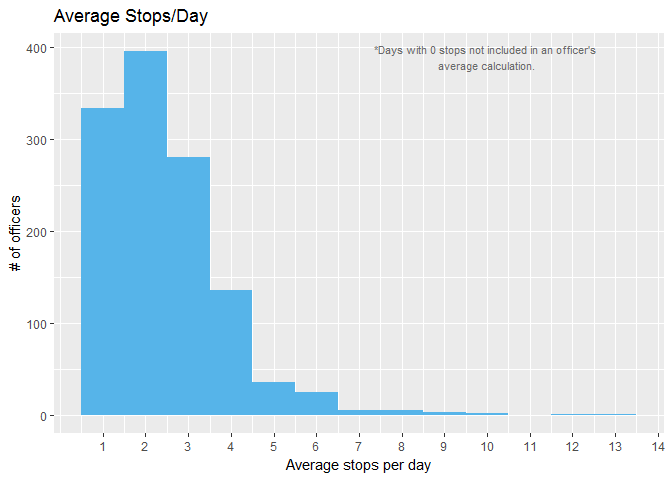 <br />Observations:

-   Only a few officers hold a high number of stops while the largest percentage of officers have a total of 0-50 stops.
-   The top 3 stopping officers each hold around .75% of the total stops, while most others in the top 50 hold less than .375%.
-   Typically, the more stops, the fewer officers there are who have stopped that often. However, there are a few outliers in the 2000s with bumps containing a few officers.
-   Most police officers have 2 stops per day, on average, while some have an average as high as 13.
-   Overall, this indicates there are a few high stop count offenders.

#### stop\_duration

Plotting the stop proportion by stop duration:

``` r
ggplot(df_clean, aes(stop_duration, ..prop.., group = 1)) + 
  geom_bar(fill = "#56B4E9") +
  labs(title = "Stop count proportion by stop duration", x = "Stop Duration", y = "Count proportion")
```

 <br />Observations:

-   Most stops (91.1%) lasted only 1-15 minutes.
    -   Given that most stops end in a ticket, this makes intuitive sense.

#### violations

Looking at number of violations per stop:

``` r
ggplot(df_clean, aes(violation_count, ..prop.., group = 1)) + 
  geom_bar(fill = "#56B4E9") +
  labs(title = "Stop count proportion by violation count", x = "Violation Count", y = "Count Proportion")
```

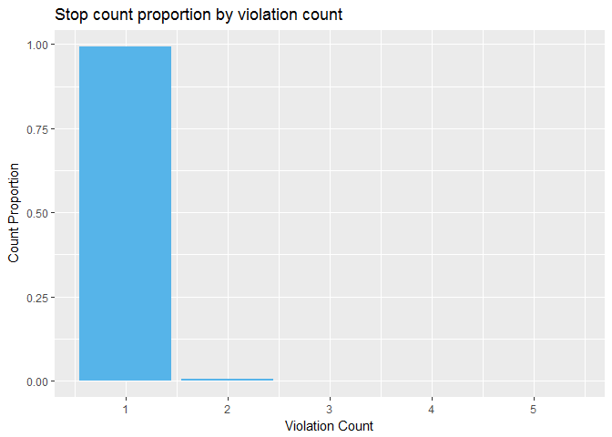

Reshaping the dataframe so there is one column for all the violations (and one distict violation per row), which is necessary for counting and plotting a bar graph:

``` r
df_split2 <- df_split %>% gather("violation_new", "n", 'violation_raw_Cell.Phone':'violation_raw_Window.Tint')
```

``` r
ggplot(df_split2, aes(reorder(violation_new, -n), n/sum(n))) + 
  geom_col(fill = "#56B4E9") + 
  theme1 +
  labs(title = "Stop count per violation proportion", x = "Violation", y = "Proportion")
```

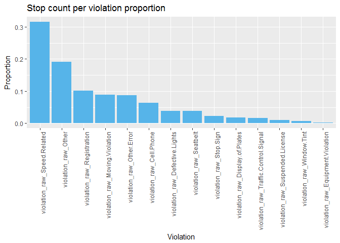 <br />Observations:

-   Most stops (99.3%) only have one violation.
-   The top 5 most common violations are: Speed.Related, Other, Registration, Moving.Violation, and Cell.Phone.
