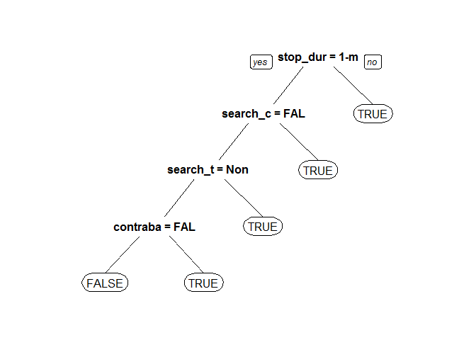
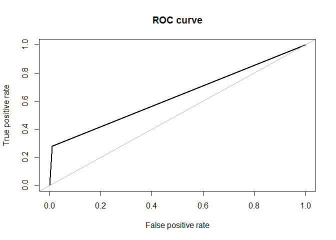
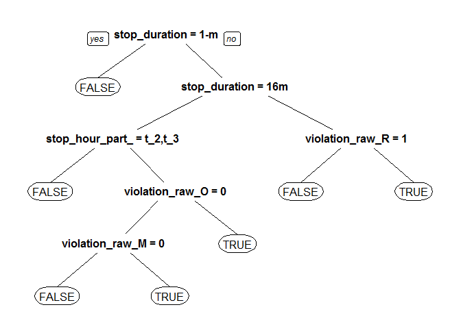
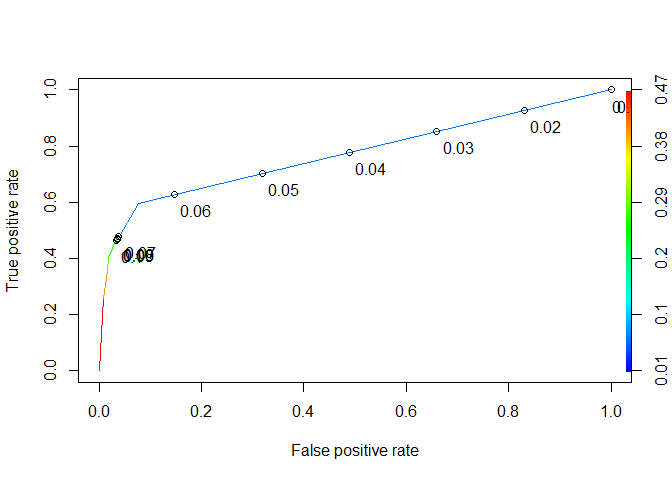

#### Use Case:

Using machine learning algorithms as classifiers to create a model to predict if a traffic stop will end in arrest.

#### Method:

The main question we're trying to answer is if we can predict the arrest status of a Connecticut State Police traffic stop given the features in our dataset. More specifically, we'd like to see if any of those features are demographic. To this end, we will be using supervised machine learning with is\_arrested as our outcome variable and all others as our predictor variables. Further data wrangling and NA handling will be performed below, however, the final comprehensive list of the 27 predictor variables used is as follows:

-   county\_name
-   driver\_gender
-   driver\_age
-   driver\_race\_raw
-   search\_conducted
-   search\_type\_raw
-   contraband\_found
-   stop\_duration
-   violation\_count
-   violation\_raw\_Cell.Phone
-   violation\_raw\_Defective.Lights
-   violation\_raw\_Display.of.Plates
-   violation\_raw\_Equipment.Violation
-   violation\_raw\_Moving.Violation
-   violation\_raw\_Other
-   violation\_raw\_Other.Error
-   violation\_raw\_Registration
-   violation\_raw\_Seatbelt
-   violation\_raw\_Speed.Related
-   violaiton\_raw\_Stop.Sign
-   violation\_raw\_Suspended.License
-   violation\_raw\_Traffic.Control.Signla
-   violation\_raw\_Window.Tint
-   stop\_hour\_part\_of\_day
-   stop\_season
-   stop\_dom
-   day\_of\_week

Since is\_arrested is a binary variable, we will be testing classification algorithms including CART, Random Forest, and Naive Bayes. Since our data is imbalanced, we will also test a few solutions in combination with our algorithms, including SMOTE, over-sampling, and a Penalty Matrix. Because of the imbalance, accuracy is not the best metric to evaluate the success of our algorithms. Instead, a combination of Kappa and AUC will be used.

#### Data Wrangling:

Load in necessary libraries and datasets:

``` r
library(rpart)
library(rpart.plot)
library(caret)
library(e1071)
library(caTools)
library(lubridate)
library(DMwR)
library(randomForest)
library(ROSE)
library(dplyr)
library(party)
library(irr)
library(klaR)
library(ROCR)
library(Boruta)
library(caretEnsemble)
library(gbm)

# Capstone data
stops_split <- read.csv("E:/Learning/Springboard Intro to Data Science/capstone/CT_cleaned_split.csv")

stops_split_col <- stops_split[,c(3,4,6,10,12,13,15,17,18,20,21,22,23,24,27,29:42)]
stops_split_col$stop_date <- as.POSIXct(stops_split_col$stop_date, "%Y-%m-%d", tz = "America/New_York")
```

Here, we used the split dataframe, which has one hot-encoded violation\_raw columns, and was produced in the data wrangling [script](https://github.com/paigewil/capstone/blob/master/capstone_data_wrangling.R). This makes it easier to use the violation\_raw information in a machine learning algorithm.

We need to do some data wrangling before we can apply the machine learning algorithms. For example, we need to regroup factor features so that they don't have too many levels, since some algorithms can't handle high-level factors. We also need to split up some features, extracting seperate pieces of information into new features:

``` r
# Making new attributes for ML algorithms
stops_split_edit <- stops_split_col

# making hour attribute
stops_split_edit$stop_time_hour <- stops_split_edit$stop_time
stops_split_edit$stop_time_hour[stops_split_edit$stop_time_hour == "0:00"] <- NA
stops_split_edit$stop_time_hour <- sub(":.*", "", stops_split_edit$stop_time_hour)

# grouping hour into times of day since 24 levels might be too granular
stops_split_edit$stop_time_hour_numeric <- as.numeric(stops_split_edit$stop_time_hour)
stops_split_edit$stop_hour_part_of_day <- vector(mode = "character", length = nrow(stops_split_edit))
stops_split_edit$stop_hour_part_of_day[stops_split_edit$stop_time_hour_numeric >= 0 & stops_split_edit$stop_time_hour_numeric < 6] <- "time_block1"
stops_split_edit$stop_hour_part_of_day[stops_split_edit$stop_time_hour_numeric >= 6 & stops_split_edit$stop_time_hour_numeric < 12] <- "time_block2"
stops_split_edit$stop_hour_part_of_day[stops_split_edit$stop_time_hour_numeric >= 12 & stops_split_edit$stop_time_hour_numeric < 18] <- "time_block3"
stops_split_edit$stop_hour_part_of_day[stops_split_edit$stop_time_hour_numeric >= 18 & stops_split_edit$stop_time_hour_numeric <= 23] <- "time_block4"
# -> replacing blanks with NAs
stops_split_edit$stop_hour_part_of_day[stops_split_edit$stop_hour_part_of_day == ""] <- NA
# -> turning into factor
stops_split_edit$stop_hour_part_of_day <- factor(stops_split_edit$stop_hour_part_of_day)
```

``` r
# making stop month attribute 
stops_split_edit$stop_month <- month(stops_split_edit$stop_date)

# -> making seasons variable since month variable might be too granular
stops_split_edit$stop_month_numeric <- as.numeric(stops_split_edit$stop_month)
stops_split_edit$stop_season <- vector(mode = "character", length = nrow(stops_split_edit))
stops_split_edit$stop_season[stops_split_edit$stop_month_numeric >= 3 & stops_split_edit$stop_month_numeric <= 5] <- "spring"
stops_split_edit$stop_season[stops_split_edit$stop_month_numeric >= 6 & stops_split_edit$stop_month_numeric <= 8] <- "summer"
stops_split_edit$stop_season[stops_split_edit$stop_month_numeric >= 9 & stops_split_edit$stop_month_numeric <= 11] <- "autumn"
stops_split_edit$stop_season[stops_split_edit$stop_month_numeric == 12 | stops_split_edit$stop_month_numeric == 1 | stops_split_edit$stop_month_numeric == 2] <- "winter"
stops_split_edit$stop_season <- factor(stops_split_edit$stop_season)
```

``` r
# -> making stop day of month attribute
a <- c("01", "02", "03", "04", "05", "06", "07", "08", "09")
b <- as.character(10:31)
days_label <- c(a, b)
stops_split_edit$day_of_month <- format(stops_split_edit$stop_date, "%d")

# -> breaking day of month in rough thirds since stats investigation showed the last third of the month has a lower arrest/stop ratio
  #1-10
  #11-20
  #21-31
stops_split_edit$day_of_month_numeric <- as.numeric(stops_split_edit$day_of_month)
stops_split_edit$stop_dom <- vector(mode = "character", length = nrow(stops_split_edit))
stops_split_edit$stop_dom[stops_split_edit$day_of_month_numeric >= 1 & stops_split_edit$day_of_month_numeric <= 10] <- "first_third"
stops_split_edit$stop_dom[stops_split_edit$day_of_month_numeric >= 11 & stops_split_edit$day_of_month_numeric <= 20] <- "second_third"
stops_split_edit$stop_dom[stops_split_edit$day_of_month_numeric >= 21 & stops_split_edit$day_of_month_numeric <= 31] <- "third_third"
stops_split_edit$stop_dom <- factor(stops_split_edit$stop_dom)
```

*\*For more information on the statistics investigation, check out the script, [here](https://github.com/paigewil/capstone/blob/master/statistics.R).*

``` r
# add day of week
stops_split_edit$day_of_week <- weekdays(stops_split_edit$stop_date)
stops_split_edit$day_of_week <- factor(stops_split_edit$day_of_week)
```

Cleaning up the dataset from all the wrangling steps:

``` r
# Trim off attributes created to create other attributes
# Also remove Officer ID since we don't want to create an algorithm using an ID column
# Removing original attributes that grouped/aggregated:
  # -> stop_time
  # -> stop_date
  # -> violation_raw
stops_split_small <- stops_split_edit[, c(-1,-2, -7, -13, -30, -31, -33, -34, -36, -37)]
```

We need to turn some features into factors for easier handling in the machine learning algorithms:

``` r
for (i in c(5, 7, 9, 11:25)){
  stops_split_small[[i]] <- as.factor(stops_split_small[[i]])
}
```

We need to handle NAs in the dataset explicitly instead of leaving it up to the machine learning algorithms. We will do so in a way to ensure minimum loss of information:

``` r
summary(stops_split_small)
# NAs
  # -> county_name
  # -> driver_age
  # -> search_type_raw
  # -> stop_hour_part_of_day
  # -> is_arrested

stops_clean <- stops_split_small
```

We will populate driver\_age NAs with the median because it ends up being a whole number (like our other driver\_age ages) and is very similar to the mean:

``` r
#driver_age
med <- median(stops_clean$driver_age, na.rm = TRUE)
stops_clean$driver_age[is.na(stops_clean$driver_age) == TRUE] <- med
```

For search\_type\_raw, when no search was conducted, the value is NA. Instead, we'll create a new factor level, "None". In addition, there are some NAs where a search was conducted. Those are bucketed into the pre-existing "Other" category.

``` r
#search_type_raw
# -> replacing blanks with NAs
stops_clean$search_type_raw[stops_clean$search_type_raw == ""] <- NA
table(stops_clean$search_type_raw, stops_clean$search_conducted, useNA = "always")
# -> 313337 are from search_conducted = FALSE
# -> 486 where search_conducted = TRUE but no search type indicated
# adding level to factor to make a "None" level for the search types where no search was conducted
stops_clean$search_type_raw <- factor(stops_clean$search_type_raw, levels = c(levels(stops_clean$search_type_raw), "None"))
stops_clean$search_type_raw[(is.na(stops_clean$search_type_raw) == TRUE & stops_clean$search_conducted == FALSE)] <- "None"

table(stops_clean$search_type_raw, stops_clean$is_arrested, useNA = "always")
# 151/7312  = 0.02065098 are is_arrested == TRUE, so can't remove with out 
#                        significant loss of information
# => will identify as "Other"" since that is the mode of is_arrested = TRUE and a 
#    generic "catch all" level
stops_clean$search_type_raw[(is.na(stops_clean$search_type_raw) == TRUE)] <- "Other"
```

county\_name and stop\_hour\_part\_of\_day have small amounts of NAs so those rows will be removed since there is no sensible way to populate them:

``` r
# county_name
stops_clean$county_name[stops_clean$county_name == ""] <- NA
#get rid of blank level
stops_clean$county_name <- factor(stops_clean$county_name, levels = levels(stops_clean$county_name)[2:9])
table(stops_clean$county_name, stops_clean$is_arrested, useNA = "always")
# 4/7312 = .000547046 (percentage removed from is_arrested == TRUE)
# 10/306001 = 3.267963e-05
# Not a sizeable removal amount

# stop_hour_part_of_day
table(stops_clean$stop_hour_part_of_day, stops_clean$is_arrested, useNA = "always")
table(stops_clean$stop_hour_part_of_day, stops_clean$county_name, useNA = "always")
# -> no overlapping NAs with county_name
# 8/7308 = 0.001094691 (percentage removed from is_arrested == TRUE after remove
#                       county_name NAs)
# 212/305991 = 0.0006928308

# Since neither county_name nor stop_hour_part_of_day NAs account for a significant
# percentage of our outcome variables, we will remove the rows with those NAs.
stops_clean2 <- stops_clean[!is.na(stops_clean$stop_hour_part_of_day),]
stops_clean2 <- stops_clean2[!is.na(stops_clean2$county_name),]
```

There are NAs in our outcome variable, is\_arrested. Since our algorithm might become biased if we assume an arrest status for the NAs, we must remove the rows where is\_arrested = NA:

``` r
# How are NAs distributed throughout is_arrested?
table(stops_clean2$is_arrested, useNA = "always")
# 5352 NAs 

stops_clean2 <- stops_clean2[!is.na(stops_clean2$is_arrested),]
stops_clean3 <- stops_clean2
```

Before we start running some algorithms, we need to remove the stop\_outcome variable to only focus on predicting is\_arrested:

``` r
stops_arrested <- stops_clean3[,-8]
```

#### Algorithms:

Let's split our dataset into a test and training set:

``` r
# Since I have a lot of data, I want to make my testing sample a little larger
# to have better tests to make sure I'm choosing the best algorithm

# Splitting data using createDataPartition since it works better with unbalanced data
set.seed(3000)
spl_cdp = createDataPartition(stops_arrested$is_arrested, p = 0.75, list = FALSE)
train_arrest = stops_arrested[spl_cdp,]
test_arrest = stops_arrested[-spl_cdp,]
```

One hurdle in running algorithms with the dataset is that it is signficantly imbalanced, meaning we have a lot more non-arrests than arrests. Specifically, non-arrests make up 97.67% of the data, as we can see in the tables below:

``` r
table(stops_arrested$is_arrested)
```

    ## 
    ##  FALSE   TRUE 
    ## 305779   7300

``` r
prop.table(table(stops_arrested$is_arrested))
```

    ## 
    ##     FALSE      TRUE 
    ## 0.9766832 0.0233168

To account for the imbalance such that the machine learning algorithm doesn't predict FALSE for every observation to get a high accuracy, we will test a number of different imbalance handling solutions with a number of algorithms to pick the best performing model.

As a better measure of how good the model is at predicting the correct outcome, we will look at a combination of Kappa and AUC over accuracy because they are better measures for imbalanced data.

Using SMOTE to fix imbalance with the CART algorithm:

``` r
set.seed(111)
train.smote <- SMOTE(is_arrested ~., data = train_arrest)
tree.smote <- rpart(is_arrested ~ ., data = train.smote)
prp(tree.smote)
```



``` r
print(tree.smote)
```

    ## n= 38325 
    ## 
    ## node), split, n, loss, yval, (yprob)
    ##       * denotes terminal node
    ## 
    ##  1) root 38325 16425 FALSE (0.57142857 0.42857143)  
    ##    2) stop_duration=1-15 min 25328  5054 FALSE (0.80045799 0.19954201)  
    ##      4) search_conducted=FALSE 23678  3493 FALSE (0.85247909 0.14752091)  
    ##        8) search_type_raw=None 22997  2812 FALSE (0.87772318 0.12227682)  
    ##         16) contraband_found=FALSE 22691  2506 FALSE (0.88955974 0.11044026) *
    ##         17) contraband_found=TRUE 306     0 TRUE (0.00000000 1.00000000) *
    ##        9) search_type_raw=Consent,Inventory,Other 681     0 TRUE (0.00000000 1.00000000) *
    ##      5) search_conducted=TRUE 1650    89 TRUE (0.05393939 0.94606061) *
    ##    3) stop_duration=16-30 min,30+ min 12997  1626 TRUE (0.12510579 0.87489421) *

When predicting on the test set, we see that the Kappa is low at 0.2214208 with the AUC, not bad at 0.77:

``` r
pred.tree.smote2 <- predict(tree.smote, newdata = test_arrest, type = "class")
confusionMatrix(table(test_arrest$is_arrested, pred.tree.smote2))$overall['Kappa']
```

    ##     Kappa 
    ## 0.2214208

``` r
roc.curve(test_arrest$is_arrested, pred.tree.smote2)
```


    ## Area under the curve (AUC): 0.770

Using SMOTE with Random Forest:

``` r
set.seed(111)
rf.smote <- randomForest(is_arrested ~ ., data = train.smote)
pred.rf.smote2 <- predict(rf.smote, newdata = test_arrest, type = "class")
confusionMatrix(table(test_arrest$is_arrested, pred.rf.smote2))$overall['Kappa']
```

    ##     Kappa 
    ## 0.2812014

``` r
roc.curve(test_arrest$is_arrested, pred.rf.smote2)
```


    ## Area under the curve (AUC): 0.762

Here, we get a Kappa of 0.2812 and an AUC of 0.762, overall, not much different than SMOTE with CART.

Using over-sampling to fix imbalance with the Random Forest algorithm:

``` r
# 229335 is the number of is_arrested == FALSE in train_arrest
set.seed(111)
train_arrest_over <- ovun.sample(is_arrested ~., data = train_arrest, method = "over", N = 2*229335)$data
rf.over <- randomForest(is_arrested ~ ., data = train_arrest_over, ntree = 50)
pred.rf.over <- predict(rf.over, newdata = test_arrest, type = "class")
confusionMatrix(table(test_arrest$is_arrested, pred.rf.over))$overall['Kappa']
```

    ##    Kappa 
    ## 0.322508

``` r
roc.curve(test_arrest$is_arrested, pred.rf.over)
```


    ## Area under the curve (AUC): 0.732

The Kappa is slightly higher, but still low at 0.322508 and the AUC is not bad at 0.732:

Using SMOTE to fix imbalance with the Naive Bayes algorithm:

``` r
set.seed(111)
nb.model.smote <- naiveBayes(is_arrested ~., data = train.smote, laplace = 1)
nb.predict.smote <- predict(nb.model.smote, newdata = test_arrest, type = "class")
confusionMatrix(table(test_arrest$is_arrested, nb.predict.smote))$overall['Kappa']
```

    ##    Kappa 
    ## 0.256684

``` r
roc.curve(test_arrest$is_arrested, nb.predict.smote)
```


    ## Area under the curve (AUC): 0.744

The Kappa is still low at 0.256684 with the AUC at 0.744.

Now, instead of balancing the unbalanced dataset by adding manufactured obserations or removing observations, we can also try using a Penalty Matrix. Here, we want a higher penalty for false negatives, i.e., where the model labels an observation as having no arrest when there was one, because we're most concerned about accurately labeling arrests. Thus, our Penalty Matrix will weight those error more heavily.

``` r
PenaltyMatrix = matrix(c(0,1,6,0), byrow = TRUE, nrow = 2)
```

Here, we use CART with our Penalty Matrix:

``` r
set.seed(111)
stops_arrest_tree_penalty <- rpart(is_arrested ~., data = train_arrest, parms = list(loss = PenaltyMatrix))
prp(stops_arrest_tree_penalty)
```


``` r
print(stops_arrest_tree_penalty)
```

    ## n= 234810 
    ## 
    ## node), split, n, loss, yval, (yprob)
    ##       * denotes terminal node
    ## 
    ##  1) root 234810 32850 FALSE (0.97668328 0.02331672)  
    ##    2) stop_duration=1-15 min 213803 12930 FALSE (0.98992063 0.01007937) *
    ##    3) stop_duration=16-30 min,30+ min 21007 17687 TRUE (0.84195744 0.15804256)  
    ##      6) stop_duration=16-30 min 16584 10476 FALSE (0.89471780 0.10528220)  
    ##       12) stop_hour_part_of_day=time_block2,time_block3 9131  3516 FALSE (0.93582302 0.06417698) *
    ##       13) stop_hour_part_of_day=time_block1,time_block4 7453  6293 TRUE (0.84435798 0.15564202)  
    ##         26) violation_raw_Other=0 5426  3480 FALSE (0.89310726 0.10689274)  
    ##           52) violation_raw_Moving.Violation=0 4480  2046 FALSE (0.92388393 0.07611607) *
    ##           53) violation_raw_Moving.Violation=1 946   707 TRUE (0.74735729 0.25264271) *
    ##         27) violation_raw_Other=1 2027  1447 TRUE (0.71386285 0.28613715) *
    ##      7) stop_duration=30+ min 4423  2849 TRUE (0.64413294 0.35586706)  
    ##       14) violation_raw_Registration=1 669   270 FALSE (0.93273543 0.06726457) *
    ##       15) violation_raw_Registration=0 3754  2225 TRUE (0.59270112 0.40729888) *

``` r
PredictCARTPenalty2 = predict(stops_arrest_tree_penalty, newdata = test_arrest, type = "class")
confusionMatrix(table(test_arrest$is_arrested, PredictCARTPenalty2))$overall['Kappa']
```

    ##     Kappa 
    ## 0.3537442

``` r
roc.curve(test_arrest$is_arrested, PredictCARTPenalty2)
```


    ## Area under the curve (AUC): 0.693

So far, this model performs the best with a Kappa at 0.3537442 and an AUC at 0.693.

A complete testing of the combinations of the imbalance handling options (SMOTE, ROSE, over-sampling, under-sampling, and Penalty Matrix) and algorithms (CART, Random Forest, and Naive Bayes) were performed in a seperate R script. For a full investigation, please see the script [here](https://github.com/paigewil/capstone/blob/master/machine_learning.R). The top performing combinations were explored above.

To help us widdle down the model options further, we'll perform a 10-fold CV test on these top performing imbalance solutions and algorithm combinations and see what Kappa and AUC values are returned.

SMOTE with CART:

``` r
set.seed(123)
folds <- createFolds(stops_arrested$is_arrested, k = 10)
cv_results <- lapply(folds, function(x) {
  arrest_train <- stops_arrested[-x, ]
  arrest_test <- stops_arrested[x, ]
  arrest.train.smote <- SMOTE(is_arrested ~., data = arrest_train)
  tree.model <- rpart(is_arrested ~ ., data = arrest.train.smote)
  arrest.pred <- predict(tree.model, arrest_test, type = "class")
  auc_val <- roc.curve(arrest_test$is_arrested, arrest.pred)$auc
  kappa <- kappa2(data.frame(arrest_test$is_arrested, arrest.pred))$value
  return(c(auc_val, kappa))
})
```

``` r
df_cv_results <- data.frame(cv_results)
#AUC
mean(unlist(df_cv_results[1,]))
```

    ## [1] 0.7754418

``` r
#Kappa
mean(unlist(df_cv_results[2,]))
```

    ## [1] 0.2234328

Penalty Matrix with CART:

``` r
set.seed(123)
cv_resultsPM <- lapply(folds, function(x) {
  arrest_train <- stops_arrested[-x, ]
  arrest_test <- stops_arrested[x, ]
  tree.model <- rpart(is_arrested ~ ., data = arrest_train, parms = list(loss = PenaltyMatrix))
  arrest.pred <- predict(tree.model, arrest_test, type = "class")
  auc_val <- roc.curve(arrest_test$is_arrested, arrest.pred)$auc
  kappa <- kappa2(data.frame(arrest_test$is_arrested, arrest.pred))$value
  return(c(auc_val, kappa))
})
```

``` r
df_cv_resultsPM <- data.frame(cv_resultsPM)
#AUC
mean(unlist(df_cv_resultsPM[1,]))
```

    ## [1] 0.7018223

``` r
#Kappa
mean(unlist(df_cv_resultsPM[2,]))
```

    ## [1] 0.3649853

SMOTE with RandomForest:

``` r
set.seed(123)
cv_results_rf <- lapply(folds, function(x) {
  arrest_train <- stops_arrested[-x, ]
  arrest_test <- stops_arrested[x, ]
  arrest.train.smote <- SMOTE(is_arrested ~., data = arrest_train)
  tree.model <- randomForest(is_arrested ~ ., data = arrest.train.smote, ntree = 50)
  arrest.pred <- predict(tree.model, arrest_test, type = "class")
  auc_val <- roc.curve(arrest_test$is_arrested, arrest.pred)$auc
  kappa <- kappa2(data.frame(arrest_test$is_arrested, arrest.pred))$value
  return(c(auc_val, kappa))
})
```

``` r
df_cv_results_rf <- data.frame(cv_results_rf)
#AUC
mean(unlist(df_cv_results_rf[1,]))
```

    ## [1] 0.7677302

``` r
#Kappa
mean(unlist(df_cv_results_rf[2,]))
```

    ## [1] 0.2910813

Over-sampling with RandomForest:

``` r
set.seed(123)
cv_results_rf_over_test <- lapply(folds[1:10], function(x) {
  arrest_train <- stops_arrested[-x, ]
  arrest_test <- stops_arrested[x, ]
  arrest.train.over <- upSample(arrest_train[,-8], arrest_train[,8], yname = "is_arrested")
  tree.model <- randomForest(is_arrested ~ ., data = arrest.train.over, ntree = 50)
  arrest.pred <- predict(tree.model, arrest_test, type = "class")
  auc_val <- roc.curve(arrest_test$is_arrested, arrest.pred)$auc
  kappa <- kappa2(data.frame(arrest_test$is_arrested, arrest.pred))$value
  return(c(auc_val, kappa))
})
```

``` r
df_cv_results_rf_over_test <- data.frame(cv_results_rf_over_test)
#AUC
mean(unlist(df_cv_results_rf_over_test[1,]))
```

    ## [1] 0.7363104

``` r
#Kappa
mean(unlist(df_cv_results_rf_over_test[2,]))
```

    ## [1] 0.306312

SMOTE with Naive Bayes:

``` r
set.seed(123)
cv_results_nb <- lapply(folds, function(x) {
  arrest_train <- stops_arrested[-x, ]
  arrest_test <- stops_arrested[x, ]
  arrest.train.smote <- SMOTE(is_arrested ~., data = arrest_train)
  tree.model <- naiveBayes(is_arrested ~., data = arrest.train.smote, laplace = 1)
  arrest.pred <- predict(tree.model, arrest_test, type = "class")
  auc_val <- roc.curve(arrest_test$is_arrested, arrest.pred)$auc
  kappa <- kappa2(data.frame(arrest_test$is_arrested, arrest.pred))$value
  return(c(auc_val, kappa))
})
```

``` r
df_cv_results_nb <- data.frame(cv_results_nb)
#AUC
mean(unlist(df_cv_results_nb[1,]))
```

    ## [1] 0.7493591

``` r
#Kappa
mean(unlist(df_cv_results_nb[2,]))
```

    ## [1] 0.2619547

From the resulting Kappas and AUCs, we fine-tuned the parameters of the top three performing models using cross-validation and picked the top performing of them to use as our overall model. To save on performance overhead, full code for the other two contenders, SMOTE with Random Forest and over-sampling with Random Forest can be seen in the [machine learning script](https://github.com/paigewil/capstone/blob/master/machine_learning.R).

Here is the fine-tuning procedure done on the top performing model, Penalty Matrix with CART:

``` r
ctrl_cart2 <- trainControl(method = "cv", number = 10)
grid_cart2 <- expand.grid(.cp = seq(0.01,0.1,0.01))
set.seed(13)
m_cart2 <- train(is_arrested ~., data = train_arrest,
                method = "rpart",
                metric = "Kappa",
                trControl = ctrl_cart2,
                tuneGrid = grid_cart2,
                parms = list(loss = PenaltyMatrix))
m_cart2
```

    ## CART 
    ## 
    ## 234810 samples
    ##     27 predictor
    ##      2 classes: 'FALSE', 'TRUE' 
    ## 
    ## No pre-processing
    ## Resampling: Cross-Validated (10 fold) 
    ## Summary of sample sizes: 211328, 211330, 211330, 211330, 211330, 211329, ... 
    ## Resampling results across tuning parameters:
    ## 
    ##   cp    Accuracy   Kappa    
    ##   0.01  0.9649675  0.3298956
    ##   0.02  0.9712533  0.3035417
    ##   0.03  0.9712533  0.3035417
    ##   0.04  0.9712533  0.3035417
    ##   0.05  0.9712533  0.3035417
    ##   0.06  0.9712533  0.3035417
    ##   0.07  0.9712533  0.3035417
    ##   0.08  0.9712533  0.3035417
    ##   0.09  0.9712533  0.3035417
    ##   0.10  0.9712533  0.3035417
    ## 
    ## Kappa was used to select the optimal model using the largest value.
    ## The final value used for the model was cp = 0.01.

``` r
predict_cart2 <- predict(m_cart2, newdata = test_arrest)
kappa2(data.frame(test_arrest$is_arrested, predict_cart2))$value
```

    ## [1] 0.3294899

``` r
roc.curve(test_arrest$is_arrested, predict_cart2)
```

    ## Area under the curve (AUC): 0.708

From the Kappa and AUC results, we determined that the best performing algorithm was between SMOTE with Random Forest and CART with Penalty Matrix. Given that CART with Penalty Matrix can be modeled without manufacturing observations, this is the model of choice. However, the Kappa is still very low, indicating this is not a great performing model in its predictive power of arrest status. In an attempt to improve performance, we will explore feature selection and ensemble methods. Let’s start with feature selection.

Here, we use Recursive Feature Elimination, RFE, to identify the most important features to try and reduce our dataset to the most important information. RFE is an algorithm that uses Random Forest to remove redundant features. In the example below, we use Penalty Matrix to handle our imbalanced dataset.

``` r
control_fs <- rfeControl(functions = rfFuncs,
                         method = "cv",
                         number = 10)
set.seed(444)
feature_selection_arrest2 <- rfe(is_arrested ~.,
                                     data = train_arrest,
                                     rfeControl = control_fs,
                                     metric = "Kappa",
                                     ntree = 100,
                                     parms = list(loss = PenaltyMatrix))

feature_selection_arrest2
```

    ## 
    ## Recursive feature selection
    ## 
    ## Outer resampling method: Cross-Validated (10 fold) 
    ## 
    ## Resampling performance over subset size:
    ## 
    ##  Variables Accuracy   Kappa AccuracySD KappaSD Selected
    ##          4   0.9767 0.00000  2.203e-05 0.00000         
    ##          8   0.9772 0.09972  2.842e-04 0.03849         
    ##         16   0.9784 0.23807  4.580e-04 0.01532         
    ##         53   0.9792 0.27603  3.158e-04 0.01410        *
    ## 
    ## The top 5 variables (out of 53):
    ##    stop_duration30+ min, stop_duration16-30 min, stop_hour_part_of_daytime_block3, stop_hour_part_of_daytime_block2, violation_raw_Other1

The top variables returned are stop\_duration, stop\_hour\_part\_of\_day, and violation\_raw\_Other.

Let’s get a more holistic picture by looking at the important features from our parameter fine-tuned Random Forest with SMOTE, Random Forest with over-sampling, and CART with Penalty Matrix algorithms.

Random Forest with SMOTE and mtry = 3:

``` r
set.seed(444)
train_arrest_smote <- SMOTE(is_arrested ~., data = train_arrest)
model.smote.rf <- randomForest(is_arrested ~ ., data = train_arrest_smote, mtry = 3)
pred.rf.smote <- predict(model.smote.rf, newdata = test_arrest, type = "class")
confusionMatrix(table(test_arrest$is_arrested, pred.rf.smote))$overall['Kappa']
```

    ##     Kappa 
    ## 0.2728642

``` r
roc.curve(test_arrest$is_arrested, pred.rf.smote)
```


    ## Area under the curve (AUC): 0.764

``` r
randomForest::varImpPlot(model.smote.rf)
```


Random Forest with over-sampling and mtry = 27:

``` r
set.seed(555)
model.over.rf <- randomForest(is_arrested ~ ., data = train_arrest_over, mtry = 27, ntree = 30)
pred.rf.over.finetuned <- predict(model.over.rf, newdata = test_arrest, type = "class")
confusionMatrix(table(test_arrest$is_arrested, pred.rf.over.finetuned))$overall['Kappa']
```

    ##     Kappa 
    ## 0.3174045

``` r
roc.curve(test_arrest$is_arrested, pred.rf.over.finetuned)
```



    ## Area under the curve (AUC): 0.635

``` r
varImpPlot(model.over.rf)
```


CART with Penalty Matrix and cp = 0.01 (\*):

``` r
cart.penalty.ft <- rpart(is_arrested ~ ., data = train_arrest, cp = 0.01, parms = list(loss = PenaltyMatrix))
pred.cart.penalty.ft <- predict(cart.penalty.ft, newdata = test_arrest, type = "class")
confusionMatrix(table(test_arrest$is_arrested, pred.cart.penalty.ft))$overall['Kappa']
```

    ##     Kappa 
    ## 0.3537442

``` r
roc.curve(test_arrest$is_arrested, pred.cart.penalty.ft)
```


    ## Area under the curve (AUC): 0.693

``` r
prp(cart.penalty.ft)
```



``` r
print(cart.penalty.ft)
```

    ## n= 234810 
    ## 
    ## node), split, n, loss, yval, (yprob)
    ##       * denotes terminal node
    ## 
    ##  1) root 234810 32850 FALSE (0.97668328 0.02331672)  
    ##    2) stop_duration=1-15 min 213803 12930 FALSE (0.98992063 0.01007937) *
    ##    3) stop_duration=16-30 min,30+ min 21007 17687 TRUE (0.84195744 0.15804256)  
    ##      6) stop_duration=16-30 min 16584 10476 FALSE (0.89471780 0.10528220)  
    ##       12) stop_hour_part_of_day=time_block2,time_block3 9131  3516 FALSE (0.93582302 0.06417698) *
    ##       13) stop_hour_part_of_day=time_block1,time_block4 7453  6293 TRUE (0.84435798 0.15564202)  
    ##         26) violation_raw_Other=0 5426  3480 FALSE (0.89310726 0.10689274)  
    ##           52) violation_raw_Moving.Violation=0 4480  2046 FALSE (0.92388393 0.07611607) *
    ##           53) violation_raw_Moving.Violation=1 946   707 TRUE (0.74735729 0.25264271) *
    ##         27) violation_raw_Other=1 2027  1447 TRUE (0.71386285 0.28613715) *
    ##      7) stop_duration=30+ min 4423  2849 TRUE (0.64413294 0.35586706)  
    ##       14) violation_raw_Registration=1 669   270 FALSE (0.93273543 0.06726457) *
    ##       15) violation_raw_Registration=0 3754  2225 TRUE (0.59270112 0.40729888) *

Based on the results of the algorithms and feature selection, some of the top variables are:

-   stop\_duration
-   search\_conducted
-   search\_type\_raw
-   contraband\_found
-   stop\_hour\_part\_of\_day

Let’s try to improve our model by reducing our dataset to the aforementioned features.

``` r
stops_arrested_top_combo <- stops_arrested[, c(5:9, 25)]

set.seed(133)
spl_top_combo = createDataPartition(stops_arrested_top_combo$is_arrested, p = 0.75, list = FALSE)
train_arrest_top_combo = stops_arrested_top_combo[spl_top_combo,]
test_arrest_top_combo = stops_arrested_top_combo[-spl_top_combo,]

stops_arrest_top_pm_combo <- rpart(is_arrested ~., data = train_arrest_top_combo, cp = 0.01, parms = list(loss = PenaltyMatrix))
predict_top_pm_combo = predict(stops_arrest_top_pm_combo, newdata = test_arrest_top_combo, type = "class")
confusionMatrix(table(test_arrest_top_combo$is_arrested, predict_top_pm_combo))$overall['Kappa']
```

    ##     Kappa 
    ## 0.3388805

``` r
roc.curve(test_arrest_top_combo$is_arrested, predict_top_pm_combo)
```


    ## Area under the curve (AUC): 0.715

As we can see from the resulting Kappa and AUC, our performance isn’t really improved through feature selection. Let’s explore the ensemble method to try and combine the results of the different algorithms in another attempt to improve model performance.

Here we will use a combination of CART, Random Forest, and Naïve Bayes with the Penalty Matrix. The predictions of each algorithm will be combined using a majority vote.

``` r
set.seed(111)
stops_arrest_rf_penalty <- randomForest(is_arrested ~., data = train_arrest, ntree= 100, parms = list(loss = PenaltyMatrix))
set.seed(111)
stops_arrest_nb_penalty <- naiveBayes(is_arrested ~., data = train_arrest, laplace = 1, parms = list(loss = PenaltyMatrix))

set.seed(123)
train_arrest_ensemble <- train_arrest
test_arrest_ensemble <- test_arrest
train_arrest_ensemble$rf_ensemble <- predict(stops_arrest_rf_penalty, type = "prob")[,2]
test_arrest_ensemble$rf_ensemble <- predict(stops_arrest_rf_penalty, newdata = test_arrest, type = "prob")[,2]
train_arrest_ensemble$cart_ensemble <- predict(cart.penalty.ft, type = "prob")[,2]
test_arrest_ensemble$cart_ensemble <- predict(cart.penalty.ft, newdata = test_arrest, type = "prob")[,2]
train_arrest_ensemble$nb_ensemble <- predict(stops_arrest_nb_penalty, newdata = train_arrest, type = "raw")[,2]
test_arrest_ensemble$nb_ensemble <- predict(stops_arrest_nb_penalty, newdata = test_arrest, type = "raw")[,2]
# Renaming levels to avoid error
levels(train_arrest_ensemble$is_arrested) <- c("F", "T")
levels(test_arrest_ensemble$is_arrested) <- c("F", "T")

set.seed(123)
test_arrest_ensemble$rf_ensemble_class <- predict(stops_arrest_rf_penalty, newdata = test_arrest, type = "class")
test_arrest_ensemble$cart_ensemble_class <- predict(cart.penalty.ft, newdata = test_arrest, type = "class")
test_arrest_ensemble$nb_ensemble_class <- predict(stops_arrest_nb_penalty, newdata = test_arrest, type = "class")
levels(test_arrest_ensemble$rf_ensemble_class) <- c("F", "T")
levels(test_arrest_ensemble$cart_ensemble_class) <- c("F", "T")
levels(test_arrest_ensemble$nb_ensemble_class) <- c("F", "T")

test_arrest_ensemble$pred_maj <- as.factor(ifelse(test_arrest_ensemble$rf_ensemble_class == "T" & test_arrest_ensemble$cart_ensemble_class == "T", "T",                                                 ifelse(test_arrest_ensemble$rf_ensemble_class == "T" & test_arrest_ensemble$nb_ensemble_class == "T", "T",                                                        ifelse(test_arrest_ensemble$cart_ensemble_class == "T" & test_arrest_ensemble$nb_ensemble_class == "T", "T", "F"))))

confusionMatrix(table(test_arrest_ensemble$is_arrested, test_arrest_ensemble$pred_maj))$overall['Kappa']
```

    ##     Kappa 
    ## 0.3336945

``` r
roc.curve(test_arrest_ensemble$is_arrested, test_arrest_ensemble$pred_maj)
```


    ## Area under the curve (AUC): 0.625

Again the Kappa and AUC are not much affected. Therefore, we will just stick with our CART with Penalty Matrix model, which is starred (\*) above.

To fine-tune the chosen model a little bit further, we will adjust the threshold based off of the elbow of the ROC curve, finding the right balance between the false positive rate and the true positive rate.

``` r
set.seed(111)
final_model_pred <- predict(cart.penalty.ft, newdata = test_arrest, type = "p")
final_model_ROC <-  prediction(final_model_pred[,2], test_arrest$is_arrested)
ROCperf_finalmodel <- performance(final_model_ROC, "tpr", "fpr")
plot(ROCperf_finalmodel, colorize=TRUE, print.cutoffs.at=seq(0,0.1,by=0.01), text.adj=c(-0.2,1.7))
```



``` r
confusionMatrix(table(test_arrest$is_arrested, final_model_pred[,2] >= 0.065))$overall['Kappa']
```

    ##     Kappa 
    ## 0.2849794

``` r
roc.curve(test_arrest$is_arrested, final_model_pred[,2]>= 0.065)
```


    ## Area under the curve (AUC): 0.720

This is our final model, leaving us with a Kappa of 0.2849794 and an AUC value of 0.720.

#### Conclusion:

The overall learnings from the machine learning investigation is that the dataset we currently have does not contain the most relevant information for successfully predicting arrest status. Testing different algorithms and combinations, fine-tuning parameters, and feature selecting don’t do much to improve our models, further cementing this point. However, we still learned some important information. One of the main questions of the project was to see if demographic factors play a role in arrest outcome of traffic stops. Because the important variables identified are not demographic and the fact that the models don’t perform well regardless of what the important variables were, the answer to our question seems to be that demographic factors don’t play a large role in arrest status. In fact, none of the features in the dataset play a large role. However, this doesn’t mean that the features don’t play any role. From our visual analysis (script and summary report, [here](https://github.com/paigewil/capstone/blob/master/visualization.R) and [here](https://github.com/paigewil/capstone/blob/master/exploratory_data_analysis_report.md)), we saw statistically significant discrepancies in arrest status between different demographic populations. To gain a better-rounded and clearer understanding of what factors are at play in arrests and if implicit bias is present, more data is needed to establish a better performing model.

<br />
