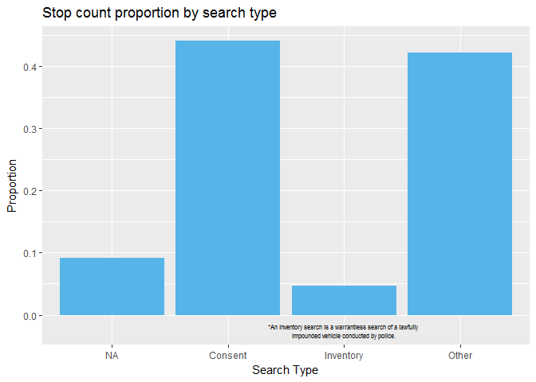
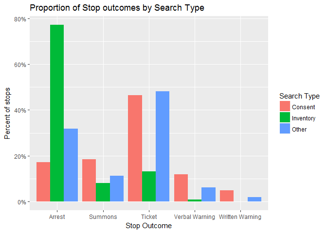
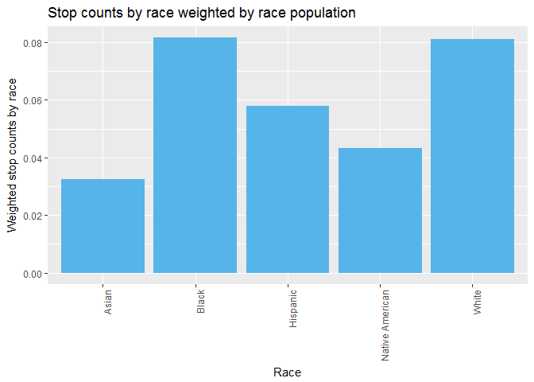
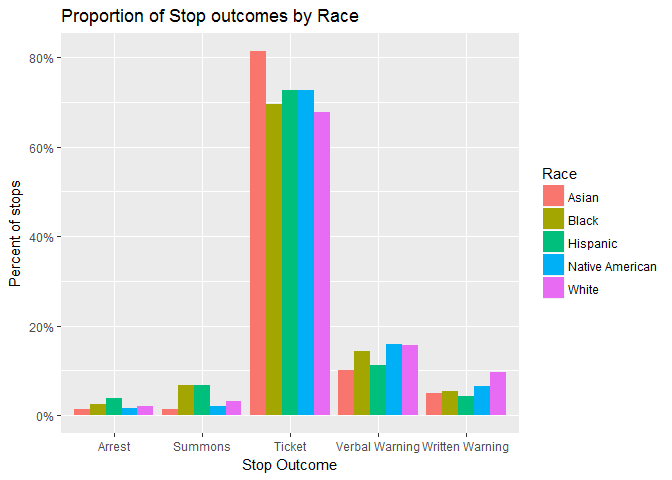
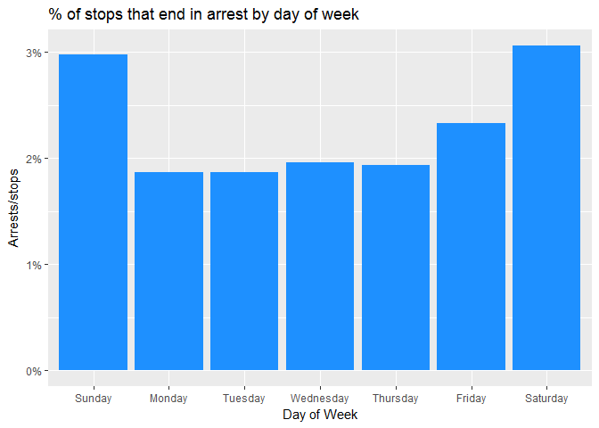
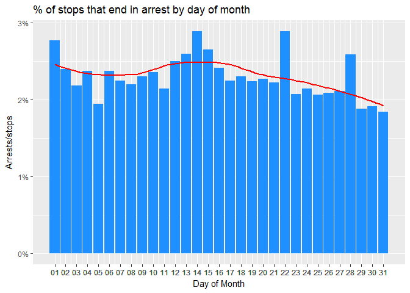
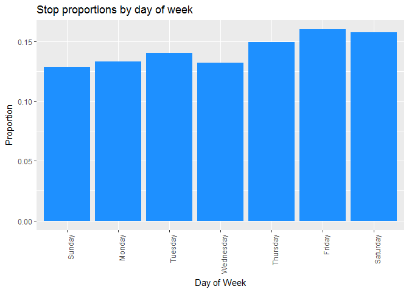
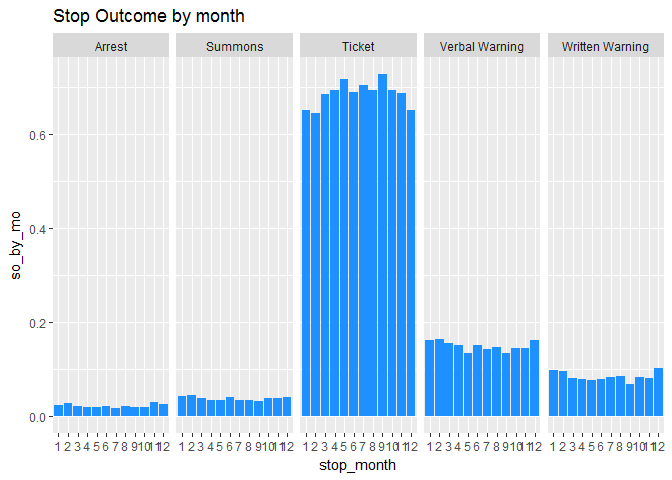
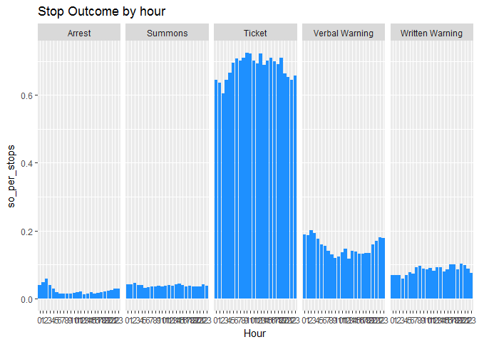

Summary:
--------

Of all the attributes tested against stop\_outcome and is\_arrested, there were statistically significant results, meaning all of the attributes significantly contribute to the outcome of a stop. For some attributes, this makes more intuitive sense than others. For example, attributes that describe the stop, like stop duration, search type, and violation are obviously going to relate to the stop outcome. However, characteristics of the driver; gender, race, and age also influence stop outcome. Ultimately, the analysis provides a good base level understanding of the important variables at play. Investigating further with machine learning will help us uncover more granular nuances. <br /> <br /> For completion of understanding, here is a list of all the attributes I tested:

-   driver\_gender\_raw
-   driver\_race\_raw
-   driver\_age
-   county\_name
-   search\_conducted
-   search\_type
-   contraband\_found
-   stop\_duration
-   violation\_count
-   violation
-   stop\_time\_hour
-   day\_of\_week
-   day\_of\_month
-   month\_year

I will highlight a few to show some insights and showcase my work. However, the methods used were applied to all the attribute investigations in a similar fashion. <br /> <br /> The [conventional significance level for social sciences](http://wikiofscience.wikidot.com/stats:significance-level-cutoff-point) is 0.05, which is what I will be using here.

Deep dive analysis:
-------------------

#### Search type:

The search type of most searches conducted was consent.

``` r
searchtype <- df_clean %>% filter(search_conducted == TRUE) %>% group_by(search_type_raw) %>% dplyr::summarise(n = n()) %>% mutate(st_prop = n/sum(n))
```

``` r
ggplot(searchtype, aes(search_type_raw, st_prop)) +
  geom_bar(stat = "identity", fill = "#56B4E9") +
  annotate("text", x = 3, y = -.025, label = "*An inventory search is a warrantless search of a lawfully \nimpounded vehicle conducted by police.", size = 2) +
  labs(title = "Stop count proportion by search type", x = "Search Type", y = "Proportion") +
  scale_x_discrete(labels = c("NA", "Consent", "Inventory", "Other"))
```



A vast majority of inventory searches end in arrest. In fact, there is 95% confidence interval for the arrest/stop proportion of (0.7139833, 0.8214710) indicating that since the whole interval is above 50%, we can be 95% confident that for the entire population of inventory search types, at least half are going to end in arrest. <br /> <br /> By contrast, most consent searches end in a ticket.

``` r
df_search_conducted <- df_clean %>% filter(search_conducted == TRUE)
st_arrest_ft <- addmargins(table(df_search_conducted$search_type_raw, df_search_conducted$is_arrested, useNA = "ifany"))
st_arrest_ft <- head(st_arrest_ft,-1)
inv <- st_arrest_ft[3,]
inv_true <- inv[[2]]
inv_n <- inv[[4]]
prop.test(inv_true, inv_n)
```

    ## 
    ##  1-sample proportions test with continuity correction
    ## 
    ## data:  inv_true out of inv_n, null probability 0.5
    ## X-squared = 72.9, df = 1, p-value < 2.2e-16
    ## alternative hypothesis: true p is not equal to 0.5
    ## 95 percent confidence interval:
    ##  0.7139833 0.8214710
    ## sample estimates:
    ##     p 
    ## 0.772

``` r
st_by_so2 <- setNames(data.frame(table(df_search_conducted$search_type_raw, df_search_conducted$stop_outcome, exclude = NULL)), c("Search_Type", "Stop_Outcome", "count")) 
st_totals_so2 <- data.frame(st_by_so2 %>% group_by(Search_Type) %>% dplyr::summarise(sum_st = sum(count)))
st_by_so2 <- left_join(st_by_so2, st_totals_so2, by = "Search_Type")
st_by_so2 <- st_by_so2 %>% mutate(percent_of_st  = count/sum_st)
ggplot(st_by_so2 %>% filter(is.na(Stop_Outcome) != TRUE & Search_Type != ""), aes(Stop_Outcome, percent_of_st, fill = Search_Type)) +
  geom_bar(stat = "identity", position = "dodge") +
  labs(title = "Proportion of Stop outcomes by Search Type", x = "Stop Outcome", y = "Percent of stops") +
  scale_y_continuous(labels = scales::percent) +
  scale_fill_discrete(name = "Search Type")
```



#### Race:

Blacks and Whites are stopped the most (when weighted against their Connecticut population size).

``` r
census_race <- census_whole_state %>% select(1:5,
                                             BAC_MALE, BAC_FEMALE,
                                             WAC_MALE, WAC_FEMALE,
                                             H_MALE, H_FEMALE,
                                             IAC_MALE,IAC_FEMALE,
                                             AAC_MALE, AAC_FEMALE) %>%
                                      dplyr::mutate(Black = BAC_MALE + BAC_FEMALE,
                                                    White = WAC_MALE + WAC_FEMALE,
                                                    Hispanic = H_MALE + H_FEMALE,
                                                    NativeAmerican = IAC_MALE + IAC_FEMALE,
                                                    Asian = AAC_MALE + AAC_FEMALE)
census_race <- census_race %>% select(-c(6:15))
race_cols <- colnames(census_race)[6:10]
census_race <- data.frame(t(census_race[,-(1:5)])) # removing non-race columns
census_race$race <- race_cols
census_race <- arrange(census_race, race)
table_race <- setNames(data.frame(table(df_clean$driver_race_raw)),c("race", "count"))
table_race <- bind_cols(table_race, census_race)
temp_name <- colnames(table_race)
temp_name[3] <- "total_pop" #rename weird column
colnames(table_race) <- temp_name
table_race <- table_race %>% mutate(pop_prop = count/total_pop)
```

``` r
ggplot(table_race, aes(race, pop_prop)) +
  geom_bar(stat = "identity", fill = "#56B4E9") +
  theme1 +
  labs(title = "Stop counts by race weighted by race population", x = "Race", y = "Weighted stop counts by race")
```



However, Blacks and Hispanics have the highest proportion of “worst” offenses (arrests and summons) while Native Americans and Whites have the highest proportion of “better” (verbal and written warnings) offenses.

``` r
race_by_so <- setNames(data.frame(table(df_clean$driver_race_raw, df_clean$stop_outcome, exclude = NULL)), c("Race", "Stop_Outcome", "count")) 
race_totals_so <- data.frame(race_by_so %>% group_by(Race) %>% dplyr::summarise(sum_race = sum(count)))
race_by_so <- left_join(race_by_so, race_totals_so, by = "Race")
race_by_so <- race_by_so %>% mutate(percent_of_race  = count/sum_race)
ggplot(race_by_so %>% filter(is.na(Stop_Outcome) != TRUE), aes(Stop_Outcome, percent_of_race, fill = Race)) +
  geom_bar(stat = "identity", position = "dodge") +
  labs(title = "Proportion of Stop outcomes by Race", x = "Stop Outcome", y = "Percent of stops") +
  scale_y_continuous(labels = scales::percent)
```



Performing two-proportion z-tests give statistically significant results (p-values of 2.2e-16 for all), indicating the larger proportion of arrests and summons for Blacks and Hispanics and the larger proportion of verbal and written warnings for Whites and Native Americans are likely not due to chance.

``` r
so_race <- addmargins(table(df_clean$driver_race_raw, df_clean$stop_outcome,  useNA = "ifany"))
so_hb <- colSums(so_race[c(2:3),])
so_nonhb <- colSums(so_race[c(1,4:5),])
so_hb_combined <- rbind(so_hb, so_nonhb)
# Testing summons proportion of Black and Hispanic 
prop.test(x = as.vector(so_hb_combined[,2]), n = as.vector(so_hb_combined[,7]), alternative = "greater")
```

    ## 
    ##  2-sample test for equality of proportions with continuity
    ##  correction
    ## 
    ## data:  as.vector(so_hb_combined[, 2]) out of as.vector(so_hb_combined[, 7])
    ## X-squared = 1947.6, df = 1, p-value < 2.2e-16
    ## alternative hypothesis: greater
    ## 95 percent confidence interval:
    ##  0.03483309 1.00000000
    ## sample estimates:
    ##     prop 1     prop 2 
    ## 0.06694841 0.03043803

``` r
# Testing arrest proportion of Black and Hispanic
prop.test(x = as.vector(so_hb_combined[,1]), n = as.vector(so_hb_combined[,7]), alternative = "greater")
```

    ## 
    ##  2-sample test for equality of proportions with continuity
    ##  correction
    ## 
    ## data:  as.vector(so_hb_combined[, 1]) out of as.vector(so_hb_combined[, 7])
    ## X-squared = 263.5, df = 1, p-value < 2.2e-16
    ## alternative hypothesis: greater
    ## 95 percent confidence interval:
    ##  0.009287031 1.000000000
    ## sample estimates:
    ##     prop 1     prop 2 
    ## 0.03117167 0.02068795

``` r
so_nonnaw <- colSums(so_race[c(1:3),])
so_naw <- colSums(so_race[c(4:5),])
so_naw_combined <- rbind(so_naw, so_nonnaw)
# Testing verbal warning proportion of White and Native American 
prop.test(x = as.vector(so_naw_combined[,4]), n = as.vector(so_naw_combined[,7]), alternative = "greater")
```

    ## 
    ##  2-sample test for equality of proportions with continuity
    ##  correction
    ## 
    ## data:  as.vector(so_naw_combined[, 4]) out of as.vector(so_naw_combined[, 7])
    ## X-squared = 406.98, df = 1, p-value < 2.2e-16
    ## alternative hypothesis: greater
    ## 95 percent confidence interval:
    ##  0.02778652 1.00000000
    ## sample estimates:
    ##    prop 1    prop 2 
    ## 0.1569036 0.1267668

``` r
# Testing written warning proportion of White and Native American 
prop.test(x = as.vector(so_naw_combined[,5]), n = as.vector(so_naw_combined[,7]), alternative = "greater")
```

    ## 
    ##  2-sample test for equality of proportions with continuity
    ##  correction
    ## 
    ## data:  as.vector(so_naw_combined[, 5]) out of as.vector(so_naw_combined[, 7])
    ## X-squared = 1618.9, df = 1, p-value < 2.2e-16
    ## alternative hypothesis: greater
    ## 95 percent confidence interval:
    ##  0.04530774 1.00000000
    ## sample estimates:
    ##     prop 1     prop 2 
    ## 0.09593239 0.04898753

In fact, the arrest/stop proportion of Hispanics is ~1.6 times (.039124434/.024557563 = ~1.6) the proportion of the next highest race, Black, also a statistically significant result, with a p-value of 2.2e-16.

``` r
race_table <- table(df_clean$driver_race_raw, df_clean$is_arrested, useNA = "ifany")
non_hispanic <- colSums(race_table[c(1,2,4,5),])
race_table2 <- rbind(race_table, non_hispanic)
race_table2 <- race_table2[c(3,6),]
race_table2 <- addmargins(race_table2)
race_table2 <- race_table2[c(1,2),]
prop.test(x = as.vector(race_table2[,2]), n = as.vector(race_table2[,4]), alternative = "greater")
```

    ## 
    ##  2-sample test for equality of proportions with continuity
    ##  correction
    ## 
    ## data:  as.vector(race_table2[, 2]) out of as.vector(race_table2[, 4])
    ## X-squared = 402.41, df = 1, p-value < 2.2e-16
    ## alternative hypothesis: greater
    ## 95 percent confidence interval:
    ##  0.01605447 1.00000000
    ## sample estimates:
    ##     prop 1     prop 2 
    ## 0.03912443 0.02119216

It is interesting to note that Hispanics are the third highest in terms of stop proportion when weighted by Census race population. Considering Hispanics have the highest arrest likelihood seems to anecdotally support the statistical results seen here that race does impact arrest status outcome. <br /> <br /> More generally speaking, the chi-square independence test of race and arrest status gives a p-value of 2.2e-16, meaning we reject the null hypothesis that the two are independent, further supporting our observations.

``` r
race_arrest_chi <- table(df_clean$driver_race_raw, df_clean$is_arrested, useNA = "ifany")
chisq.test(race_arrest_chi)
```

    ## 
    ##  Pearson's Chi-squared test
    ## 
    ## data:  race_arrest_chi
    ## X-squared = 507.62, df = 8, p-value < 2.2e-16

The leads to an obvious question of correlation versus causation. Are different races being targeted with more severe stop outcomes (arrests and summons) because of their race or do different races behave differently such that their actions cause “worse” stop outcomes? This is something I hope to uncover more insights into with machine learning. At the very least, the significant relationship between driver characteristics and stop outcome is an insight requiring further investigation, possibly with more data gathered by the client.

#### Race and age:

Adding an extra layer into our analysis of race, let’s see if there is a difference in the mean age of arrest for each race.

In order to calculate the mean, we need to exclude NAs. Ages below 15 and 80 and older were made NA because it can be reasonably assumed those ages were recorded in error. This is because it is illegal for people under 15 to drive and the bumps in stop counts for people 80 and older in our dataset hints at older ages being used incorrectly or as an educated guess for older drivers' ages.

Looking at the boxplots, we can see that the mean age of arrest is lower for Black and Hispanic drivers.

``` r
ggboxplot(df_clean %>% filter(is_arrested == TRUE), x = "driver_race_raw", y = "driver_age", color = "driver_race_raw",
          xlab = "Driver Race", ylab = "Driver Age")
```


Performing a t-test on the difference in mean ages of arrest for Hispanic and Black drivers versus the other races, confirms our observations, giving a p-value of 2.2e-16, meaning we favor the alternative hypothesis that says the mean age of arrest for Hispanics and Blacks is less than the other races.

``` r
df_clean$race2 <- vector(mode="character", length = nrow(df_clean))
df_clean$race2[df_clean$driver_race_raw != "Hispanic" & df_clean$driver_race_raw != "Black"] <- "NonHB"
df_clean$race2[df_clean$driver_race_raw == "Hispanic" | df_clean$driver_race_raw == "Black" ] <- "HB"
t.test(driver_age ~ race2, data = df_clean %>% filter(is_arrested == TRUE), alternative = "less")
```

    ## 
    ##  Welch Two Sample t-test
    ## 
    ## data:  driver_age by race2
    ## t = -9.1618, df = 4854, p-value < 2.2e-16
    ## alternative hypothesis: true difference in means is less than 0
    ## 95 percent confidence interval:
    ##       -Inf -2.307413
    ## sample estimates:
    ##    mean in group HB mean in group NonHB 
    ##            33.87758            36.69002

#### Over-time:

When an individual is stopped seems to have a difference on their stop outcome and whether or not they’re arrested.

In particular, we see that more arrests occur on the weekend and decrease towards the end of the month, supported with two-proportion z-tests comparing Saturday and Sunday to the other weekdays and the last 3rd of the month to the rest of the month.

``` r
df_clean$stop_date <- as.POSIXct(df_clean$stop_date, "%Y-%m-%d", tz = "America/New_York")
df_clean$day_of_week <- weekdays(df_clean$stop_date)
df_clean$day_of_week <- factor(df_clean$day_of_week, levels = c("Sunday", "Monday", "Tuesday", "Wednesday", "Thursday", "Friday", "Saturday"))
arrests_per_day_of_week <- data.frame(df_clean %>% group_by(day_of_week, is_arrested) %>% dplyr::summarise(sum_arrests = n()))
arrests_dow_total <- arrests_per_day_of_week %>% group_by(day_of_week) %>% dplyr::summarise(sum_count = sum(sum_arrests))
arrests_per_day_of_week  <- left_join(arrests_per_day_of_week , arrests_dow_total, by = "day_of_week")
arrests_per_day_of_week <- arrests_per_day_of_week %>% mutate(arrests_per_stop  = sum_arrests/sum_count)  
ggplot(arrests_per_day_of_week %>% filter(is_arrested == TRUE), aes(day_of_week, arrests_per_stop)) +
  geom_bar(stat = "identity", fill = "#1E90FF") +
  labs(title = "% of stops that end in arrest by day of week", x = "Day of Week", y = "Arrests/stops") +
  scale_y_continuous(labels = scales::percent)
```



``` r
a <- c("01", "02", "03", "04", "05", "06", "07", "08", "09")
b <- as.character(10:31)
days_label <- c(a, b)
df_clean$day_of_month <- format(df_clean$stop_date, "%d")
df_clean$day_of_month <- factor(df_clean$day_of_month,
                              ordered = TRUE,
                              levels = days_label)
arrests_per_day <- data.frame(df_clean %>% group_by(day_of_month, is_arrested) %>% dplyr::summarise(sum_arrests = n()))
arrests_per_day_tot <- arrests_per_day %>% group_by(day_of_month) %>% dplyr::summarise(sum_count = sum(sum_arrests))
arrests_per_day  <- left_join(arrests_per_day, arrests_per_day_tot, by = "day_of_month")
arrests_per_day <- arrests_per_day %>% mutate(arrests_per_stop  = sum_arrests/sum_count)   
ggplot(arrests_per_day %>% filter(is_arrested == TRUE), aes(as.numeric(day_of_month), arrests_per_stop)) +
  geom_bar(stat = "identity", fill = "#1E90FF") + 
  geom_smooth(se = FALSE, color = "red") + 
  labs(title = "% of stops that end in arrest by day of month", x = "Day of Month", y = "Arrests/stops") +
  scale_y_continuous(labels = scales::percent) +
  scale_x_continuous(breaks = as.numeric(arrests_per_day$day_of_month), labels = as.character(arrests_per_day$day_of_month))
```



``` r
end_of_month <- addmargins(table(df_clean$day_of_month, df_clean$is_arrested, useNA = "ifany"))
end_of_month <- head(end_of_month, -1)
end <- colSums(end_of_month[c(21:31),])
beginning <- colSums(end_of_month[c(1:20),])
end_of_month2 <- rbind(end, beginning)
# Testing arrest proportion of the end of the month
prop.test(x = as.vector(end_of_month2[,2]), n = as.vector(end_of_month2[,4]), alternative = "less")
```

    ## 
    ##  2-sample test for equality of proportions with continuity
    ##  correction
    ## 
    ## data:  as.vector(end_of_month2[, 2]) out of as.vector(end_of_month2[, 4])
    ## X-squared = 11.748, df = 1, p-value = 0.0003046
    ## alternative hypothesis: less
    ## 95 percent confidence interval:
    ##  -1.0000000000 -0.0009956766
    ## sample estimates:
    ##     prop 1     prop 2 
    ## 0.02172794 0.02362915

``` r
weekend <- addmargins(table(df_clean$day_of_week, df_clean$is_arrested, useNA = "ifany"))
weekend <- head(weekend, -1)
satsun <- colSums(weekend[c(1,7),])
weekday <- colSums(weekend[c(2:6),])
weekend2 <- rbind(satsun, weekday)
# Testing arrest proportion of the weekend
prop.test(x = as.vector(weekend2[,2]), n = as.vector(weekend2[,4]), alternative = "greater")
```

    ## 
    ##  2-sample test for equality of proportions with continuity
    ##  correction
    ## 
    ## data:  as.vector(weekend2[, 2]) out of as.vector(weekend2[, 4])
    ## X-squared = 303.11, df = 1, p-value < 2.2e-16
    ## alternative hypothesis: greater
    ## 95 percent confidence interval:
    ##  0.009170215 1.000000000
    ## sample estimates:
    ##     prop 1     prop 2 
    ## 0.03025112 0.02002214

Looking at the stop proportion by day of the week, Sunday had the smallest number of stops possibly indicating that the kinds of stops on the weekends warranted more arrests than the stops during the week.

``` r
ggplot(df_clean, aes(day_of_week, ..prop.., group = 1)) + 
  geom_bar(fill = "#1E90FF") +
  theme1 +
  labs(title = "Stop proportions by day of week", x = "Day of Week", y = "Proportion")
```



There is a lower number of tickets during the winter months and an increase in all other stop outcomes, again supported with statistics.

``` r
df_clean$stop_month <- month(df_clean$stop_date)
df_clean$stop_month <- factor(df_clean$stop_month, 
                              ordered = TRUE,
                              levels = as.character(1:12))
so_mo <- data.frame(df_clean %>% group_by(stop_month, stop_outcome) %>% dplyr::summarise(sum_so = n()))
so_mo_total <- so_mo %>% group_by(stop_month) %>% dplyr::summarise(sum_count = sum(sum_so))
so_mo  <- left_join(so_mo, so_mo_total, by = "stop_month")
so_mo <- so_mo %>% mutate(so_by_mo  = sum_so/sum_count)  
ggplot(so_mo %>% filter(is.na(stop_outcome) != TRUE), aes(stop_month, so_by_mo)) +
  geom_bar(stat= "identity", fill = "#1E90FF") +
  facet_grid(. ~ stop_outcome) +
  labs(title = "Stop Outcome by month")
```



``` r
so_mo_p <- addmargins(table(df_clean$stop_month, df_clean$stop_outcome,  useNA = "ifany"))
winter_mo <- colSums(so_mo_p[c(1:2, 12),])
non_winter_mo <- colSums(so_mo_p[c(3:11),])
mo_combined <- rbind(winter_mo, non_winter_mo)
# Testing ticket proportion of winter months
prop.test(x = as.vector(mo_combined[,3]), n = as.vector(mo_combined[,7]), alternative = "less")
```

    ## 
    ##  2-sample test for equality of proportions with continuity
    ##  correction
    ## 
    ## data:  as.vector(mo_combined[, 3]) out of as.vector(mo_combined[, 7])
    ## X-squared = 627.14, df = 1, p-value < 2.2e-16
    ## alternative hypothesis: less
    ## 95 percent confidence interval:
    ##  -1.00000000 -0.04515099
    ## sample estimates:
    ##    prop 1    prop 2 
    ## 0.6502042 0.6986043

``` r
# Testing verbal warning proportion of winter months
prop.test(x = as.vector(mo_combined[,4]), n = as.vector(mo_combined[,7]), alternative = "greater")
```

    ## 
    ##  2-sample test for equality of proportions with continuity
    ##  correction
    ## 
    ## data:  as.vector(mo_combined[, 4]) out of as.vector(mo_combined[, 7])
    ## X-squared = 139.94, df = 1, p-value < 2.2e-16
    ## alternative hypothesis: greater
    ## 95 percent confidence interval:
    ##  0.01509008 1.00000000
    ## sample estimates:
    ##    prop 1    prop 2 
    ## 0.1632902 0.1456844

``` r
# Testing written warning proportion of winter months
prop.test(x = as.vector(mo_combined[,5]), n = as.vector(mo_combined[,7]), alternative = "greater")
```

    ## 
    ##  2-sample test for equality of proportions with continuity
    ##  correction
    ## 
    ## data:  as.vector(mo_combined[, 5]) out of as.vector(mo_combined[, 7])
    ## X-squared = 261.34, df = 1, p-value < 2.2e-16
    ## alternative hypothesis: greater
    ## 95 percent confidence interval:
    ##  0.01677641 1.00000000
    ## sample estimates:
    ##     prop 1     prop 2 
    ## 0.09929200 0.08049909

``` r
# Testing arrest proportion of winter months
prop.test(x = as.vector(mo_combined[,1]), n = as.vector(mo_combined[,7]), alternative = "greater")
```

    ## 
    ##  2-sample test for equality of proportions with continuity
    ##  correction
    ## 
    ## data:  as.vector(mo_combined[, 1]) out of as.vector(mo_combined[, 7])
    ## X-squared = 36.774, df = 1, p-value = 6.633e-10
    ## alternative hypothesis: greater
    ## 95 percent confidence interval:
    ##  0.002715148 1.000000000
    ## sample estimates:
    ##     prop 1     prop 2 
    ## 0.02584058 0.02204773

``` r
# Testing summons proportion of winter months
prop.test(x = as.vector(mo_combined[,2]), n = as.vector(mo_combined[,7]), alternative = "greater")
```

    ## 
    ##  2-sample test for equality of proportions with continuity
    ##  correction
    ## 
    ## data:  as.vector(mo_combined[, 2]) out of as.vector(mo_combined[, 7])
    ## X-squared = 61.717, df = 1, p-value = 1.983e-15
    ## alternative hypothesis: greater
    ## 95 percent confidence interval:
    ##  0.004914789 1.000000000
    ## sample estimates:
    ##     prop 1     prop 2 
    ## 0.04310299 0.03681062

Throughout the day, there are more arrests in the early hours (0000- 0300), more tickets given during the day (0600- 1900), and more verbal warnings in the early hours and late hours of the day (0000- 0500 & 2000- 2300).

``` r
df_clean$stop_time_hour <- df_clean$stop_time
df_clean$stop_time_hour[df_clean$stop_time_hour == "0:00"] <- NA
df_clean$stop_time_hour <- sub(":.*", "", df_clean$stop_time_hour)
df_clean$stop_time_hour <- factor(df_clean$stop_time_hour,
                                  ordered = TRUE,
                                  levels = as.character(0:23))
so_time <- setNames(data.frame(table(df_clean$stop_time_hour, df_clean$stop_outcome, exclude = NULL)), c("Hour", "StopOutcome", "count"))
so_time_totals <- data.frame(so_time %>% group_by(Hour) %>% dplyr::summarise(sum_stops = sum(count)))
so_time <- left_join(so_time, so_time_totals, by = "Hour")
so_time <- so_time %>% mutate(so_per_stops  = count/sum_stops)
ggplot(so_time %>% filter(is.na(Hour) != TRUE & is.na(StopOutcome) != TRUE), aes(Hour, so_per_stops)) +
  geom_bar(stat = "identity", fill = "#1E90FF") +
  facet_grid(. ~ StopOutcome) +
  labs(title = "Stop Outcome by hour")
```



We observe statistical significance in the higher arrest/stop proportion between 0000- 0300 with the two-proportion z-test returning a p-value of 2.2e-16.

``` r
df_clean$stop_time_hour_numeric <- as.numeric(df_clean$stop_time_hour) - 1
times <- addmargins(table(df_clean$stop_time_hour_numeric, df_clean$is_arrested, useNA = "ifany"))
times <- head(times, -1)
early <- colSums(times[c(1:4),])
other <- colSums(times[c(5:25),])
times2 <- rbind(early, other)
prop.test(x = as.vector(times2[,2]), n = as.vector(times2[,4]), alternative = "greater")
```

    ## 
    ##  2-sample test for equality of proportions with continuity
    ##  correction
    ## 
    ## data:  as.vector(times2[, 2]) out of as.vector(times2[, 4])
    ## X-squared = 1552.4, df = 1, p-value < 2.2e-16
    ## alternative hypothesis: greater
    ## 95 percent confidence interval:
    ##  0.02727515 1.00000000
    ## sample estimates:
    ##     prop 1     prop 2 
    ## 0.04739288 0.01847439

Using the two-proportion z-test to compare the hours with a greater ticket/stop proportion (0600 – 1900) to the rest of the hours give a p-value of 2.2e-16 meaning we can say the difference is statistically significant and there is a greater proportion of tickets during the hours of 0600 – 1900.

``` r
ticket_hr_chi <- addmargins(table(df_clean$stop_time_hour_numeric, df_clean$stop_outcome,  useNA = "ifany"))
more_tickets <- colSums(ticket_hr_chi[c(7:20),])
less_tickets <- colSums(ticket_hr_chi[c(1:6, 21:25),])
ticket_hr_combined <- rbind(more_tickets, less_tickets)
prop.test(x = as.vector(ticket_hr_combined [,3]), n = as.vector(ticket_hr_combined [,7]), alternative = "greater")
```

    ## 
    ##  2-sample test for equality of proportions with continuity
    ##  correction
    ## 
    ## data:  as.vector(ticket_hr_combined[, 3]) out of as.vector(ticket_hr_combined[, 7])
    ## X-squared = 1099, df = 1, p-value < 2.2e-16
    ## alternative hypothesis: greater
    ## 95 percent confidence interval:
    ##  0.05479024 1.00000000
    ## sample estimates:
    ##    prop 1    prop 2 
    ## 0.7064741 0.6487745

Using the two-proportion z-test to compare the hours with a greater verbal warning/stop proportion (0000- 0500 & 2000- 2300) to the rest of the hours give a p-value of 2.2e-16 meaning we can say the difference is statistically significant and there is a greater proportion of verbal warnings given during the hours of 0000- 0500 & 2000- 2300.

``` r
less_verbal <- colSums(ticket_hr_chi[c(7:20, 25),])
more_verbal <- colSums(ticket_hr_chi[c(1:6, 21:24),])
verbal_hr_combined <- rbind(more_verbal, less_verbal)
prop.test(x = as.vector(verbal_hr_combined [,4]), n = as.vector(verbal_hr_combined [,7]), alternative = "greater")
```

    ## 
    ##  2-sample test for equality of proportions with continuity
    ##  correction
    ## 
    ## data:  as.vector(verbal_hr_combined[, 4]) out of as.vector(verbal_hr_combined[, 7])
    ## X-squared = 1196.6, df = 1, p-value < 2.2e-16
    ## alternative hypothesis: greater
    ## 95 percent confidence interval:
    ##  0.04407568 1.00000000
    ## sample estimates:
    ##    prop 1    prop 2 
    ## 0.1807248 0.1343521

Appendix:
---------

Conditions used in statistical analysis testing:

-   Chi-square independence test:
    -   Random:  Since the data contains all stops for the specified time period, not just a selection, this is a random sample.
    -   Expected values for each data point &gt;=5 (R function verifies).
    -   Independence: Sample size &lt;= 10% of population or sampling with replacement.
        -   In 2014, there were 232,082 stops and that could include duplicate individuals. In 2014, the population of Connecticut was 3,591,873, making the sample size of our full year of data less than 10% of the population (232082/3591873 = ~6.46%) so we can claim independence.
-   Two-sample z-test for proportions (same for proportion confidence interval):
    -   Random: See above.
    -   Normal:  At least 10 expected successes and failures each— the R functions used test for this condition, if it is not met, I don’t perform the test.
    -   Independent: See above.
-   T-test for sample mean comparison:
    -   Random: See above.
    -   Normal:  Our sample size is &gt;= 30 so using the central limit theorem, we can say our sampling distribution of the same mean is normal.
    -   Independent: See above.

Bucketing of stop outcomes:

-   Worst offenses: arrest, [summons](https://patch.com/massachusetts/grafton/what-s-the-difference-between-a-summons-and-an-arrest)
-   Middle offenses: ticket
-   Better/lesser offenses: verbal warning, written warning
